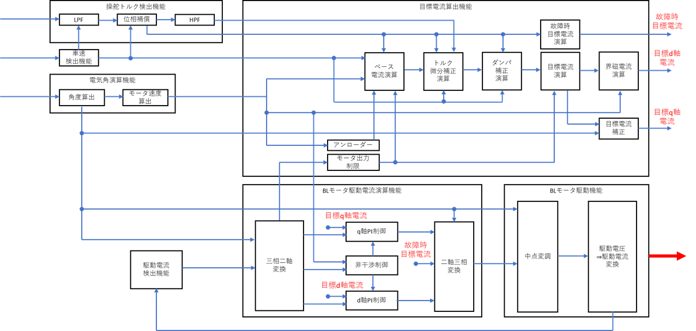
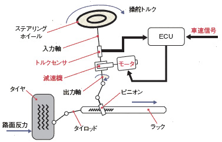

# 電動パワーステアリング (EPS) の力学モデル

`03` / `05` モデルが扱う **電動パワーステアリング (EPS)** の機構と制御を説明する。コード上は `eps_gearbox_model.{hpp,cpp}` および `eps_controller.{hpp,cpp}` に対応する。

---

## 1. EPS とは

電動パワーステアリングは、BLDC モータのトルクでドライバの操舵力を補助するシステムである。油圧式パワーステアリングに比べ、燃費・整備性・制御自由度の点で有利であり、現代の乗用車で広く使われている。

**主な機能:**

- モータトルクでドライバの操舵力を補助し、アシスト力を車両に伝える
- 車速に応じたスムーズな操舵力を実現する

**動作原理:**

1. 操舵入力トルクをトルクセンサ信号へ変換し、入力に応じたモータトルクを発生する
2. 操舵入力トルクをラック＆ピニオンギアから、モータトルクの補助によりラック軸方向の推力に変換する
3. タイヤ回転を支持するタイロッドに推力が伝達され、タイヤの揺動角に変換される

---

## 2. エネルギーフロー

操舵入力からタイヤの揺動までの流れ：

```
ステアリングホイール
   │ ドライバートルク
コラム / インターミディエイトシャフト
   │
トルクセンサ (トーションバーの捻れを検出)
   │ 検出トルク
EPS コントローラ ──▶ BLDC モータ (アシストトルク)
   │
ラック & ピニオンギア (回転 → 直線運動)
   │ ラック推力
タイロッド (左右)
   │
タイヤの揺動
```

---

## 3. EPS 制御ブロック図



上段が **目標電流演算機能**、下段が **BL モータ駆動演算機能** である。

| ブロック | 機能 |
|----------|------|
| 操舵トルク検出 (LPF → 位相補償 → HPF) | トルクセンサ信号のノイズ除去と位相補償 |
| ベース電流演算 | 操舵トルク・車速から基本アシスト電流を算出 (V カーブ) |
| トルク微分補正演算 (イナーシャ電流) | 操舵トルクの変化量に応じて電流の立ち上がりをアシスト |
| ダンパ補正演算 | モータ回転速度から外乱制動電流を算出 |
| 目標電流補正・界磁電流演算 | 最終目標 $i_q^*$・$i_d^*$ を生成 |
| 三相二軸変換 (Clarke) | 三相フィードバック電流を dq 軸電流に変換 |
| q 軸 / d 軸 PI 制御 + 非干渉制御 | dq 軸独立 PI + クロスカップリング補償 |
| 二軸三相変換 (逆 Clarke) | dq 電圧指令を三相に変換 |
| 中点変調 | 電圧利用率を $2/\sqrt{3}$ 倍に拡張 |
| 駆動電圧→駆動電流変換 | PWM デューティ比に換算して出力 |

---

## 4. 機構の力学モデル

`eps_gearbox_model.cpp` は **2 質量系** (ステアリングホイール + ローワーコラム/ピニオン) を前進オイラー法で時間積分する。

### 4.1 2 質量系の運動方程式

系は「ステアリングホイール側 ($J_{sw}$)」と「ローワーコラム/ピニオン側 ($J_{col,tot}$)」の 2 つの回転体で構成される。

$$
J_{sw}\frac{d\omega_{sw}}{dt} = T_h - T_{tb}
$$

$$
J_{col,tot}\frac{d\omega_{col}}{dt} = T_{tb} + N_g T_m - T_{spring}
$$

| 記号 | 意味 | 単位 |
|------|------|------|
| $T_h$ | ドライバ操舵トルク (入力) | Nm |
| $T_{tb}$ | トーションバートルク (= トルクセンサ読み値) | Nm |
| $N_g$ | 減速ギア比 | — |
| $T_m$ | モータ軸トルク | Nm |
| $T_{spring}$ | ラックばね・ダンパのピニオン軸等価モーメント | Nm |

### 4.2 換算慣性モーメント

ローワーコラム側の等価慣性 $J_{col,tot}$ は、モータロータ慣性とラック並進慣性をピニオン軸に換算して合算する。

$$
J_{col,tot} = J_{col} + J_{motor} N_g^2 + M_{rack} r_p^2
$$

| 項 | 意味 |
|----|------|
| $J_{col}$ | コラムベース慣性 |
| $J_{motor} N_g^2$ | 減速ギアで換算したモータロータ慣性 |
| $M_{rack} r_p^2$ | ピニオン半径 $r_p$ で換算したラック並進慣性 |

コードでは `EpsGearboxModel::init()` 内の計算に直接対応する。

### 4.3 トーションバー (トルクセンサ)

コラムとピニオンの間にある細い軸。ばね-ダンパ要素としてモデル化し、捻れ角の差からトルクを算出する。

$$
T_{tb} = K_{tb}(\theta_{sw} - \theta_{col}) + C_{tb}(\omega_{sw} - \omega_{col})
$$

- $K_{tb}$ : トーションバー剛性 (≈ 143 Nm/rad ≈ 2.5 Nm/deg)
- $C_{tb}$ : トーションバー減衰 (Nm·s/rad)

この $T_{tb}$ がそのままトルクセンサ出力として EPS コントローラへ渡される。

### 4.4 ラック-ピニオン結合とばね負荷

ピニオンとラックは剛結合であり、ラック変位・速度はピニオン角から一意に決まる。

$$
x_{rack} = r_p \theta_{col}, \qquad v_{rack} = r_p \omega_{col}
$$

ラックに作用するばね・ダンパ力 (路面反力の簡易モデル) は次式で与えられる。

$$
F_{rack} = K_s x_{rack} + C_s v_{rack}
$$

このラック推力をピニオン軸等価モーメントに変換すると、4.1 式の $T_{spring}$ が得られる。

$$
T_{spring} = F_{rack} \cdot r_p = K_s r_p^2 \theta_{col} + C_s r_p^2 \omega_{col}
$$

- $K_s$ : ラックばね定数 [N/m]
- $C_s$ : ラック粘性減衰 [N·s/m]
- $r_p$ : ピニオン半径 [m]

### 4.5 運動学的拘束 (モータ-コラム結合)

減速ギアを介してモータ軸とコラムは剛結合されており、各ステップ先頭でモータの角速度を更新する。

$$
\omega_{motor} = N_g \cdot \omega_{col}
$$

この拘束により、モータの逆起電力が `MotorModel` 内で正しく算出される。コードでは `motor.set_angular_vel(kEpsGearRatio * gearbox_state.omega_col)` に対応する。

### 4.6 前進オイラー積分

各タイムステップ $\Delta t$ ごとに角加速度を算出し、速度・角度を更新する。

$$
\alpha_{sw} = \frac{T_h - T_{tb}}{J_{sw}}, \qquad
\alpha_{col} = \frac{T_{tb} + N_g T_m - T_{spring}}{J_{col,tot}}
$$

$$
\omega_{sw}[k{+}1] = \omega_{sw}[k] + \alpha_{sw}\,\Delta t, \qquad
\theta_{sw}[k{+}1] = \theta_{sw}[k] + \omega_{sw}[k{+}1]\,\Delta t
$$

$$
\omega_{col}[k{+}1] = \omega_{col}[k] + \alpha_{col}\,\Delta t, \qquad
\theta_{col}[k{+}1] = \theta_{col}[k] + \omega_{col}[k{+}1]\,\Delta t
$$

### 4.7 機械共振への注意

トーションバー (ばね) とステアリングホイール・ローワーコラムの慣性が組み合わさると、2 質量系は共振点を持つ。固有角周波数の目安：

$$
\omega_n \approx \sqrt{K_{tb}\left(\frac{1}{J_{sw}} + \frac{1}{J_{col,tot}}\right)} \approx 60\ \text{rad/s} \approx 9.5\ \text{Hz}
$$

トルクセンサ信号をそのままアシスト制御に使うと、この共振を励起してしまう。これを防ぐため、トルクセンサ信号には LPF をかける (次節参照)。

---

## 5. アシスト制御 (アシストマップ)

`eps_controller.cpp` と `eps_main.cpp` が協調して、センサトルクから q 軸電流指令を生成する。

### 5.1 トルクセンサ LPF

トルクセンサ読み値 $T_{tb}$ を 1 次 IIR ローパスフィルタで平滑化する。

$$
\hat{T}_{tb}[k{+}1] = \hat{T}_{tb}[k] + \bigl(T_{tb}[k] - \hat{T}_{tb}[k]\bigr)\cdot \omega_{lpf}\,\Delta t
$$

カットオフ周波数 $\omega_{lpf} \approx 20\ \text{rad/s}\ (\approx 3.2\ \text{Hz})$ は機械共振 (≈ 9.5 Hz) より十分低く設定されている。コードでは `sensor_filt` 変数に対応する。

### 5.2 V カーブ (ベース電流マップ)

フィルタ後トルク $\hat{T}_{tb}$ に対して、デッドゾーン補正付きの比例マップで $i_q^*$ を算出する。

$$
i_q^* =
\begin{cases}
\operatorname{clamp}\!\left(G_{assist}\,\bigl(|\hat{T}_{tb}| - T_{dz}\bigr)\,\operatorname{sgn}(\hat{T}_{tb}),\ \pm i_{q,max}\right)
  & |\hat{T}_{tb}| > T_{dz} \\
0 & |\hat{T}_{tb}| \le T_{dz}
\end{cases}
$$

| パラメータ | 記号 | デフォルト値 |
|-----------|------|-------------|
| アシストゲイン | $G_{assist}$ | 18.0 A/Nm |
| デッドゾーン幅 | $T_{dz}$ | 0.3 Nm |
| 最大 q 軸電流 | $i_{q,max}$ | 85 A |

デッドゾーンは小さい操舵トルク域での「据わり感 (ハンドルのセンター感覚)」を確保するために設ける。

全体の電流指令は以下の 3 成分の和として定義される（本実装ではベース電流のみ）。

$$
i_q^* = i_{\text{base}} + i_{\text{inertia}} + i_{\text{damper}}
$$

| 成分 | 決定要素 | 役割 |
|------|----------|------|
| ベース電流 | 操舵トルク・車速 | アシストの基本量を決める (V カーブ) |
| イナーシャ電流 | 操舵トルクの変化量 (微分) | 操舵開始時の電流立ち上げを補助 |
| ダンパ電流 | モータ回転速度 | ステアリングからの外乱を制動 |

> **本コードの実装範囲**  
> `bldc-foc-sim` の `EpsController` は **ベース電流 (V カーブ)** を実装している。イナーシャ電流・ダンパ電流は今後の拡張候補である。

---

## 6. 評価シナリオ

`EpsGearboxSim` は、ステアリングラックをばね負荷に接続し、ドライバ操舵トルクをランプ状に与えて、操舵トルクに対するラック推力の特性を評価する。



```sh
./EpsGearboxSim --tmax 6.0 --ramp 0.3 --span 2.0
```

- `--tmax` : ドライバ操舵トルクの最大値 [Nm]
- `--ramp` : 操舵トルクを 0 から最大値まで上げるランプ時間 [s]

出力 `data/eps_output.csv` には、トーションバートルク・アシストトルク・ラック推力・ラック変位などが記録される。

---

## 関連ドキュメント

- [`foc.md`](foc.md) — モータ側のベクトル制御
- [`motor-model.md`](motor-model.md) — モータの電気・機械方程式
- [`sensorless.md`](sensorless.md) — `05` で組み合わされるセンサーレス制御
