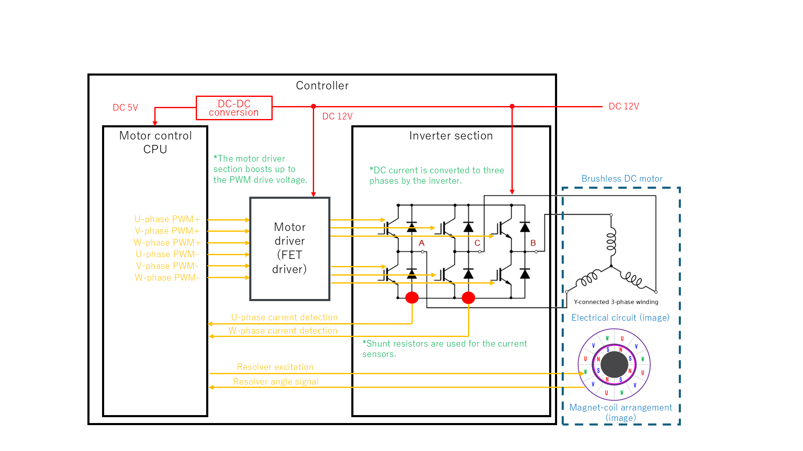
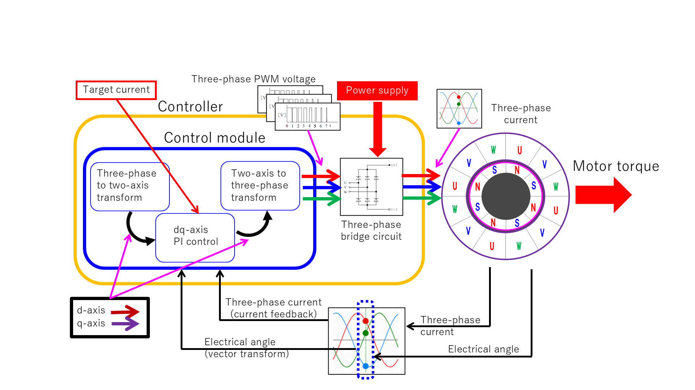
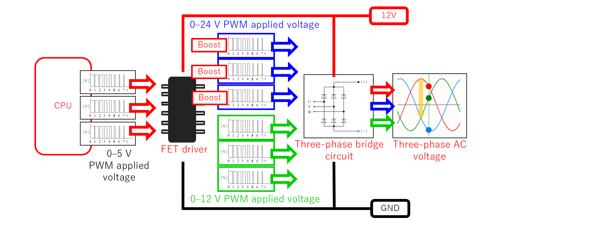

# ベクトル制御 (FOC) の原理

三相ブラシレスモータの **ベクトル制御 (Field-Oriented Control, FOC)** の考え方と、`bldc-foc-sim` での実装を説明する。コード上は `motor_controller.{hpp,cpp}` に対応する。

> **適用対象：電動パワーステアリング (EPS)**  
> 本シミュレータおよびドキュメントに登場する電圧レベル（バッテリ 12 V・上アーム駆動用昇圧 24 V）・電流検出方式（2 シャント）・制御帯域などのパラメータは、**車載 EPS（Electric Power Steering）** を前提とした設定である。EPS はステアリングコラムまたはラックに取り付けたブラシレスモータでアシストトルクを発生させるシステムであり、12 V 車載電源、高い応答性、フェールセーフ設計が要求される。他の用途（産業用・高電圧系など）に転用する場合は、電圧・電流・帯域の各パラメータを適宜読み替えること。

---

## 1. なぜベクトル制御か

三相交流電流は時間とともに正弦波状に変化するため、これを目標値に直接追従させるのは難しい。FOC では三相交流を **ロータと同期回転する 2 軸 (d 軸・q 軸)** に変換し、各軸を直流量として扱う。直流量になれば、PI 制御で定常偏差なく追従させることができる。

> **なぜ直流量だと PI 制御が有効か**  
> PI 制御の積分項は「定常偏差をゼロにする」性質を持つが、これが保証されるのは**目標値が DC（一定値）のとき**だけである。正弦波の交流量を直接 PI 制御すると、正弦波は周波数成分を持つため積分器が追従しきれず定常偏差が残る。dq 変換でロータと同期した座標系に移ると、正弦波だった電流が直流値に見えるため、PI 積分が完全に機能して定常偏差ゼロを達成できる。

**実現手法：**

1. 三相 (U 相、V 相、W 相) 成分を二軸 (d 軸、q 軸) 成分に変換する。
2. 二軸成分に対して、それぞれ電流フィードバック制御を適用する。
3. フィードバック後の二軸成分を三相交流に変換し、モータ駆動電圧として印加する。

**電流制御帯域と速度制御帯域の分離**

FOC では制御帯域を意図的に二段階に分ける。電流制御ループ（内側）はスイッチング周波数の 1/10 程度（例：$f_{sw} = 20\,\text{kHz}$ なら $\alpha_{cc} \approx 2\,\text{kHz}$）に設計し、速度・位置ループ（外側）はその 1/5〜1/10 程度にする。これにより外側のループは内側を「理想的なトルク源」として扱え、制御設計を階層的に分離できる。

制御ループの全体像：

```
三相電流 UVW ──[Clarke]──▶ αβ ──[Park (θ)]──▶ dq
                                                  │
                                         [dq 軸 PI 制御 + デカップリング]
                                                  │
三相電圧 UVW ◀─[逆Clarke]── αβ ◀──[逆Park (θ)]── dq
     │
     ▼
 [PWM インバータ] ──▶ モータ
```

座標変換の数学的詳細は [`coordinate-transform.md`](coordinate-transform.md) 参照。

---

## 2. d 軸と q 軸の役割

| 軸 | 名称 | 役割 |
|----|------|------|
| d 軸 | Direct Axis | ロータ磁束と同じ向き。通常運転ではトルクに寄与しない |
| q 軸 | Quadrature Axis | 磁束と直交。**トルクを生む** |

電磁トルクは

$$
T_e = K_t \cdot i_q
$$

であり、q 軸電流のみがトルクを決める。したがって通常運転では **d 軸電流指令を 0、q 軸電流指令を目標トルク相当値** に設定する。

> **なぜ $i_d^* = 0$ が最適か（SPMSM の場合）**  
> SPMSM（表面磁石型）では $L_d = L_q$ のため、突極性に由来するリラクタンストルクがゼロである。このとき、一定のモータ電流振幅 $|I| = \sqrt{i_d^2 + i_q^2}$ のもとでトルクを最大化する条件（MTPA: Maximum Torque Per Ampere）は $i_d = 0$ となる。d 軸電流は銅損を増やすだけでトルクに寄与しないため、ゼロに保つのが最も効率的である。

**トルク定数と逆起電力定数の関係**

SI 単位系では $K_t = K_e$ が成立する（$K_t$ の単位: Nm/A、$K_e$ の単位: V·s/rad）。これはエネルギー保存から導かれる関係であり、$T_e \cdot \omega_m = e \cdot i_q$ を整理すると確認できる。実際のデータシートでは $K_e$ が rpm 基準で記載されることが多いため、単位変換（$K_e[\text{V·s/rad}] = K_e[\text{V/krpm}] \times 1000/2\pi \times 1/60$）に注意が必要である。

### 弱め界磁制御

d 軸に負の電流を流すと、永久磁石の磁束を打ち消す向きに磁界が働き、逆起電力が抑えられる。これにより高回転域を拡張できる。これを **弱め界磁制御** と呼ぶ。本シリーズの基本モデルは弱め界磁を行わない ($i_d^* = 0$) が、高回転特性の拡張余地として位置付けられる。

**弱め界磁の限界速度**

弱め界磁なしで到達できる最高回転数（基底速度）は、電圧制約から求まる。

$$
\omega_{m,\,\text{base}} = \frac{V_{dc}/\sqrt{3} - R \cdot I_{\text{rated}}}{K_e}
$$

この速度を超えると逆起電力が電源電圧を上回るため、電流が流せなくなる。弱め界磁では $i_d < 0$ として逆起電力の有効値を下げ、さらに高回転を実現する。

---

## 3. dq 軸 PI 制御

d 軸・q 軸それぞれに独立した PI 制御器を持つ。

$$
v_d^* = K_p (i_d^* - i_d) + K_i \int (i_d^* - i_d)\, dt
$$

$$
v_q^* = K_p (i_q^* - i_q) + K_i \int (i_q^* - i_q)\, dt
$$

- $i_d^*,\, i_q^*$ : d 軸 / q 軸の電流指令値
- $v_d^*,\, v_q^*$ : PI 制御器が出力する電圧指令

PI ゲイン $K_p,\, K_i$ の決め方は [`pi-tuning.md`](pi-tuning.md) 参照。

### 帯域幅ベースのゲイン設計

電流制御ループを目標帯域幅 $\alpha_{cc}$（rad/s）の 1 次系として設計すると、ゲインは次式で求まる。

$$
K_p = \alpha_{cc} \cdot L, \qquad K_i = \alpha_{cc} \cdot R
$$

例：$L = 1\,\text{mH}$、$R = 1\,\Omega$、$f_{sw} = 20\,\text{kHz}$ の場合、$\alpha_{cc} = 2\pi \times 2000 \approx 12566\,\text{rad/s}$ とすると $K_p = 12.6$、$Ki = 12566$ となる。この設計式はモータの電気系を 1 次遅れ $G(s) = 1/(Ls+R)$ とみなし、ループ伝達関数の極を $s = -\alpha_{cc}$ に置いた結果である。

### アンチワインドアップ

出力電圧指令が電源電圧を超えると PI 積分器がいつまでも積み上がり（ワインドアップ）、インバータが飽和から回復した後に大きなオーバーシュートが生じる。これを防ぐ代表的な手法が**バックキャルキュレーション法**で、飽和量を積分器入力に負帰還して積分の過剰な蓄積を抑える。電圧制限は三相合成電圧として $|v_{dq}^*| \leq V_{dc}/\sqrt{3}$（正弦波変調時）を基準とすることが多い。

---

## 4. dq 軸非干渉制御 (デカップリング)

[`motor-model.md`](motor-model.md) で示したとおり、dq 軸電圧方程式には相互結合項が含まれる。

$$
v_d = R i_d + L \frac{di_d}{dt} - \omega_e L i_q
$$

$$
v_q = R i_q + L \frac{di_q}{dt} + \omega_e L i_d + K_e \omega_m
$$

$-\omega_e L i_q$ と $+\omega_e L i_d$ の項は、一方の軸の電流が他方の軸に外乱として作用することを意味する。回転速度 $\omega_e$ が高いほど、また電流が急変するほどこの影響は大きくなる。

**非干渉制御 (デカップリング)** は、この結合項を打ち消すフィードフォワード電圧を PI 出力に加算する手法である。

$$
v_d^* = \underbrace{K_p (i_d^* - i_d) + K_i \int (i_d^* - i_d)\, dt}_{\text{PI 出力}} \underbrace{- \omega_e L i_q}_{\text{FF}}
$$

$$
v_q^* = \underbrace{K_p (i_q^* - i_q) + K_i \int (i_q^* - i_q)\, dt}_{\text{PI 出力}} \underbrace{+ \omega_e L i_d + K_e \omega_m}_{\text{FF}}
$$

これにより d 軸と q 軸が互いに干渉しない独立な 1 次遅れ系として振る舞い、過渡応答が改善される。

### 結合項の定量的評価

結合項 $\omega_e L i$ がどの程度の電圧になるかを具体的に見積もる。

**例：** $N = 3000\,\text{rpm}$、$P_n = 4$、$L = 1\,\text{mH}$、$i_q = 2\,\text{A}$ のとき

$$
\omega_e = P_n \cdot \frac{2\pi N}{60} = 4 \times \frac{2\pi \times 3000}{60} \approx 1257\,\text{rad/s}
$$

$$
\omega_e L i_q = 1257 \times 0.001 \times 2 \approx 2.5\,\text{V}
$$

電源電圧 12 V に対して約 20% の外乱電圧となる。これが補償なしに d 軸へ飛び込むと、$i_d^* = 0$ を維持するために PI 積分が余分な電圧を出力し続けることになり、応答が遅れる。高速・高電流ほど影響が大きい。

### 効果が現れる条件

| 運転状態 | 効果 |
|----------|------|
| 定常状態 ($i_d \approx 0$) | 結合項が小さく PI の積分が吸収。効果はほとんど見えない |
| 過渡応答 (電流指令の急変) | 結合項が外乱として相手軸に飛び込むのを防ぎ、整定が速くきれいになる |
| 高速回転・弱め界磁 | $\omega_e L i$ が大きくなり、補償の有無で差が出る |

`scripts/compare_decoupling_transient.py` は `--iq_step` で過渡を起こし、非干渉制御 ON/OFF の応答を比較する。

---

## 5. A 型・B 型モデルの違い

本リポジトリには制御の詳細が異なる 2 種類のモデルがある。

| 型 | 駆動方式 | 用途 |
|----|----------|------|
| A 型 (002) | 理想電圧源。PI 出力をそのままモータに印加 | 純粋な FOC ループの理解 |
| B 型 (003〜) | PWM 駆動。PI 出力を Duty 比に換算して印加 | 実機 ECU に近い駆動回路まで含めた教材 |

B 型では DC リンク電圧 $V_{dc}$・キャリア周波数・最大デューティが考慮され、印加できる電圧に上限が生じる。詳細は [`pwm-inverter.md`](pwm-inverter.md) 参照。

---

## 6. 実装上のスイッチ

`bldc-foc-sim` では、非干渉制御と中点変調を **実行時フラグ** で切り替えられる。いずれも既定では OFF であり、従来動作を完全に維持する。

```sh
./BrushlessDCMotor --decoupling     # 非干渉制御を有効化
./BrushlessDCMotor --midpoint       # 中点変調を有効化
```

コード上は `MotorController::set_options(use_midpoint, use_decoupling)` で設定し、`compute()` 内で条件分岐する。

---

## 7. システム全体構成

FOC を実現するハードウェア全体の接続を以下に示す。



左から右へ、次の順で接続される。

| ブロック | 役割 |
|----------|------|
| モータ制御 CPU | FOC 演算・PWM 指令生成・センサ読み取り |
| モータドライバ (FET ドライバ) | CPU の 0–5 V PWM 信号を FET ゲート駆動電圧へ変換・昇圧 |
| インバータ部（三相ブリッジ回路） | DC 電圧を三相交流に変換してモータへ印加 |
| ブラシレス DC モータ | Y 結線三相巻線。電磁力によりトルクを発生 |

**信号の流れ：**

- CPU から U/V/W 各相の上アーム (+) / 下アーム (−) 合計 6 本の PWM 信号をドライバへ送る
- 電流センサはシャント抵抗 (U 相・W 相) で検出し、CPU へフィードバックする
- レゾルバの励磁信号を CPU から送り、角度信号を受け取って電気角を算出する

---

## 8. FOC 制御ブロック全体像



FOC 制御ループは次の経路で構成される。

1. **目標電流 (d 軸・q 軸)** を指令として入力する
2. **dq 軸 PI 制御** が電流偏差をゼロにする電圧指令を算出する
3. **2 軸 → 3 相変換 (逆 Park・逆 Clarke)** で三相電圧指令に変換する
4. **三相ブリッジ回路** が PWM でモータへ電圧を印加し、トルクを発生させる
5. モータに流れる **三相電流** をシャント抵抗で検出する
6. 検出電流を **電気角 (レゾルバ由来)** を用いて **3 相 → 2 軸変換 (Clarke・Park)** し、dq 軸電流としてフィードバックする

この閉ループにより、d 軸・q 軸の電流をそれぞれ DC 量として独立に PI 制御できる。

---

## 9. FET ドライバと昇圧回路

車載 ECU に印加される電圧は通常バッテリ電圧の 12 V である。しかし三相ブリッジ回路では、**上アーム FET のゲートを駆動するために、ソース電位（スイッチングノード電位）よりも高い電圧**が必要となる。そのためモータドライバ IC は上アーム側への PWM 印加電圧を 24 V まで昇圧して出力する。



CPU が出力する 0–5 V の PWM 信号は FET ドライバで変換され、上アーム側は **0–24 V**、下アーム側は **0–12 V** の PWM としてブリッジ回路へ供給される。

### ブートストラップ方式

上アーム FET ゲート駆動電圧の昇圧手段として最も広く使われる方式。

- 下アームがオンの期間中にブートストラップコンデンサをバッテリ電圧（12 V）で充電する
- 上アームがオンに切り替わる際、コンデンサの充電電荷を使ってゲートをソース電位＋12 V = 24 V 相当で駆動する
- 回路が簡単でコストが低い反面、**上アームを長時間連続オンにするとコンデンサが自然放電して電圧が低下する**制約がある
- このためブートストラップ方式では**最大デューティ比に上限**（例：95%）が生じる。これは後述のデッドタイム制約と合わせ、ソフトウェアでデューティ範囲を制限することで対処する

### チャージポンプ方式

クロック信号でコンデンサの充電・転送を繰り返し、高電圧を連続的に生成する方式。

- **上アームの連続オン**が可能なため、100% デューティ動作が必要な場合に有利
- ブートストラップに比べて回路が複雑になり、コストが上がる

### ゲート抵抗と FET スイッチング特性

FET ドライバとゲート端子の間に直列に接続する**ゲート抵抗 $R_g$** はスイッチング速度を決める重要なパラメータである。

- $R_g$ を小さくすると：スイッチングが速くなり**スイッチング損失が低減**するが、$dv/dt$・$di/dt$ が大きくなり**EMI（電磁ノイズ）が増大**する
- $R_g$ を大きくすると：EMI が抑制されるが**スイッチング損失が増加**し、熱設計が厳しくなる
- デッドタイム中は FET の**ボディダイオード**が還流電流を流す。Si MOSFET のボディダイオードは逆回復電荷（$Q_{rr}$）が大きくスイッチング損失の要因となる。SiC MOSFET は $Q_{rr}$ が極めて小さく、高速・高効率駆動に有利である

---

## 10. PWM デューティ比とデッドタイム

三相正弦波駆動では、すべての上アーム・下アーム FET は **デューティ比 50% のバランス状態**から駆動を開始する。

- **＋側電流** を流す相：50–95% のデューティで PWM を出力する
- **－側電流** を流す相：5–50% のデューティで PWM を出力する


両端に 5% のマージンを設けているのは、**デッドタイム**を確保するためである。

**デッドタイムとは：**  
上アームと下アームが同時にオンになると電源と GND が直結する**アーム短絡（貫通電流）**が発生し、FET が破損する。これを防ぐため、一方がオフになってから他方がオンになるまでの間に**両アームともオフにする期間（デッドタイム）**を挿入する必要がある。デューティ比の上限を 95%、下限を 5% に制限するのはこのデッドタイム期間をソフトウェア側で保証するためである。

### デッドタイムによる電圧誤差と補償

デッドタイム期間中は意図した電圧が印加されないため、出力電圧に誤差が生じる。1 スイッチング周期 $T_{sw}$ に対してデッドタイム $t_d$ があると、1 周期あたりの電圧誤差は次式で表される。

$$
\Delta V = V_{dc} \cdot \frac{t_d}{T_{sw}} = V_{dc} \cdot t_d \cdot f_{sw}
$$

この誤差は電流の極性に依存した符号を持つ（電流が正のときは電圧が低めになる）。**デッドタイム補償**では検出電流の符号を判定し、$\Delta V$ 分をデューティ指令に加減算することで誤差を打ち消す。低速・低電流域では電流ゼロクロス付近の符号が不安定になるため、ヒステリシスを設けた符号判定が用いられることが多い。

### センタアライン PWM の利点

PWM キャリアとして**三角波（センタアライン）**を使うと、スイッチングタイミングが 1 周期に 2 回対称に配置される。これにより：

- 電流リップルのスペクトルがキャリア周波数の **偶数次高調波**に集中し、奇数次成分が相殺される
- 三角波の頂点・谷点でのサンプリングにより、**ADC 取得タイミングと電流リップルの中点が一致**し、自然にリップル平均値をサンプリングできる（後述の電流検出と連携）

---

## 11. 電流検出とサンプリングタイミング

### 2 シャント vs 3 シャント

三相電流の検出方式には主に 2 種類ある。

| 方式 | シャント位置 | 特徴 |
|------|-------------|------|
| 2 シャント | 下アーム 2 相（例：U 相・W 相） | 部品点数が少なく低コスト。本システムが採用 |
| 3 シャント | 各相の下アームまたは直列 | 全相を独立検出。低変調率でも正確 |

2 シャント方式では 3 相目（V 相）の電流を **キルヒホッフの電流則** から算出する。

$$
i_V = -(i_U + i_W)
$$

Y 結線では中性点電流がゼロ（$i_U + i_V + i_W = 0$）であることを利用している。

### サンプリングタイミング

センタアライン PWM（三角波キャリア）を使う場合、ADC のサンプリングトリガを**三角波の谷（下アームが全相オン）**に同期させる。

```
  キャリア    /\/\/\
  サンプル   ↑  ↑  ↑  ← 谷でサンプリング（全下アームオン期間）
```

この期間中は下アームが確実にオンになっているため、シャント抵抗に確実に相電流が流れる。また電流リップルの中点でサンプリングするため、リップルによる誤差が最小化される。

### 2 シャント方式の最小パルス幅制約

変調率が高い（デューティが 0% または 100% 付近）状態では、下アームのオン期間が極めて短くなる。この場合、シャント電流が安定する前に ADC サンプリングが終わってしまい、**正確な電流値が取得できない**問題が生じる。

対策として、デューティの上下限を制限する（本システムの 5〜95%制限はこれも含む）か、電流値を前サンプル値で補間するホールド処理を用いる。3 シャント方式はこの制約が緩和される利点がある。

---

## 関連ドキュメント

- [`motor-model.md`](motor-model.md) — モータの電気・機械方程式
- [`coordinate-transform.md`](coordinate-transform.md) — Clarke / Park 変換
- [`pwm-inverter.md`](pwm-inverter.md) — PWM・インバータ・中点変調
- [`pi-tuning.md`](pi-tuning.md) — PI ゲインの設計
