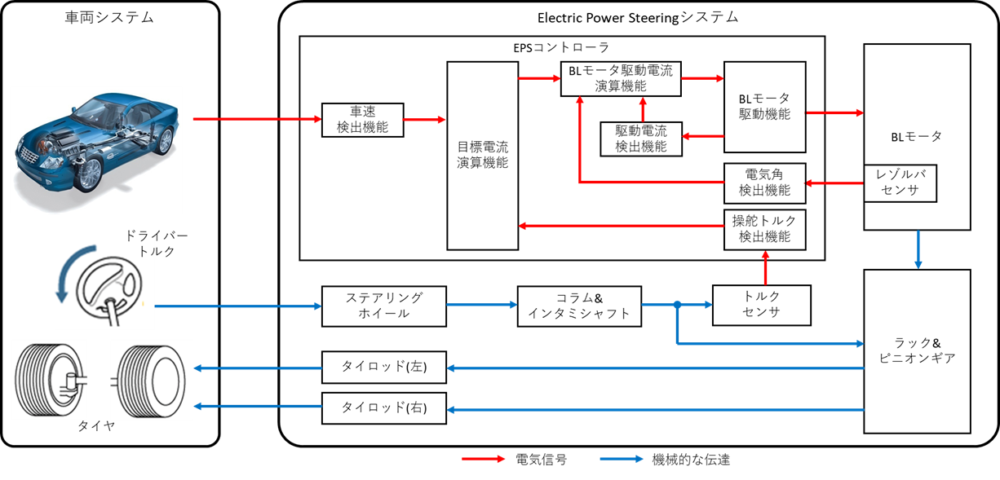
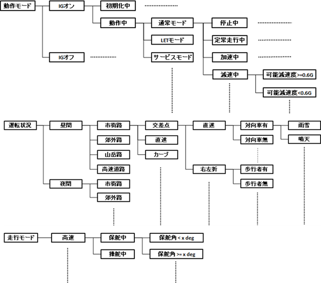
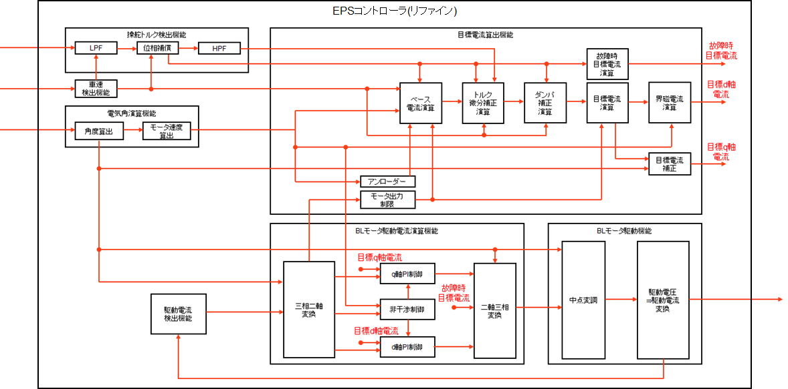

# 機能安全 — HARA と ISO 26262 安全要求導出

EPS システムを題材に、ISO 26262 Concept Phase (Part 3〜4) の HARA から HW/SW 安全要求導出までの一連のプロセスを説明する。

---

## 1. HARA とは何か

**HARA = Hazard Analysis and Risk Assessment（ハザード分析・リスクアセスメント）**

ISO 26262 の Concept Phase (Part 3) で実施される、安全要求を導出するための最も基本的な安全分析プロセス。

### HARA の目的

1. システムが引き起こしうる **ハザード（危険事象）** を網羅的に抽出
2. ハザードが事故に至る **シナリオ** を分析
3. シナリオごとに **ASIL（Automotive Safety Integrity Level）** を決定
4. ASIL を満たすための **安全目標（Safety Goal）** を定義

→ 後段の機能安全要求 (FSR)・技術安全要求 (TSR) のベースとなる。

### なぜ HARA が必要か

- 「故障が発生しても人を傷つけない」設計のため。バグゼロを目指すのではなく、故障が起きた前提で安全側にフェイルする設計を体系化する。
- 上位（製品仕様）から下位（HW/SW 実装）までトレーサビリティを確保する。
- 量産車載 ECU は ISO 26262 認証が事実上必須 → HARA は出発点。

### HARA を行わないとどうなるか

- どの機能を冗長化すべきか判断基準がない
- どの故障モードに対して何 ms 以内に安全状態に遷移すべきか定まらない
- 部品・コードのレビュー観点が「動くかどうか」だけになり、安全観点が抜ける
- 第三者監査 (TÜV, SGS 等) で認証取得不可

---

## 2. HARA の標準フロー

```
Step 1: アイテム定義 ──▶ Step 2: ハザード抽出 ──▶ Step 3: シナリオ分析
                                                          │
                                    Step 5: 安全目標導出 ◀── Step 4: ASIL 決定
                                          │
                                          ▼
                              FSR → TSR → HSR / SSR → 実装・テスト
```

### Step 1: アイテム定義 (Item Definition)

分析対象システムの境界・機能・動作モード・運転状況を明確化する。  
EPS の例：機能＝「車速に応じたアシスト力 〜Nm」、動作モード＝「走行中・停止中」、  
運転状況＝「市街地・高速道路・コーナリング」など。  
ここが曖昧だと以降の分析がブレる。

### Step 2: ハザード抽出

アイテムの機能ごとに「故障した場合の危険現象」を列挙する。  
手法: FMEA（故障モード影響解析）、HAZOP、ブレーンストーミング。  
EPS の例：「走行中にステアリングがロックする」「走行中にハンドルが急に重くなる」「走行中にハンドルが勝手に動く」など。

### Step 3: シナリオ分析

ハザード × 運転状況の組み合わせから事故に至るシナリオを記述する。  
例：「市街地交差点 + アシスト失陥 + 歩行者あり → 外側に膨らみ歩行者と衝突」。  
単一の故障モードでも、状況により事故の重大度が変わる点に注意。網羅性のため複数シナリオを必ず作成する。

### Step 4: ASIL 決定

シナリオごとに S（Severity）・E（Exposure）・C（Controllability）を割り当て、ASIL マトリクスで ASIL を決定（QM / A / B / C / D）。  
→ 詳細は [第 3 節](#3-asil-算出とデコンポジション) 参照。

### Step 5: 安全目標の導出

ハザードの否定形を「安全目標」として記述。FTTI（Fault Tolerant Time Interval：許容遅延）も併記する。  
例：「ステアリングロック」→「ロック状態を 100 ms 以内に解除する」

---

## 3. ASIL 算出とデコンポジション

### 3.1 3 つのパラメータ S / E / C

| パラメータ | 意味 | クラス |
|-----------|------|--------|
| **S (Severity)** | 事故が発生したときの被害規模 | S0〜S3 |
| **E (Exposure)** | ハザードが発生し得る運転状況の頻度 | E1〜E4 |
| **C (Controllability)** | ドライバが回避可能な確率 | C0〜C3 |

**Severity（AIS 尺度参考）**

| クラス | 内容 |
|--------|------|
| S0 | 安全関連でない損害（AIS 0 および AIS 1〜6 の確率が 10% 未満） |
| S1 | 軽度および中程度の障害（AIS 1〜6 の確率が 10% 以上） |
| S2 | 重度および生命を脅かす障害、生存の可能性がある（AIS 3〜6 の確率が 10% 以上） |
| S3 | 生命を脅かす障害・致命的（AIS 5〜6 の確率が 10% 以上） |

*AIS = Abbreviated Injury Scale（略式障害尺度）*

**Exposure（状況の尺度）**

| クラス | 内容 |
|--------|------|
| E1 | 規定なし。大多数のドライバーにとって年に一回未満しか発生しない状況。 |
| E2 | 平均動作時間の 1% 未満。大多数のドライバーにとって年に数回しか発生しない状況。 |
| E3 | 平均動作時間の 1〜10%。平均的なドライバーにとって年に一回以上発生する状況。 |
| E4 | 平均動作時間の 1% 超。ほとんどすべての運転中に発生する状況。 |

**Controllability（コントローラビリティ）**

| クラス | 内容 |
|--------|------|
| C0 | 大抵はコントロール可能。 |
| C1 | 容易にコントロール可能。99% 以上が通常危害を回避できる。 |
| C2 | 通常はコントロール可能。90% 以上が通常危害を回避できる。 |
| C3 | コントロールが困難またはコントロール不能。90% 未満が通常危害を回避できる。 |

### 3.2 ASIL マトリクス

S × E × C の組み合わせで ASIL を決定する。QM（Quality Management）は通常品質管理で十分であり安全関連でないことを意味する。ASIL D が最も厳しい。

| S | E | C1 | C2 | C3 |
|---|---|----|----|----|
| S1 | E1 | QM | QM | QM |
| S1 | E2 | QM | QM | QM |
| S1 | E3 | QM | QM | ASIL A |
| S1 | E4 | QM | ASIL A | ASIL B |
| S2 | E1 | QM | QM | QM |
| S2 | E2 | QM | QM | ASIL A |
| S2 | E3 | QM | ASIL A | ASIL B |
| S2 | E4 | ASIL A | ASIL B | ASIL C |
| S3 | E1 | QM | QM | ASIL A |
| S3 | E2 | QM | ASIL A | ASIL B |
| S3 | E3 | ASIL A | ASIL B | ASIL C |
| S3 | E4 | ASIL B | ASIL C | **ASIL D** |

### 3.3 ASIL デコンポジション（分解）

ASIL D の単一要素を 2 つの**独立した**要素に分解することで、各々の要求 ASIL を下げる手法。

| 分解パターン | 要素 1 | 要素 2 |
|-------------|--------|--------|
| ASIL D | ASIL B(D) | ASIL B(D) |
| ASIL D | ASIL C(D) | ASIL A(D) |
| ASIL D | ASIL D(D) | ASIL QM(D) |

条件：2 要素が「独立」であること（共通故障原因を持たないこと）。  
例：入力センサ系と監視（Watchdog）系を独立化すれば、各々 B(D) 設計で済む。

---

## 4. EPS への HARA 適用例

### 4.1 HARA の概念フロー

```
故障発生
   │
   ▼
ハザード："突然のセルフステア"
   │
   ├──▶ 状況の尺度："一般道路走行中" → E4
   ├──▶ コントローラビリティ:"ブレーキ等で回避を試みる" → C3
   └──▶ シビアリティ:"コントロールに失敗し重傷する" → S3
   │
   ▼
危険事象:"一般道路走行中の突然のセルフステアで周辺の他車に衝突"
   │
   ▼
ASIL D (S3 × E4 × C3)
```

### 4.2 ハザード抽出

定義したシステム構成図・機能から危険状態を抽出する。



*EPS のシステム構成図と各機能に対するハザードの対応関係。*

| 機能 | 故障内容 | ハザード |
|------|---------|---------|
| BL モータ駆動機能 | BL モータが一定の角度で固着する | 走行中にステアリングがロックする |
| 操舵トルク検出機能 | ドライバーの意図しない入力トルクを検出する | 走行中にステアリングが勝手に動く |
| 操舵トルク検出機能 | ドライバーの入力トルクを検出できずアシストが OFF | 走行中にハンドルが急に重くなる |
| 車速検出機能 | 検出した車速が実際の値と異なる | 走行中にハンドルが重くなる |
| 電気角検出機能 | 検出した電気角が実際の値と異なりモータを適切に駆動できない | 走行中にハンドルがフラフラする |
| 操舵トルク検出機能 | 入力トルクを正確に検出できずアシスト量が小さい | 走行中、操舵の切り出しが重い |
| 駆動電流検出機能 | モータ駆動電流を正確に検出できず電流 F/B 量が演算できない | 走行中、操舵の戻りが悪い |
| 操舵トルク検出機能 | 入力トルクを正確に検出できずアシスト量が大きい | 走行中、操舵の切り出しが異常に軽い |
| 操舵トルク検出機能 | 検出した入力トルクが回転方向によってバラつく | 走行中、左右の操舵にアンバランスがある |

### 4.3 シナリオ分析

ハザードと運転状況の組み合わせから、事故に至るシナリオを作成する。  
「状況」は「動作モード」「運転状況」から考慮し、定型でなくブレーンストーミングで洗い出す。



*左：ハザードと状況分析の入力。右：事故に至るシナリオ作成の流れ。*

| ハザード | 状況 | 事故に至るシナリオ |
|---------|------|-----------------|
| 走行中にハンドルが急に重くなる | 市街地交差点で周囲に歩行者あり | 左右折にアシスト失陥し、外側に膨らみ歩行者と衝突 |
| 走行中にハンドルが急に重くなる | 直線路で対向車あり | アシスト失陥しても直進中であり影響はない |
| 走行中にハンドルが急に重くなる | コーナ走行（旋回 G：0.x G 以上）中 | 市街地コーナ走行中にアシスト失陥し、対向車線にはみ出して対向車や障害物と衝突 |

### 4.4 ASIL レベルの抽出

| ハザード | 状況 | E | C | S | ASIL |
|---------|------|---|---|---|------|
| 走行中にステアリングがロックする | 一般路での旋回中 | E4 | C3 | S3 | **ASIL-D** |
| 走行中にステアリングが勝手に動く | 一般路での走行中 | E4 | C3 | S3 | **ASIL-D** |
| 走行中にハンドルが急に重くなる | 一般路での旋回中 | E4 | C3 | S3 | **ASIL-D** |
| 走行中にハンドルが重くなる | 一般路での走行中 | E4 | C2 | S2 | ASIL-B |
| 走行中にハンドルがフラフラする | 一般路での走行中 | E4 | C2 | S3 | ASIL-C |
| 走行中、操舵の切り出しが重い | 一般路での走行中 | E4 | C2 | S3 | ASIL-B |
| 走行中、操舵の戻りが悪い | 一般路での走行中 | E4 | C2 | S0 | QM |
| 走行中、操舵の切り出しが異常に軽い | 一般路での走行中 | E4 | C2 | S3 | ASIL-C |
| 走行中、左右の操舵にアンバランスがある | 一般路での走行中 | E4 | C2 | S3 | ASIL-C |

### 4.5 安全目標の抽出

安全目標＝**危険事象の否定形**。FTTI（Fault Tolerant Time Interval）も併記する。

> ※ FTTI の値は参考値

| ハザード | 安全目標 | FTTI | ASIL | 安全状態 |
|---------|---------|------|------|---------|
| 走行中にステアリングがロックする | ステアリングのロック状態を解除して安全な状態を保つ | 100 ms | D | モータアシストの停止、車両の停止 |
| 走行中にステアリングが勝手に動く | セルフステアリングの状態を解除して安全状態を保つ | 100 ms | D | モータアシストの停止、車両の停止 |
| 走行中にハンドルが急に重くなる | 唐突なアシスト失陥が発生しても安全状態を保つ | 100 ms | D | モータアシストの停止、車両の停止 |
| 走行中にハンドルが重くなる | アシスト失陥が発生しても安全な状態を保つ | 100 ms | B | モータアシストの停止、車両の停止 |
| 走行中にハンドルがフラフラする | アシストの不安定を解除して安全な状態を保つ | 100 ms | C | モータアシストの停止、車両の停止 |
| 走行中、操舵の切り出しが重い | アシスト遅延が発生しても安全な状態を保つ | 100 ms | B | モータアシストの停止、車両の停止 |
| 走行中、操舵の戻りが悪い | 意図しないアシストが発生しても安全な状態を保つ | 200 ms | QM | アシスト量を抑制する、車両の停止 |
| 走行中、操舵の切り出しが異常に軽い | 過剰なアシストを解除して安全な状態を保つ | 100 ms | C | モータアシストの停止、車両の停止 |
| 走行中、左右の操舵にアンバランスがある | アシストの不安定が発生しても安全な状態を保つ | 100 ms | C | モータアシストの停止、車両の停止 |

---

## 5. 安全要求の導出フロー

```
安全目標 (SG)
   │
   ▼ [ASIL デコンポジション適用]
機能安全要求 (FSR) ← Part 3
   │
   ▼
技術安全要求 (TSR) ← Part 4
   │
   ├──▶ ハードウェア安全要求 (HSR) ← Part 5
   └──▶ ソフトウェア安全要求 (SSR) ← Part 6
              │
              ▼
         実装・テスト・検証
```

ここまでが Part 4 までの流れ。導出した HSR, SSR を元に、Part 5, Part 6 のフェーズに移行する。

### 5.1 機能安全要求 (FSR) の導出

安全目標に ASIL デコンポジションを適用し、機能レベルの要求（FSR）を導出する。

| 安全目標 | ASIL | FSR ID | ASIL (分解後) | 機能安全要求 |
|---------|------|--------|--------------|------------|
| ステアリングが勝手に動かない | D | FSR2.1 | B(D) | ドライバートルク入力の検出における機能不全は検出され、安全状態へ導かなければならない |
| 同上 | D | FSR2.2 | B(D) | 目標電流の算出における機能不全は検出され、安全状態へ導かなければならない |
| 同上 | D | FSR2.3 | B(D) | BL モータ駆動における機能不全は検出され、安全状態へ導かなければならない |

### 5.2 技術安全要求 (TSR) の導出

FSR を具体的なシステム技術要求（TSR）へ分解する。

| FSR ID | 機能安全要求 | TSR ID | 技術安全要求 |
|--------|------------|--------|------------|
| FSR2.1 | ドライバートルク入力の検出における機能不全は検出され、安全状態へ導かなければならない | TSR2.1.1 | ドライバートルクの入力信号の異常を判定すること |
|  |  | TSR2.1.2 | 異常を検知した場合、モータアシストを停止すること |
|  |  | TSR2.1.3 | 異常を検知した場合、ドライバーに異常を通知すること |
| FSR2.2 | 目標電流の算出における機能不全は検出され、安全状態へ導かなければならない | TSR2.2.1 | ウォッチドッグにより、演算機能の実行を監視すること |
|  |  | TSR2.2.2 | ウォッチドッグが異常を検知した場合、モータアシストを停止すること |
|  |  | TSR2.2.3 | ウォッチドッグが異常を検知した場合、ドライバーに異常を通知すること |
| FSR2.3 | BL モータ駆動における機能不全は検出され、安全状態へ導かなければならない | TSR2.3.1 | 許容値を超えた電流を出力しないこと |
|  |  | TSR2.3.2 | 電流の出力をシャットダウンする機能を有すること |

### 5.3 HW/SW 安全要求 (HSR / SSR) の導出

TSR を HW 要求（HSR）と SW 要求（SSR）に分解し、HSI（Hardware-Software Interface）仕様に落とし込む。



*HSI 仕様：入出力・バスインターフェース・ピン割付と、各 I/F の SW/HW 文書への参照関係。*

**HSI 仕様の構成例（操舵トルク入力の場合）**

- HW：センサ xxx（0.2〜4.8 V の電圧範囲で検出する回路）
- SW：操舵トルク検出機能 yyy への入力（0.2 V 未満・4.8 V 以上は異常値として判定）
- I/F：マイコンの 12 bit ADC（ポート z 経由）

| TSR ID | 技術安全要求 | HSR/SSR ID | HW/SW 要求 |
|--------|------------|-----------|-----------|
| TSR2.1.1 | ドライバートルクの入力信号の異常を判定すること | HSR2.1.1.1 | 操舵トルクは 0.2〜4.8 V の電圧範囲で検出する回路を有すること |
|  |  | SSR2.1.1.1 | 0.2 V 未満・4.8 V 以上の電圧は異常入力として判定する機能を有すること |
| TSR2.1.2 | 異常を検知した場合、モータアシストを停止すること | HSR2.1.2.1 | バッテリーから BL モータ駆動回路への電源供給を停止するリレー回路を有すること |
|  |  | SSR2.1.2.1 | ドライバートルクの異常値を 20 ms 間検知した場合、電源供給用リレー回路をオフする機能を有すること |
| TSR2.1.3 | 異常を検知した場合、ドライバーに異常を通知すること | HSR2.1.3.1 | 表示パネルに異常を通知するための CAN 通信機能を有すること |
|  |  | SSR2.1.3.1 | ドライバートルクの異常値を 20 ms 間検知した場合、CAN 通信経由でドライバーに通知する機能を有すること |

---

## まとめ：HARA〜安全要求導出フローの概観

| フェーズ | 成果物 | ISO 26262 Part |
|---------|--------|---------------|
| アイテム定義 | アイテム定義書 | Part 3 |
| ハザード抽出 | ハザードリスト | Part 3 |
| シナリオ分析 | シナリオ表 | Part 3 |
| ASIL 決定 | ASIL 評価表 | Part 3 |
| 安全目標導出 | 安全目標リスト（FTTI 付き） | Part 3 |
| 機能安全要求導出 | FSR 仕様書 | Part 3 |
| 技術安全要求導出 | TSR 仕様書 | Part 4 |
| HW/SW 安全要求導出 | HSR / SSR / HSI 仕様書 | Part 5 / Part 6 |

---

## 関連ドキュメント

- [`eps.md`](eps.md) — EPS 機構・アシストマップ・制御ブロック図
- [`foc.md`](foc.md) — ベクトル制御 (FOC) の原理
- [`motor-model.md`](motor-model.md) — モータの電気・機械方程式
