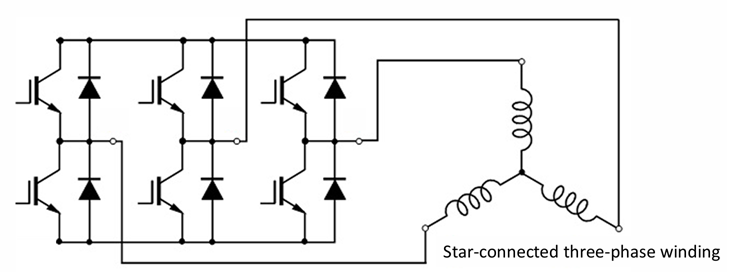

# PWM・三相インバータ・中点変調

`02` 以降のモデルが扱う **PWM インバータ駆動** と **中点変調** を説明する。コード上は `motor_controller.cpp` の PWM 換算部、および `motor_vector_conv.cpp` の中点変調関数に対応する。

---

## 1. 三相インバータと PWM

実機では、DC リンク電圧 $V_{dc}$ を三相ブリッジ回路 (6 個のスイッチング素子) でスイッチングし、任意の三相電圧を作り出す。各相のスイッチを高速に ON/OFF し、その **デューティ比** (ON 時間の割合) で等価的な電圧を制御する方式が **PWM (パルス幅変調)** である。



*6 個の FET (IGBT) で構成される三相ブリッジ回路。各相に上アーム・下アームがある。右は Y 結線された三相コイル。*

三角波キャリアと電圧指令を比較してパルス列を生成する。本コードのキャリア周波数は **40 kHz** (周期 25 µs) である。

### PWM デューティとデッドタイム

三相正弦波駆動では、全上・下アーム FET の PWM デューティを 50 % の均衡がとれた状態から駆動を開始する。

- 任意の相に + 側の電流を通電する場合 → デューティ 50〜95 % で出力
- − 側の電流を通電する場合 → デューティ 5〜50 % で出力

5 % のマージンは **デッドタイム** のためである。同相の上・下アーム FET を同時に ON にすると短絡が発生するため、両方 OFF になる期間をわずかに挿入する。

---

## 2. A 型・B 型モデルの違い

| モデル | 駆動方式 | 印加電圧の上限 | 用途 |
|--------|----------|----------------|------|
| `01`/`02` 理想電圧源 (A 型) | PI 出力をそのまま印加 | なし (無制限) | FOC ループの純粋な理解 |
| `03` 以降 PWM (B 型) | PI 出力をデューティ比に換算 | あり ($V_{dc}$ で制限) | 実機 ECU に近い教材 |

A 型と B 型は起動から $t \approx 0.59\,\mathrm{s}$ までは $i_q$・$T_e$・$\omega$ が完全に一致する。差が出るのは $\omega$ が十分上がってから以降のみである。

---

## 3. 逆起電力による回転数の頭打ち

q 軸の電圧バランスは定常状態で次のようになる。

$$
v_q = R i_q + K_e \omega_m
$$

モータが回転すると逆起電力 $K_e \omega_m$ が増大し、印加できる電圧の上限に達すると、それ以上 $i_q$ を流せなくなる。結果として回転数が頭打ちになる。これは PWM 駆動モデル特有の、現実的な挙動である。

A 型は理想電圧源で上限がないため、$\omega$ はさらに伸びる。実測 ($t = 5\,\mathrm{s}$): $\omega$ は 144.8 → 132.1 rad/s (約 9 % 減)、$i_q$ は 85.0 → 84.6 A。

---

## 4. 中点変調 (零相注入 / SVPWM)

通常の正弦波 PWM では $V_{dc}/2$ が相電圧ピークの限界だが、**三相の中性点電位をシフト** することで、線間電圧を変えずに相電圧ピークを下げられる。これにより、同じ $V_{dc}$ でより大きな基本波振幅を出せる。

本コードが採用するのは **min-max 方式** (空間ベクトル変調 SVPWM と等価) である。

$$
v_{zero} = -\frac{\max(v_U, v_V, v_W) + \min(v_U, v_V, v_W)}{2}
$$

$$
v_U' = v_U + v_{zero}, \quad v_V' = v_V + v_{zero}, \quad v_W' = v_W + v_{zero}
$$

### 効果

- 線間電圧は変化しない → **モータのトルクは変わらない**
- 相電圧のピークが下がる → 同じ $V_{dc}$ で基本波振幅を $\dfrac{2}{\sqrt{3}} \approx 1.155$ 倍 (約 15.5%) まで拡張できる
- 結果として、電圧飽和で頭打ちになっていた回転数・電流が改善する

実測例 (`02` モデル、$i_q^* = 85\,\mathrm{A}$):

| 条件 | $v_{rms}$ | $\omega$ 定常値 | $i_q$ 定常値 |
|------|-----------|-----------------|--------------|
| 中点変調 OFF | 10.96 V | 132.1 rad/s | 84.62 A |
| 中点変調 ON | 12.66 V (+15.5%) | 144.8 rad/s (+9.6%) | 85.00 A (指令到達) |

---

## 5. 電流ドロップの診断 (85 A → 84 A)

### 症状

`--iq_ref 85` で実行すると定常電流が約 **84.62 A** にとどまり、指令値 85 A に到達しない。

### 根本原因: PWM 電圧飽和

`motor_controller.cpp` の PWM デューティ換算は、q 軸電流指令から固定的に $v_{\text{peak}}$ を算出する。

$$
\text{duty} = \text{clamp}\!\left(\frac{|i_q^*|}{k_{\text{PwmMaxAmp}}},\, 0,\, 1\right) \times k_{\text{PwmMaxDuty}}
$$

$$
v_{\text{peak}} = \text{duty} \times \frac{V_{dc}}{2}
$$

デフォルトパラメータ ($i_q^* = 85\,\mathrm{A}$、$k_{\text{PwmMaxAmp}} = 125\,\mathrm{A}$、$k_{\text{PwmMaxDuty}} = 0.95$、$V_{dc} = 48\,\mathrm{V}$) を代入すると:

$$
v_{\text{peak}} = \frac{85}{125} \times 0.95 \times \frac{48}{2} = 15.504\,\mathrm{V}
$$

一方、85 A を定常的に流すには逆起電力を含む q 軸電圧が必要となる。

$$
v_{q,\text{required}} = R i_q + K_e \omega_{ss} = 0.1 \times 85 + 0.0533 \times 144.8 \approx 8.50 + 7.72 = 16.22\,\mathrm{V}
$$

$v_{q,\text{required}} (16.22\,\mathrm{V}) > v_{\text{peak}} (15.504\,\mathrm{V})$ のため PI 出力がクランプされ、電流は指令値に届かない。

### 定常落ち着き点の確認

クランプ後に定常状態が成立する条件は $v_q = v_{\text{peak}}$ であるため:

$$
R i_{q,ss} + K_e \omega_{ss} = 15.504\,\mathrm{V}
$$

CSV データ ($i_{q,ss} \approx 84.62\,\mathrm{A}$、$\omega_{ss} \approx 132.1\,\mathrm{rad/s}$) で検証すると:

$$
0.1 \times 84.62 + 0.0533 \times 132.1 = 8.46 + 7.04 = 15.50\,\mathrm{V} \checkmark
$$

$v_{\text{peak}}$ とぴったり一致し、電圧クランプが原因であることが確認できる。

### 解決策

| 方法 | コマンド例 | 効果 |
|------|-----------|------|
| 中点変調を有効化 | `./BrushlessDCMotor --midpoint` | $v_{\text{peak}}$ が $2/\sqrt{3}$ 倍 → 17.91 V。16.22 V を十分カバー |
| DC 電圧を上げる | `./BrushlessDCMotor --vdc 55` | $V_{dc}$ 上昇に比例して $v_{\text{peak}}$ が増加 |
| `kPwmMaxDuty` を上げる | `sim_params.hpp` を編集 | デューティ上限の緩和 (実機では熱設計と要相談) |

---

## 6. PWM デューティ換算

`motor_controller.cpp` では、q 軸電流指令から PWM デューティ比を線形換算する。

$$
v_{\text{peak}} = \text{clamp}\!\left(\frac{|i_q^*|}{k_{\text{PwmMaxAmp}}},\, 0,\, 1\right) \times k_{\text{PwmMaxDuty}} \times \frac{V_{dc}}{2} \times \begin{cases} \frac{2}{\sqrt{3}} & \text{(中点変調 ON)} \\ 1 & \text{(中点変調 OFF)} \end{cases}
$$

`kPwmMaxAmp` は最大デューティに対応する電流、`kPwmMaxDuty` はデューティ比の上限 (95 %) である。

---

## 7. 実装上のスイッチ (中点変調)

中点変調は実行時フラグで切り替えられる (既定 OFF)。

```sh
./BrushlessDCMotor --midpoint
```

`scripts/compare_modulation.py` で ON/OFF の波形を比較できる。

コード上は `MotorVectorConv::apply_midpoint_modulation()` が零相注入を行い、`MotorController::compute()` がフラグに応じて適用する。中点変調 ON のときは PWM デューティ換算でも電圧利用率の拡張 ($2/\sqrt{3}$ 倍) を反映する。

---

## 関連ドキュメント

- [`foc.md`](foc.md) — ベクトル制御 (FOC) の原理
- [`coordinate-transform.md`](coordinate-transform.md) — Clarke / Park 変換
- [`motor-model.md`](motor-model.md) — モータの電気・機械方程式
- [`waveform-analysis.md`](waveform-analysis.md) — 実測ベースの波形差解析
