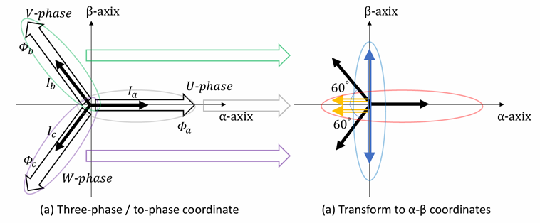
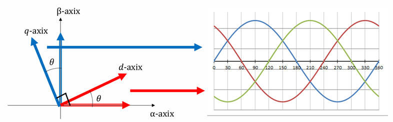

# Coordinate Transforms — Clarke Transform and Park Transform

This document explains the mathematics of the coordinate transforms used in Field-Oriented Control. In the code this corresponds to `motor_vector_conv.{hpp,cpp}`.  
The transform is performed in two stages.

```
Three-phase UVW ──[Clarke transform]──▶ Two-phase αβ (stationary frame) ──[Park transform]──▶ dq (rotating frame)
```

---

## 1. What Are the d-axis and q-axis

In three-phase brushless motor control, it is common to decompose the three-phase AC components into two axes, the **d-axis (Direct Axis)** and the **q-axis (Quadrature Axis)**, and to apply feedback control.

| Axis | Name | Role |
|----|------|------|
| d-axis | Direct Axis | Same direction as the rotor flux. Does not contribute to torque. Used in field-weakening control |
| q-axis | Quadrature Axis | Orthogonal to the flux. **The torque-producing component** |

The RMS value of the three-phase components is not equal to the q-axis current. When a d-axis component exists (as in field weakening, etc.), the RMS calculation differs.


*The UVW three-phase AC consists of sinusoids offset from each other by 120°. Converting them into the DC quantities of the d- and q-axes allows PI control to be applied.*

---

## 2. Clarke Transform (Three-phase → Two-phase αβ)

The three-phase UVW quantities are transformed into the **stationary reference frame** of two mutually orthogonal axes, α and β.  
This code uses the **power-invariant form** ($k = \sqrt{2/3}$).

Projecting each of the three phase axes onto the unit vectors at 0°, 120°, and 240° yields the αβ components (the 3-sensor version).

$$
\begin{bmatrix} i_\alpha \cr i_\beta \end{bmatrix} = \sqrt{\frac{2}{3}} \begin{bmatrix} 1 & -\dfrac{1}{2}       & -\dfrac{1}{2}      \cr 0 & \dfrac{\sqrt{3}}{2} & -\dfrac{\sqrt{3}}{2} \end{bmatrix} \begin{bmatrix} i_U \cr i_V \cr i_W \end{bmatrix}
$$

When the three phases are balanced ($i_U + i_V + i_W = 0$), the zero-sequence component becomes 0, and the expression above can be fully represented by its two rows.



*(a) The relationship between the three-phase UVW coordinate system and the αβ coordinate system. (b) How the three-phase current vector is projected onto the α and β axes.*

### 2.1 Derivation of the Scale Factor — Absolute Transform Condition

The following is the basic projection expression, which is still a **relative transform**. For the inverse transform to return the original values, the condition of an **absolute transform** must be satisfied.

Define the transform matrix with a scale factor $k$.

$$
[C_{abc}] = k \begin{bmatrix} \cos 0°  & \cos 120°  & \cos 240° \cr \sin 0°  & \sin 120°  & \sin 240° \end{bmatrix}, \qquad [C_{\alpha\beta}] = k \begin{bmatrix} \cos 0°  & \cos 120°  & \cos 240° \cr \sin 0°  & \sin 120°  & \sin 240° \end{bmatrix}^{T}
$$

From the condition that multiplying $[C_{abc}]$ by the inverse transform $[C_{\alpha\beta}]$ gives the identity matrix,

$$
[C_{abc}][C_{\alpha\beta}] = [1]
$$

expanding the left-hand side and substituting the numerical values gives

$$
k^2 \begin{bmatrix} 1 & -\dfrac{1}{2}       & -\dfrac{1}{2}      \cr 0 & \dfrac{\sqrt{3}}{2} & -\dfrac{\sqrt{3}}{2} \end{bmatrix} \begin{bmatrix} 1             & 0                   \cr -\dfrac{1}{2} & \dfrac{\sqrt{3}}{2} \cr -\dfrac{1}{2} & -\dfrac{\sqrt{3}}{2} \end{bmatrix} = k^2 \begin{bmatrix} \dfrac{3}{2} & 0            \cr 0            & \dfrac{3}{2} \end{bmatrix} = [1]
$$

Therefore,

$$
\boxed{k = \sqrt{\frac{2}{3}}}
$$

The transform matrix is thus determined as follows.

$$
[C_{abc}] = \sqrt{\frac{2}{3}} \begin{bmatrix} 1 & -\dfrac{1}{2}       & -\dfrac{1}{2}      \cr 0 & \dfrac{\sqrt{3}}{2} & -\dfrac{\sqrt{3}}{2} \end{bmatrix}
$$

### 2.2 Simplification to a Two-sensor Setup

Substituting $i_V = -(i_U + i_W)$, from $i_U + i_V + i_W = 0$, completes the αβ transform using **only the two components of the U-phase and W-phase**.

**α component:**

$$
i_\alpha = \sqrt{\frac{2}{3}} \left( i_U - \frac{1}{2}\bigl(-(i_U + i_W)\bigr) - \frac{1}{2} i_W \right) = \sqrt{\frac{2}{3}} \cdot \frac{3}{2}\thinspace  i_U
$$

**β component:**

$$
i_\beta = \sqrt{\frac{2}{3}} \left( \frac{\sqrt{3}}{2}\bigl(-(i_U + i_W)\bigr) - \frac{\sqrt{3}}{2}\thinspace  i_W \right) = \sqrt{\frac{2}{3}} \left( -\frac{\sqrt{3}}{2}\thinspace  i_U - \sqrt{3}\thinspace  i_W \right)
$$

$$
\boxed{ \begin{bmatrix} i_\alpha \cr i_\beta \end{bmatrix} = \sqrt{\frac{2}{3}} \begin{bmatrix} \dfrac{3}{2}           & 0       \cr -\dfrac{\sqrt{3}}{2}   & -\sqrt{3} \end{bmatrix} \begin{bmatrix} i_U \cr i_W \end{bmatrix} }
$$

> In hardware, only the U- and W-phases need to be sensed, allowing one current sensor to be eliminated.

### 2.3 Inverse Clarke Transform (αβ → UVW)

$$
i_U = i_\alpha, \quad i_V = -\frac{1}{2}i_\alpha + \frac{\sqrt{3}}{2}i_\beta, \quad i_W = -\frac{1}{2}i_\alpha - \frac{\sqrt{3}}{2}i_\beta
$$

---

## 3. Park Transform (Two-phase αβ → Rotating dq)

The stationary coordinates αβ are transformed into a dq coordinate system that rotates at the electrical angle $\theta$. This turns the sinusoidal AC quantities into **DC quantities**.

$$
\begin{bmatrix} i_d \cr i_q \end{bmatrix} = \begin{bmatrix} \cos\theta & -\sin\theta \cr \sin\theta & \cos\theta \end{bmatrix} \begin{bmatrix} i_\alpha \cr i_\beta \end{bmatrix}
$$

Here $\theta$ is the **electrical angle**, which is the mechanical angle $\theta_m$ multiplied by the number of pole pairs $P_n$ ($\theta_e = P_n \cdot \theta_m$).


*Transforms from the fixed αβ coordinates to the dq rotating coordinates rotated by the electrical angle θ. Because it rotates in synchronism with the rotor, the sinusoid appears as a DC quantity.*

### 3.1 Direct Three-phase-to-Two-axis Transform — Combining Clarke + Park

Multiplying the αβ expression from Section 2.2 by the Park rotation matrix gives

$$
\begin{bmatrix} i_d \cr i_q \end{bmatrix} = \sqrt{\frac{2}{3}} \underbrace{ \begin{bmatrix} \cos\theta & -\sin\theta \cr \sin\theta &  \cos\theta \end{bmatrix} }_{\text{rotation matrix}} \begin{bmatrix} \dfrac{3}{2}           & 0       \cr -\dfrac{\sqrt{3}}{2}   & -\sqrt{3} \end{bmatrix} \begin{bmatrix} i_U \cr i_W \end{bmatrix}
$$

Organizing the transform matrix via the angle-addition formulas yields the following **three-phase-to-two-axis transform expression**.

$$
\begin{bmatrix} i_d \cr i_q \end{bmatrix} = \sqrt{2} \begin{bmatrix} \cos\theta & -\sin\theta \cr \sin\theta &  \cos\theta \end{bmatrix} \begin{bmatrix} \dfrac{\sqrt{3}}{2} & 0  \cr -\dfrac{1}{2}        & -1 \end{bmatrix} \begin{bmatrix} i_U \cr i_W \end{bmatrix} = \sqrt{2} \begin{bmatrix} \sin\negthinspace \left(\theta + \dfrac{2}{3}\pi\right)   & -\sin(\theta)                              \cr -\sin\negthinspace \left(\theta + \dfrac{1}{6}\pi\right)  & -\sin\negthinspace \left(\theta + \dfrac{1}{2}\pi\right) \end{bmatrix} \begin{bmatrix} i_U \cr i_W \end{bmatrix}
$$

Multiplying by the RMS conversion factor $\sqrt{\dfrac{1}{3}}$ to correct the three-phase AC components into DC components (see [Section 4](#4-rms-effective-value-conversion) for the reason) gives

$$
\boxed{ \begin{bmatrix} i_d \cr i_q \end{bmatrix} = \sqrt{\frac{2}{3}} \begin{bmatrix} \sin\negthinspace \left(\theta + \dfrac{2}{3}\pi\right)   & -\sin(\theta)                              \cr -\sin\negthinspace \left(\theta + \dfrac{1}{6}\pi\right)  & -\sin\negthinspace \left(\theta + \dfrac{1}{2}\pi\right) \end{bmatrix} \begin{bmatrix} i_U \cr i_W \end{bmatrix} }
$$

### 3.2 Inverse Park Transform (dq → αβ)

Given by the transpose (= inverse) of the rotation matrix.

$$
\begin{bmatrix} i_\alpha \cr i_\beta \end{bmatrix} = \begin{bmatrix} \cos\theta & \sin\theta \cr -\sin\theta & \cos\theta \end{bmatrix} \begin{bmatrix} i_d \cr i_q \end{bmatrix}
$$

Returning dq → αβ with the inverse Park transform, and then converting αβ → UVW with the inverse Clarke transform, allows the result to be output as three-phase PWM voltage.



*The DC command values of the dq axes are converted, via αβ, into three-phase sinusoids. The graph on the right shows the three-phase voltage waveforms after the inverse transform.*

---

## 4. RMS (Effective Value) Conversion

The three-phase-to-two-phase transform can be expressed in vector space as follows.

$$
i_{\alpha\beta} = \sqrt{\frac{2}{3}} \left( i_U + e^{j\frac{2\pi}{3}} i_V + e^{j\frac{4\pi}{3}} i_W \right)
$$

Letting the RMS value be $i$, the current per phase is

$$
i_U = \sqrt{2}\thinspace  i \cos(\omega t), \qquad i_V = \sqrt{2}\thinspace  i \cos\negthinspace \left(\omega t + \frac{2\pi}{3}\right), \qquad i_W = \sqrt{2}\thinspace  i \cos\negthinspace \left(\omega t + \frac{4\pi}{3}\right)
$$

Rewriting with Euler's formula $\cos(\omega t) = \dfrac{e^{j\omega t} + e^{-j\omega t}}{2}$ and substituting gives

$$
i_{\alpha\beta} = \sqrt{\frac{2}{3}} \sqrt{2}\thinspace  i \left( \frac{3}{2}\thinspace  e^{j\omega t} + \frac{1}{2}\thinspace  e^{-j\omega t} \negthinspace \left(1 + e^{j\frac{4\pi}{3}} + e^{j\frac{8\pi}{3}}\right) \right)
$$

The parenthesized term $1 + e^{j\frac{4\pi}{3}} + e^{j\frac{8\pi}{3}}$ becomes 0 by the symmetry of the trigonometric functions, so

$$
i_{\alpha\beta} = \sqrt{3}\thinspace  i\thinspace  e^{j\omega t}
$$

> **Conclusion:** The current after the three-phase-to-two-phase transform becomes $\sqrt{3}$ times the RMS value, so it is necessary to multiply by $\sqrt{\dfrac{1}{3}}$.

Note that when a d-axis component exists (as in field weakening, etc.), the relationship is no longer a simple proportion.

---

## 5. Derivation of the Inverse Transform — dq → Three-phase

The two-axis (d, q) → three-phase (U, V, W) transform is explained below.

We find the inverse of the forward transform expression obtained in Section 3.1.

$$
\begin{bmatrix} i_d \cr i_q \end{bmatrix} = \sqrt{\frac{2}{3}} \begin{bmatrix} \sin\negthinspace \left(\theta + \dfrac{2}{3}\pi\right)   & -\sin(\theta)                              \cr -\sin\negthinspace \left(\theta + \dfrac{1}{6}\pi\right)  & -\sin\negthinspace \left(\theta + \dfrac{1}{2}\pi\right) \end{bmatrix} \begin{bmatrix} i_U \cr i_W \end{bmatrix}
$$

**Compute the determinant.**

$$
\det A = \sin\negthinspace \left(\theta + \frac{2}{3}\pi\right) \cdot \left(-\sin\negthinspace \left(\theta + \frac{1}{2}\pi\right)\right) - \left(-\sin(\theta)\right) \cdot \left(-\sin\negthinspace \left(\theta + \frac{1}{6}\pi\right)\right)
$$

Expanding with the angle-addition formulas (expanding $\sin(\theta+\frac{2}{3}\pi)\cos\theta - \sin\theta\sin(\theta+\frac{1}{6}\pi)$, and using the orthogonality of the trigonometric functions) gives

$$
\det A = -\frac{\sqrt{3}}{2}
$$

**Assemble the inverse matrix.**

$$
\begin{bmatrix} i_U \cr i_W \end{bmatrix} = \sqrt{\frac{3}{2}} \cdot \frac{1}{-\dfrac{\sqrt{3}}{2}} \begin{bmatrix} -\sin\negthinspace \left(\theta + \dfrac{1}{2}\pi\right) & \sin(\theta)                   \cr \sin\negthinspace \left(\theta + \dfrac{1}{6}\pi\right)  & \sin\negthinspace \left(\theta + \dfrac{2}{3}\pi\right) \end{bmatrix} \begin{bmatrix} i_d \cr i_q \end{bmatrix}
$$

Organize the scale factor.

$$
\sqrt{\frac{3}{2}} \cdot \left(-\frac{2}{\sqrt{3}}\right) = -\frac{2}{\sqrt{2}} = -\sqrt{2}
$$

From the above,

$$
\boxed{ \begin{bmatrix} i_U \cr i_W \end{bmatrix} = -\sqrt{2} \begin{bmatrix} -\sin\negthinspace \left(\theta + \dfrac{1}{2}\pi\right) & \sin(\theta)                   \cr \sin\negthinspace \left(\theta + \dfrac{1}{6}\pi\right)  & \sin\negthinspace \left(\theta + \dfrac{2}{3}\pi\right) \end{bmatrix} \begin{bmatrix} i_d \cr i_q \end{bmatrix} }
$$

The remaining $i_V$ is computed from $i_V = -(i_U + i_W)$.

---

## 6. Vector Transform Flow

Feedback control is applied to the dq-axis currents so that they track the target control quantities.

```
Three-phase current UVW
   │
   ▼ [Clarke transform]
αβ current (stationary frame)
   │
   ▼ [Park transform (uses electrical angle θ)]
dq current (rotating frame) ◀── feedback error
   │
   ▼ [dq-axis PI control]
dq voltage command
   │
   ▼ [inverse Park transform]
αβ voltage
   │
   ▼ [inverse Clarke transform]
Three-phase PWM voltage UVW ──▶ motor
```

* In practice, the dq current values are converted into the duty ratio of the PWM signal and applied to the motor through a three-phase bridge circuit.

---

## 7. Why Split Into Two Stages

Although one could compose the Clarke transform and the Park transform into a single transform matrix from UVW to dq, splitting it into two stages has advantages.

- **The αβ stationary coordinates do not depend on the angle** — in sensorless control, the induced voltage is first estimated in αβ, and the angle is obtained from its phase. The Clarke transform alone can be performed without the angle (see [`sensorless.md`](sensorless.md))
- The physical meaning of each transform becomes clear, making debugging easier

In this code, `uvw_to_dq()` composes the two stages internally, and `uvw_to_alphabeta()` (Clarke transform only) is also provided separately for sensorless use.

---

## 8. Correspondence with the Code

The Clarke / Park transforms are implemented as static functions in `motor_vector_conv.cpp`.

```cpp
// UVW → dq (composes Clarke + Park)
Eigen::Vector2d MotorVectorConv::uvw_to_dq(const Eigen::Vector3d& uvw, double deg);

// dq → UVW (inverse Park + inverse Clarke)
Eigen::Vector3d MotorVectorConv::dq_to_uvw(const Eigen::Vector2d& dq, double deg);

// UVW → αβ (Clarke transform only; for the sensorless observer)
Eigen::Vector2d MotorVectorConv::uvw_to_alphabeta(const Eigen::Vector3d& uvw);
```

The angle argument `deg` is the electrical angle in degrees.

---

## Summary: List of Transform Equations

| Transform | Equation |
|------|-----|
| **Three-phase → αβ (3 sensors)** | $\begin{bmatrix}i_\alpha\cr i_\beta\end{bmatrix}=\sqrt{\frac{2}{3}}\begin{bmatrix}1&-\frac{1}{2}&-\frac{1}{2}\cr0&\frac{\sqrt{3}}{2}&-\frac{\sqrt{3}}{2}\end{bmatrix}\begin{bmatrix}i_U\cr i_V\cr i_W\end{bmatrix}$ |
| **Three-phase → αβ (2 sensors)** | $\begin{bmatrix}i_\alpha\cr i_\beta\end{bmatrix}=\sqrt{\frac{2}{3}}\begin{bmatrix}\frac{3}{2}&0\cr-\frac{\sqrt{3}}{2}&-\sqrt{3}\end{bmatrix}\begin{bmatrix}i_U\cr i_W\end{bmatrix}$ |
| **Three-phase → dq (direct)** | $\begin{bmatrix}i_d\cr i_q\end{bmatrix}=\sqrt{\frac{2}{3}}\begin{bmatrix}\sin(\theta+\frac{2}{3}\pi)&-\sin\theta\cr-\sin(\theta+\frac{1}{6}\pi)&-\sin(\theta+\frac{1}{2}\pi)\end{bmatrix}\begin{bmatrix}i_U\cr i_W\end{bmatrix}$ |
| **dq → three-phase (inverse)** | $\begin{bmatrix}i_U\cr i_W\end{bmatrix}=-\sqrt{2}\begin{bmatrix}-\sin(\theta+\frac{1}{2}\pi)&\sin\theta\cr\sin(\theta+\frac{1}{6}\pi)&\sin(\theta+\frac{2}{3}\pi)\end{bmatrix}\begin{bmatrix}i_d\cr i_q\end{bmatrix}$ |

---

## Related Documents

- [`foc.md`](foc.md) — Principles of Field-Oriented Control (FOC)
- [`motor-model.md`](motor-model.md) — Electrical and mechanical equations of the motor
- [`sensorless.md`](sensorless.md) — Sensorless control (induced-voltage estimation in αβ)
- [`pwm-inverter.md`](pwm-inverter.md) — PWM inverter and space-vector modulation
