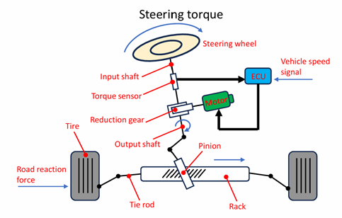

# Mechanical Model of Electric Power Steering (EPS)

This document explains the mechanism and control of the **Electric Power Steering (EPS)** handled by the `03` / `05` models. In the code, it corresponds to `eps_gearbox_model.{hpp,cpp}` and `eps_controller.{hpp,cpp}`.

---

## 1. What is EPS

Electric Power Steering is a system that assists the driver's steering effort with the torque of a BLDC motor. Compared with hydraulic power steering, it is advantageous in fuel economy, serviceability, and control flexibility, and it is widely used in modern passenger cars.

**Main functions:**

- Assist the driver's steering effort with motor torque, transmitting the assist force to the vehicle
- Provide smooth steering effort according to vehicle speed

**Operating principle:**

1. Convert the steering input torque into a torque-sensor signal, and generate a motor torque according to the input
2. Convert the steering input torque, aided by the motor torque, into thrust along the rack axis through the rack-and-pinion gear
3. The thrust is transmitted to the tie rods that support the wheel rotation, and is converted into the steering (swing) angle of the tires

### 1.1 Motor assumed in this project

This simulation targets a **three-phase BLDC motor of the 48 V class with a maximum assist current of 85 A**. These specifications assume a **high-output rack-assist EPS** that requires a large assist force.

| Item | Value | Note |
|------|----|----- |
| DC-link voltage $V_{dc}$ | 48 V | Consistent with the rated voltage in source [^ato] |
| Maximum assist current $i_{q,max}$ | 85 A | Matches the base-current upper limit in §5.2 |
| Torque constant / back-EMF constant $K_t = K_e$ | 0.0533 | Nm/A, V·s/rad |
| Phase resistance / inductance $R$ / $L$ | 0.1 Ω / 0.1 mH | — |
| Number of pole pairs $P_n$ | 4 | — |
| Steady-state operating point (default load) | $T_e \approx 4.5\thinspace \mathrm{Nm}$, $\omega_m \approx 145\thinspace \mathrm{rad/s}$ | Mechanical output $\approx 650\thinspace \mathrm{W}$ |

**Positioning as an EPS application:**

- Since the EPS assist motor requires low cogging torque, quietness, and high power density, a **three-phase brushless DC (BLDC) motor** is nowadays used as standard[^bldc].
- The **rack-assist type**, which couples the motor directly to the rack axis, can deliver a larger assist force than the column type, so it is adopted for heavy vehicles with high front-axle loads[^rack]. In this high-output application, a higher voltage system (such as the 48 V of this code) is advantageous over the 12 V system common in the column type.
- Each physical parameter in this code ($V_{dc} = 48\thinspace \mathrm{V}$, $R$, $L$, $K_t$, $K_e$, $P_n$) is set based on the product datasheet of a 48 V-class BLDC motor (ATO 110WDM06020-48V)[^ato].

> **Note — Difference from "1 kW-class 12 V EPS"**
> Real-vehicle column-type EPS is commonly a 12 V system in the several-tens-to-80 A class (equivalent to $12\thinspace \mathrm{V} \times 85\thinspace \mathrm{A} \approx 1\thinspace \mathrm{kW}$). This simulation handles the same 85 A-class current, but adopts **48 V** for the voltage system to match the product datasheet, so it corresponds to a higher-output rack-assist EPS.

[^ato]: ATO 110WDM06020-48V brushless DC motor datasheet (see [`../references.md`](../references.md) §2).
[^bldc]: Three-phase brushless motors are used for EPS motors. ABLIC "Automotive Electric Power Steering Motors (EPS Motors)" <https://www.ablic.com/en/semicon/applications/electric-power-steering-motor/>, Bosch "Electric power steering systems" <https://www.bosch-mobility.com/en/solutions/steering/electric-power-steering-systems/>.
[^rack]: Rack-assist EPS is intended for applications requiring a large assist force (i.e., heavy vehicles with high front-axle loads). Nexteer "Rack-Assist Electric Power Steering" <https://www.nexteer.com/electric-power-steering/rack-assist-electric-power-steering/>.

---

## 2. Energy Flow

The flow from steering input to tire swing:

```
Steering wheel
   │ Driver torque
Column / intermediate shaft
   │
Torque sensor (detects torsion of the torsion bar)
   │ Detected torque
EPS controller ──▶ BLDC motor (assist torque)
   │
Rack & pinion gear (rotation → linear motion)
   │ Rack thrust
Tie rods (left / right)
   │
Tire swing
```

---

## 3. EPS Control Block Diagram


The upper stage is the **target-current computation function**, and the lower stage is the **BL motor drive computation function**.

| Block | Function |
|----------|------|
| Steering torque detection (LPF → phase compensation → HPF) | Noise removal and phase compensation of the torque-sensor signal |
| Base-current computation | Computes the basic assist current from steering torque and vehicle speed (V-curve) |
| Torque-derivative correction computation (inertia current) | Assists the current rise according to the rate of change of the steering torque |
| Damper correction computation | Computes a disturbance-braking current from the motor rotation speed |
| Target-current correction / field-current computation | Generates the final targets $i_q^{\ast}$ and $i_d^{\ast}$ |
| Three-phase to two-axis transform (Clarke) | Transforms the three-phase feedback currents into dq-axis currents |
| q-axis / d-axis PI control + decoupling control | Independent dq-axis PI + cross-coupling compensation |
| Two-axis to three-phase transform (inverse Clarke) | Transforms the dq voltage commands into three phases |
| Midpoint modulation | Extends the voltage utilization by a factor of $2/\sqrt{3}$ |
| Drive-voltage → drive-current conversion | Converts to the PWM duty cycle for output |

---

## 4. Mechanical Model of the Mechanism

`eps_gearbox_model.cpp` integrates a **2-mass system** (steering wheel + lower column/pinion) in time using the forward Euler method.

### 4.1 Equations of Motion of the 2-Mass System

The system consists of two rotating bodies: the "steering-wheel side ($J_{sw}$)" and the "lower-column/pinion side ($J_{col,tot}$)".

$$
J_{sw}\frac{d\omega_{sw}}{dt} = T_h - T_{tb}
$$

$$
J_{col,tot}\frac{d\omega_{col}}{dt} = T_{tb} + N_g T_m - T_{spring}
$$

| Symbol | Meaning | Unit |
|------|------|------|
| $T_h$ | Driver steering torque (input) | Nm |
| $T_{tb}$ | Torsion-bar torque (= torque-sensor reading) | Nm |
| $N_g$ | Reduction gear ratio | — |
| $T_m$ | Motor shaft torque | Nm |
| $T_{spring}$ | Equivalent pinion-axis moment of the rack spring/damper | Nm |

### 4.2 Referred Moment of Inertia

The equivalent inertia $J_{col,tot}$ on the lower-column side is obtained by referring the motor-rotor inertia and the rack translational inertia to the pinion axis and summing them.

$$
J_{col,tot} = J_{col} + J_{motor} N_g^2 + M_{rack} r_p^2
$$

| Term | Meaning |
|----|------|
| $J_{col}$ | Column base inertia |
| $J_{motor} N_g^2$ | Motor-rotor inertia referred through the reduction gear |
| $M_{rack} r_p^2$ | Rack translational inertia referred through the pinion radius $r_p$ |

In the code, this corresponds directly to the computation inside `EpsGearboxModel::init()`.

### 4.3 Torsion Bar (Torque Sensor)

A thin shaft located between the column and the pinion. It is modeled as a spring-damper element, and the torque is computed from the difference in twist angles.

$$
T_{tb} = K_{tb}(\theta_{sw} - \theta_{col}) + C_{tb}(\omega_{sw} - \omega_{col})
$$

- $K_{tb}$ : torsion-bar stiffness (≈ 143 Nm/rad ≈ 2.5 Nm/deg)
- $C_{tb}$ : torsion-bar damping (Nm·s/rad)

This $T_{tb}$ is passed directly to the EPS controller as the torque-sensor output.

### 4.4 Rack-Pinion Coupling and Spring Load

The pinion and the rack are rigidly coupled, so the rack displacement and velocity are uniquely determined from the pinion angle.

$$
x_{rack} = r_p \theta_{col}, \qquad v_{rack} = r_p \omega_{col}
$$

The spring/damper force acting on the rack (a simplified model of the road reaction force) is given by the following equation.

$$
F_{rack} = K_s x_{rack} + C_s v_{rack}
$$

Converting this rack thrust into an equivalent pinion-axis moment yields the $T_{spring}$ of the equation in 4.1.

$$
T_{spring} = F_{rack} \cdot r_p = K_s r_p^2 \theta_{col} + C_s r_p^2 \omega_{col}
$$

- $K_s$ : rack spring constant [N/m]
- $C_s$ : rack viscous damping [N·s/m]
- $r_p$ : pinion radius [m]

### 4.5 Kinematic Constraint (Motor-Column Coupling)

The motor shaft and the column are rigidly coupled through the reduction gear, and the motor angular velocity is updated at the beginning of each step.

$$
\omega_{motor} = N_g \cdot \omega_{col}
$$

Owing to this constraint, the back-EMF of the motor is correctly computed inside `MotorModel`. In the code, this corresponds to `motor.set_angular_vel(kEpsGearRatio * gearbox_state.omega_col)`.

### 4.6 Forward Euler Integration

At each time step $\Delta t$, the angular acceleration is computed and the velocity and angle are updated.

$$
\alpha_{sw} = \frac{T_h - T_{tb}}{J_{sw}}, \qquad \alpha_{col} = \frac{T_{tb} + N_g T_m - T_{spring}}{J_{col,tot}}
$$

$$
\omega_{sw}[k{+}1] = \omega_{sw}[k] + \alpha_{sw}\thinspace \Delta t, \qquad \theta_{sw}[k{+}1] = \theta_{sw}[k] + \omega_{sw}[k{+}1]\thinspace \Delta t
$$

$$
\omega_{col}[k{+}1] = \omega_{col}[k] + \alpha_{col}\thinspace \Delta t, \qquad \theta_{col}[k{+}1] = \theta_{col}[k] + \omega_{col}[k{+}1]\thinspace \Delta t
$$

### 4.7 Note on Mechanical Resonance

When the torsion bar (spring) combines with the inertias of the steering wheel and the lower column, the 2-mass system has a resonance point. A rough estimate of the natural angular frequency:

$$
\omega_n \approx \sqrt{K_{tb}\left(\frac{1}{J_{sw}} + \frac{1}{J_{col,tot}}\right)} \approx 60\ \text{rad/s} \approx 9.5\ \text{Hz}
$$

If the torque-sensor signal is used directly for assist control, this resonance would be excited. To prevent this, an LPF is applied to the torque-sensor signal (see the next section).

---

## 5. Assist Control (Assist Map)

`eps_controller.cpp` and `eps_main.cpp` work together to generate the q-axis current command from the sensor torque.

### 5.1 Torque-Sensor LPF

The torque-sensor reading $T_{tb}$ is smoothed with a first-order IIR low-pass filter.

$$
\hat{T}_{tb}[k{+}1] = \hat{T}_{tb}[k] + \bigl(T_{tb}[k] - \hat{T}_{tb}[k]\bigr)\cdot \omega_{lpf}\thinspace \Delta t
$$

The cutoff frequency $\omega_{lpf} \approx 20\ \text{rad/s}\ (\approx 3.2\ \text{Hz})$ is set sufficiently below the mechanical resonance (≈ 9.5 Hz). In the code, it corresponds to the `sensor_filt` variable.

### 5.2 V-Curve (Base-Current Map)

For the filtered torque $\hat{T}_{tb}$, $i_q^{\ast}$ is computed with a proportional map that includes dead-zone correction.

$$
i_q^{\ast} = \begin{cases} \mathrm{clamp}\negthinspace \left(G_{assist}\thinspace \bigl(|\hat{T}_{tb}| - T_{dz}\bigr)\thinspace \mathrm{sgn}(\hat{T}_{tb}),\ \pm i_{q,max}\right) & |\hat{T}_{tb}| > T_{dz} \cr 0 & |\hat{T}_{tb}| \le T_{dz} \end{cases}
$$

| Parameter | Symbol | Default value |
|-----------|------|-------------|
| Assist gain | $G_{assist}$ | 18.0 A/Nm |
| Dead-zone width | $T_{dz}$ | 0.3 Nm |
| Maximum q-axis current | $i_{q,max}$ | 85 A |

The dead zone is provided to ensure a "settled feel (on-center feel of the steering wheel)" in the low steering-torque region.

The overall current command is defined as the sum of the following three components (in this implementation, only the base current is present).

$$
i_q^{\ast} = i_{\text{base}} + i_{\text{inertia}} + i_{\text{damper}}
$$

| Component | Determining factor | Role |
|------|----------|------|
| Base current | Steering torque, vehicle speed | Determines the basic amount of assist (V-curve) |
| Inertia current | Rate of change (derivative) of the steering torque | Assists the current rise at the start of steering |
| Damper current | Motor rotation speed | Brakes disturbances from the steering |

> **Scope of this code's implementation**  
> The `EpsController` of `bldc-foc-sim` implements the **base current (V-curve)**. The inertia current and damper current are candidates for future extension.

### 5.3 Current Map (Synthesis of the Target Current)

The target current is synthesized as the sum and difference of individual maps looked up from multi-dimensional data such as steering torque and vehicle speed. Each component is given as a one-dimensional map (horizontal axis = determining factor, vertical axis = target current); the base current and the inertia current are added, and the damper current is subtracted.

#### Figure (Current Map)


$$
i_q^{\ast} = i_{\text{base}} + i_{\text{inertia}} - i_{\text{damper}}
$$

> **About the signs**  
> The figure above uses a notation in which the damper current is **subtracted** as a quantity in the *braking direction*. The $i_q^{\ast} = i_{\text{base}} + i_{\text{inertia}} + i_{\text{damper}}$ of §5.2 treats $i_{\text{damper}}$ as a signed quantity (negative during braking); the two are equivalent.

#### Text Explanation

- **Target current**: The target current amount for controlling the motor is computed based on multi-dimensional data obtained from the torque sensor, vehicle speed, and so on.
- **Base current**: Computed from steering torque and vehicle speed, it determines the basic current amount for driving the motor (horizontal axis: steering torque; multiple curves parameterized by vehicle speed).
- **Inertia current**: Determined by the rate of change (derivative) of the steering torque, it assists the current rise at the start of steering (horizontal axis: torque derivative).
- **Damper current**: Determined by the motor rotation speed, it brakes disturbances from the steering wheel (horizontal axis: motor rotation speed; subtractive component).

> **Scope of this code's implementation — the current map is not included in the implementation**
> The current map described in this section (the individual tables for base current, inertia current, and damper current) is **merely a conceptual diagram for explaining the control algorithm, and is not included in the `bldc-foc-sim` implementation**. The reasons are as follows.
>
> - The map values themselves are **tuning data** crafted per vehicle, and they **depend on vehicle-signal data** such as steering torque and vehicle speed.
> - The map values for a real vehicle are **confidential information (know-how)** of each company, so this OSS does not include concrete tables.
>
> For this reason, the current `EpsController` implements **only the base current (V-curve) of §5.2**.
>
> **Future work:** There is preparation in place to carve out the map mechanism as a replaceable interface, so that a **provisional (dummy) map for operation checking** can be injected in place of real data. Note that the provisional map is strictly for behavior checking and is not a real-vehicle tuning value.

---

## 6. Evaluation Scenario

`EpsGearboxSim` connects the steering rack to a spring load and applies the driver steering torque in a ramp shape, evaluating the characteristic of the rack thrust with respect to the steering torque.



```sh
./EpsGearboxSim --tmax 6.0 --ramp 0.3 --span 2.0
```

- `--tmax` : maximum value of the driver steering torque [Nm]
- `--ramp` : ramp time to raise the steering torque from 0 to the maximum [s]

The output `data/eps_output.csv` records the torsion-bar torque, assist torque, rack thrust, rack displacement, and so on.

---

## Related Documents

- [`foc.md`](foc.md) — Field-Oriented Control on the motor side
- [`motor-model.md`](motor-model.md) — Electrical and mechanical equations of the motor
- [`sensorless.md`](sensorless.md) — Sensorless control combined in `05`
