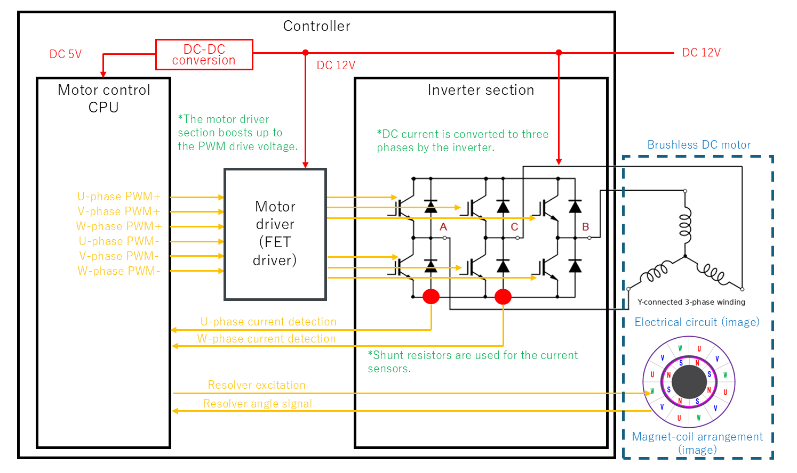
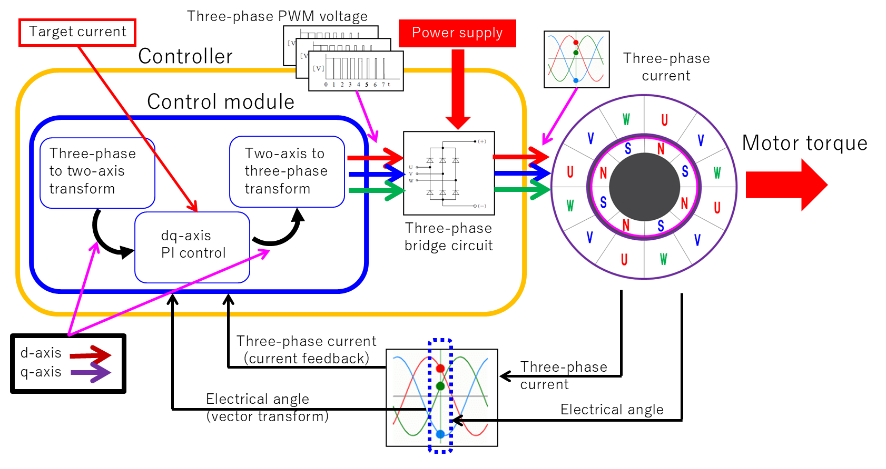
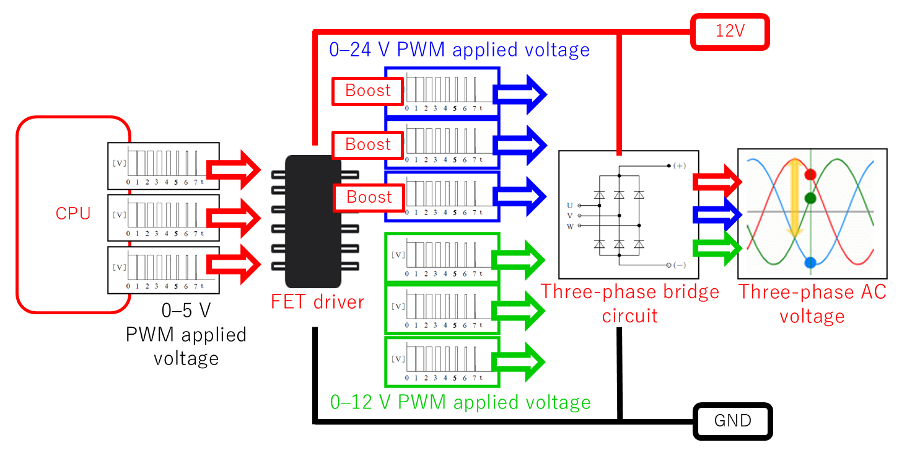
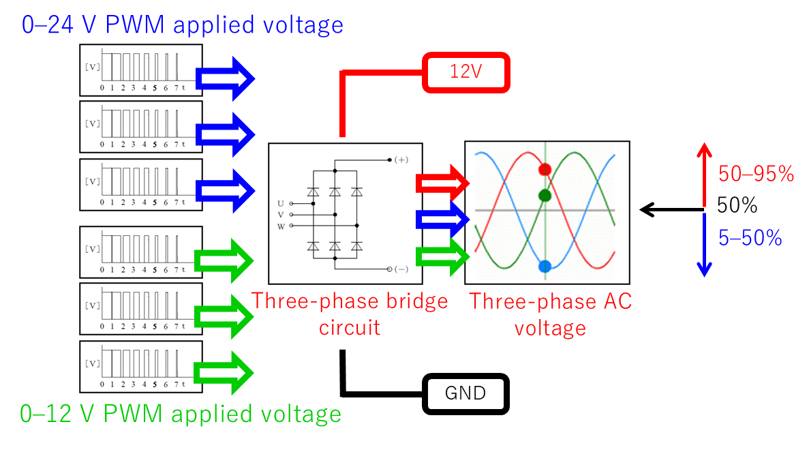

# Principles of Field-Oriented Control (FOC)

This document explains the concept of **Field-Oriented Control (FOC)** for three-phase brushless motors and its implementation in `bldc-foc-sim`. In the code this corresponds to `motor_controller.{hpp,cpp}`.

> **Application target: Electric Power Steering (EPS)**  
> The parameters appearing in this simulator and documentation — voltage levels (12 V battery, 24 V boost for driving the upper arms), the current-sensing method (2 shunts), the control bandwidth, and so on — are configured on the premise of **automotive EPS (Electric Power Steering)**. EPS is a system that generates assist torque with a brushless motor mounted on the steering column or the rack, and it requires a 12 V automotive power supply, high responsiveness, and a fail-safe design. When repurposing this for other applications (industrial, high-voltage systems, etc.), reinterpret the voltage, current, and bandwidth parameters accordingly.

---

## 1. Why Field-Oriented Control

Because three-phase AC currents vary sinusoidally over time, making them track a target value directly is difficult. In FOC, the three-phase AC is transformed into **two axes (d-axis and q-axis) that rotate in synchronism with the rotor**, and each axis is treated as a DC quantity. Once they are DC quantities, PI control can make them track without steady-state error.

> **Why PI control is effective for DC quantities**  
> The integral term of PI control has the property of "driving the steady-state error to zero," but this is guaranteed only **when the target value is DC (a constant value)**. If a sinusoidal AC quantity is PI-controlled directly, the sinusoid has frequency content that the integrator cannot fully track, so a steady-state error remains. Moving to a coordinate system synchronized with the rotor via the dq transform makes the once-sinusoidal current appear as a DC value, so the PI integration works completely and achieves zero steady-state error.

**Realization method:**

1. Transform the three-phase (U-phase, V-phase, W-phase) components into the two-axis (d-axis, q-axis) components.
2. Apply current feedback control to each of the two-axis components.
3. Transform the feedback-controlled two-axis components back into three-phase AC and apply them as the motor drive voltage.

**Separation of the current-control bandwidth and the speed-control bandwidth**

In FOC, the control bandwidth is deliberately split into two stages. The current-control loop (inner) is designed at roughly 1/10 of the switching frequency (e.g., $\alpha_{cc} \approx 2\,\text{kHz}$ for $f_{sw} = 20\,\text{kHz}$), and the speed/position loop (outer) is set at about 1/5 to 1/10 of that. This lets the outer loop treat the inner loop as an "ideal torque source," allowing the control design to be hierarchically separated.

Overall picture of the control loop:

```
Three-phase current UVW ──[Clarke]──▶ αβ ──[Park (θ)]──▶ dq
                                                  │
                                       [dq-axis PI control + decoupling]
                                                  │
Three-phase voltage UVW ◀─[inv. Clarke]── αβ ◀──[inv. Park (θ)]── dq
     │
     ▼
 [PWM inverter] ──▶ motor
```

For the mathematical details of the coordinate transform, see [`coordinate-transform.md`](coordinate-transform.md).

---

## 2. Roles of the d-axis and q-axis

| Axis | Name | Role |
|----|------|------|
| d-axis | Direct Axis | Same direction as the rotor flux. Does not contribute to torque in normal operation |
| q-axis | Quadrature Axis | Orthogonal to the flux. **Produces torque** |

The electromagnetic torque is

$$
T_e = K_t \cdot i_q
$$

so only the q-axis current determines the torque. Therefore, in normal operation, the **d-axis current command is set to 0 and the q-axis current command to a value corresponding to the target torque**.

> **Why $i_d^* = 0$ is optimal (for SPMSM)**  
> In an SPMSM (surface permanent-magnet type), because $L_d = L_q$, the reluctance torque arising from saliency is zero. In this case, the condition that maximizes torque for a fixed motor current amplitude $|I| = \sqrt{i_d^2 + i_q^2}$ (MTPA: Maximum Torque Per Ampere) is $i_d = 0$. Since the d-axis current only increases copper loss and does not contribute to torque, keeping it at zero is the most efficient.

**Relationship between the torque constant and the back-EMF constant**

In the SI unit system, $K_t = K_e$ holds ($K_t$ in Nm/A, $K_e$ in V·s/rad). This is a relationship derived from energy conservation, and it can be confirmed by rearranging $T_e \cdot \omega_m = e \cdot i_q$. In actual datasheets $K_e$ is often given on an rpm basis, so care is needed with unit conversion ($K_e[\text{V·s/rad}] = K_e[\text{V/krpm}] \times 1000/2\pi \times 1/60$).

### Field-Weakening Control

Passing a negative current on the d-axis creates a magnetic field in the direction that cancels the permanent-magnet flux, suppressing the back-EMF. This extends the high-speed operating range. This is called **field-weakening control**. The basic model of this series does not perform field weakening ($i_d^* = 0$), but it is positioned as room for extending high-speed characteristics.

**Base speed limit of field weakening**

The maximum rotational speed reachable without field weakening (the base speed) is found from the voltage constraint.

$$
\omega_{m,\,\text{base}} = \frac{V_{dc}/\sqrt{3} - R \cdot I_{\text{rated}}}{K_e}
$$

Above this speed, the back-EMF exceeds the supply voltage, so current can no longer flow. In field weakening, setting $i_d < 0$ reduces the effective value of the back-EMF, achieving even higher speeds.

---

## 3. dq-axis PI Control

There is an independent PI controller for each of the d-axis and q-axis.

$$
v_d^* = K_p (i_d^* - i_d) + K_i \int (i_d^* - i_d)\, dt
$$

$$
v_q^* = K_p (i_q^* - i_q) + K_i \int (i_q^* - i_q)\, dt
$$

- $i_d^*,\, i_q^*$ : current command values on the d-axis / q-axis
- $v_d^*,\, v_q^*$ : voltage commands output by the PI controllers

For how to determine the PI gains $K_p,\, K_i$, see [`pi-tuning.md`](pi-tuning.md).

### Bandwidth-based Gain Design

Designing the current-control loop as a first-order system with a target bandwidth $\alpha_{cc}$ (rad/s), the gains are given by the following expressions.

$$
K_p = \alpha_{cc} \cdot L, \qquad K_i = \alpha_{cc} \cdot R
$$

Example: for $L = 1\,\text{mH}$, $R = 1\,\Omega$, $f_{sw} = 20\,\text{kHz}$, taking $\alpha_{cc} = 2\pi \times 2000 \approx 12566\,\text{rad/s}$ gives $K_p = 12.6$ and $Ki = 12566$. This design formula regards the electrical system of the motor as a first-order lag $G(s) = 1/(Ls+R)$ and is the result of placing the pole of the loop transfer function at $s = -\alpha_{cc}$.

### Anti-windup

When the output voltage command exceeds the supply voltage, the PI integrator keeps accumulating indefinitely (windup), and a large overshoot occurs after the inverter recovers from saturation. A representative technique to prevent this is the **back-calculation method**, which negatively feeds the saturation amount back into the integrator input to suppress excessive integral accumulation. The voltage limit is often based on the three-phase composite voltage as $|v_{dq}^*| \leq V_{dc}/\sqrt{3}$ (for sinusoidal modulation).

---

## 4. dq-axis Decoupling Control (Non-interference Control)

As shown in [`motor-model.md`](motor-model.md), the dq-axis voltage equations contain cross-coupling terms.

$$
v_d = R i_d + L \frac{di_d}{dt} - \omega_e L i_q
$$

$$
v_q = R i_q + L \frac{di_q}{dt} + \omega_e L i_d + K_e \omega_m
$$

The terms $-\omega_e L i_q$ and $+\omega_e L i_d$ mean that the current of one axis acts as a disturbance on the other axis. The higher the rotational speed $\omega_e$, and the more abruptly the current changes, the greater this effect becomes.

**Decoupling control (non-interference control)** is a technique that adds a feedforward voltage, which cancels these coupling terms, to the PI output.

$$
v_d^* = \underbrace{K_p (i_d^* - i_d) + K_i \int (i_d^* - i_d)\, dt}_{\text{PI output}} \underbrace{- \omega_e L i_q}_{\text{FF}}
$$

$$
v_q^* = \underbrace{K_p (i_q^* - i_q) + K_i \int (i_q^* - i_q)\, dt}_{\text{PI output}} \underbrace{+ \omega_e L i_d + K_e \omega_m}_{\text{FF}}
$$

This makes the d-axis and q-axis behave as independent first-order lag systems that do not interfere with each other, improving the transient response.

### Quantitative Evaluation of the Coupling Terms

Let us concretely estimate how large a voltage the coupling term $\omega_e L i$ produces.

**Example:** when $N = 3000\,\text{rpm}$, $P_n = 4$, $L = 1\,\text{mH}$, $i_q = 2\,\text{A}$,

$$
\omega_e = P_n \cdot \frac{2\pi N}{60} = 4 \times \frac{2\pi \times 3000}{60} \approx 1257\,\text{rad/s}
$$

$$
\omega_e L i_q = 1257 \times 0.001 \times 2 \approx 2.5\,\text{V}
$$

This is a disturbance voltage of about 20% relative to the 12 V supply voltage. If this leaks into the d-axis without compensation, the PI integrator keeps outputting extra voltage to maintain $i_d^* = 0$, delaying the response. The higher the speed and current, the larger the effect.

### Conditions Under Which the Effect Appears

| Operating state | Effect |
|----------|------|
| Steady state ($i_d \approx 0$) | The coupling terms are small and absorbed by the PI integration. The effect is barely visible |
| Transient response (abrupt change in current command) | Prevents the coupling terms from leaking into the other axis as a disturbance, making settling faster and cleaner |
| High-speed rotation / field weakening | $\omega_e L i$ becomes large, so the presence or absence of compensation makes a difference |

`scripts/compare_decoupling_transient.py` induces a transient with `--iq_step` and compares the responses with decoupling control ON/OFF.

---

## 5. Difference Between Type A and Type B Models

This repository contains two model types with differing control details.

| Type | Drive method | Purpose |
|----|----------|------|
| Type A (002) | Ideal voltage source. The PI output is applied to the motor directly | Understanding the pure FOC loop |
| Type B (003–) | PWM drive. The PI output is converted into a duty ratio and applied | Educational material including a drive circuit close to a real ECU |

In Type B, the DC link voltage $V_{dc}$, the carrier frequency, and the maximum duty are taken into account, so an upper limit arises on the voltage that can be applied. For details, see [`pwm-inverter.md`](pwm-inverter.md).

---

## 6. Implementation Switches

In `bldc-foc-sim`, decoupling control and midpoint modulation can be toggled via **runtime flags**. Both are OFF by default, fully preserving the legacy behavior.

```sh
./BrushlessDCMotor --decoupling     # Enable decoupling control
./BrushlessDCMotor --midpoint       # Enable midpoint modulation
```

In the code, they are set via `MotorController::set_options(use_midpoint, use_decoupling)` and branched on inside `compute()`.

---

## 7. Overall System Configuration

The connection of the entire hardware that realizes FOC is shown below.



From left to right, the connections are made in the following order.

| Block | Role |
|----------|------|
| Motor control CPU | FOC computation, PWM command generation, sensor readout |
| Motor driver (FET driver) | Converts and boosts the CPU's 0–5 V PWM signals into FET gate drive voltages |
| Inverter section (three-phase bridge circuit) | Converts DC voltage into three-phase AC and applies it to the motor |
| Brushless DC motor | Y-connected three-phase windings. Produces torque by electromagnetic force |

**Signal flow:**

- From the CPU, a total of 6 PWM signals — the upper arm (+) / lower arm (−) of each of the U/V/W phases — are sent to the driver
- The current sensors detect via shunt resistors (U-phase and W-phase) and feed back to the CPU
- The resolver excitation signal is sent from the CPU, the angle signal is received, and the electrical angle is computed

---

## 8. Overall Picture of the FOC Control Block



The FOC control loop is composed of the following path.

1. **Target current (d-axis, q-axis)** is input as a command
2. **dq-axis PI control** computes the voltage command that drives the current error to zero
3. **Two-axis → three-phase transform (inverse Park, inverse Clarke)** converts it into three-phase voltage commands
4. The **three-phase bridge circuit** applies voltage to the motor via PWM, producing torque
5. The **three-phase current** flowing in the motor is detected by the shunt resistors
6. The detected current is transformed **three-phase → two-axis (Clarke, Park)** using the **electrical angle (from the resolver)** and fed back as the dq-axis currents

Through this closed loop, the d-axis and q-axis currents can each be PI-controlled independently as DC quantities.

---

## 9. FET Driver and Boost Circuit

The voltage applied to an automotive ECU is normally the 12 V battery voltage. However, in a three-phase bridge circuit, **a voltage higher than the source potential (the switching-node potential) is needed to drive the gate of the upper-arm FET**. For this reason, the motor driver IC boosts the PWM applied voltage to the upper-arm side up to 24 V for output.



The 0–5 V PWM signals output by the CPU are converted by the FET driver and supplied to the bridge circuit as PWM of **0–24 V** on the upper-arm side and **0–12 V** on the lower-arm side.

### Bootstrap Method

The most widely used method for boosting the upper-arm FET gate drive voltage.

- While the lower arm is on, the bootstrap capacitor is charged with the battery voltage (12 V)
- When the upper arm switches on, the charge stored in the capacitor is used to drive the gate at the equivalent of the source potential + 12 V = 24 V
- The circuit is simple and low-cost, but it has the constraint that **keeping the upper arm continuously on for a long time causes the capacitor to self-discharge and its voltage to drop**
- For this reason, the bootstrap method imposes an **upper limit on the maximum duty ratio** (e.g., 95%). Together with the dead-time constraint described later, this is addressed by limiting the duty range in software

### Charge-pump Method

A method that repeatedly charges and transfers a capacitor with a clock signal to continuously generate a high voltage.

- Because **continuous on-time of the upper arm** is possible, it is advantageous when 100% duty operation is required
- Compared with the bootstrap method, the circuit becomes more complex and the cost rises

### Gate Resistance and FET Switching Characteristics

The **gate resistor $R_g$** connected in series between the FET driver and the gate terminal is an important parameter that determines the switching speed.

- Making $R_g$ smaller: switching becomes faster and **switching loss is reduced**, but $dv/dt$ and $di/dt$ become larger and **EMI (electromagnetic noise) increases**
- Making $R_g$ larger: EMI is suppressed, but **switching loss increases** and thermal design becomes more demanding
- During dead time, the FET's **body diode** carries the freewheeling current. The body diode of a Si MOSFET has a large reverse-recovery charge ($Q_{rr}$), which is a source of switching loss. A SiC MOSFET has an extremely small $Q_{rr}$, making it advantageous for fast, high-efficiency drive

---

## 10. PWM Duty Ratio and Dead Time

In three-phase sinusoidal drive, all upper- and lower-arm FETs begin driving from the **balanced state of a 50% duty ratio**.

- The phase carrying **positive-side current**: outputs PWM at a duty of 50–95%
- The phase carrying **negative-side current**: outputs PWM at a duty of 5–50%



The reason for providing a 5% margin at both ends is to secure **dead time**.

**What is dead time:**  
If the upper arm and lower arm turn on at the same time, an **arm short circuit (shoot-through current)** occurs in which the power supply and GND are directly connected, destroying the FETs. To prevent this, a **period during which both arms are off (dead time)** must be inserted between one turning off and the other turning on. The reason the duty ratio is limited to an upper bound of 95% and a lower bound of 5% is to guarantee this dead-time period in software.

### Voltage Error Due to Dead Time and Its Compensation

Because the intended voltage is not applied during the dead-time period, an error arises in the output voltage. Given a dead time $t_d$ against one switching period $T_{sw}$, the voltage error per period is expressed as follows.

$$
\Delta V = V_{dc} \cdot \frac{t_d}{T_{sw}} = V_{dc} \cdot t_d \cdot f_{sw}
$$

This error has a sign that depends on the current polarity (when the current is positive, the voltage becomes lower). In **dead-time compensation**, the sign of the detected current is determined, and $\Delta V$ is added to or subtracted from the duty command to cancel the error. In the low-speed, low-current region, the sign becomes unstable near the current zero crossing, so a sign determination with hysteresis is often used.

### Advantages of Center-aligned PWM

Using a **triangular wave (center-aligned)** as the PWM carrier places the switching timing symmetrically twice per period. As a result:

- The spectrum of the current ripple concentrates in the **even-order harmonics** of the carrier frequency, and the odd-order components cancel out
- Sampling at the peaks and valleys of the triangular wave makes the **ADC acquisition timing coincide with the midpoint of the current ripple**, so the ripple average value is naturally sampled (in coordination with the current detection described below)

---

## 11. Current Detection and Sampling Timing

### 2-shunt vs 3-shunt

There are mainly two methods for detecting the three-phase current.

| Method | Shunt position | Characteristics |
|------|-------------|------|
| 2-shunt | Lower arm of 2 phases (e.g., U-phase and W-phase) | Fewer components and lower cost. Adopted by this system |
| 3-shunt | Lower arm of each phase, or in series | Detects all phases independently. Accurate even at low modulation |

The 2-shunt method computes the current of the third phase (V-phase) from **Kirchhoff's current law**.

$$
i_V = -(i_U + i_W)
$$

This exploits the fact that in a Y connection the neutral-point current is zero ($i_U + i_V + i_W = 0$).

### Sampling Timing

When using center-aligned PWM (a triangular-wave carrier), the ADC sampling trigger is synchronized to the **valley of the triangular wave (when the lower arm is on for all phases)**.

```
  Carrier    /\/\/\
  Sample    ↑  ↑  ↑  ← sample at the valley (period when all lower arms are on)
```

Because the lower arms are reliably on during this period, the phase current reliably flows through the shunt resistors. Also, because sampling is at the midpoint of the current ripple, the error due to ripple is minimized.

### Minimum Pulse-width Constraint of the 2-shunt Method

When the modulation ratio is high (the duty is near 0% or 100%), the on-time of the lower arm becomes extremely short. In this case, the ADC sampling finishes before the shunt current stabilizes, causing the problem that **an accurate current value cannot be acquired**.

As countermeasures, one either limits the upper and lower bounds of the duty (this system's 5–95% limit includes this purpose), or uses a hold process that interpolates the current value with the previous sample value. The 3-shunt method has the advantage that this constraint is relaxed.

---

## Related Documents

- [`motor-model.md`](motor-model.md) — Electrical and mechanical equations of the motor
- [`coordinate-transform.md`](coordinate-transform.md) — Clarke / Park transforms
- [`pwm-inverter.md`](pwm-inverter.md) — PWM, inverter, and midpoint modulation
- [`pi-tuning.md`](pi-tuning.md) — PI gain design
- [`waveform-analysis.md`](waveform-analysis.md) — Measurement-based waveform difference analysis
