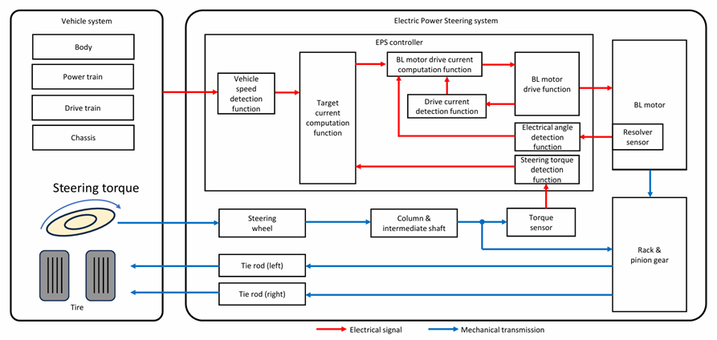

# Functional Safety — Automotive System HARA Analysis (ISO 26262 / Comprehensive Major-System Coverage)

Using the **HARA (Hazard Analysis and Risk Assessment)** of automotive systems as a subject, this document organizes the analysis methods of the ISO 26262 Concept Phase (Parts 3–4) together with the ASIL evaluation of representative hazards drawn across the major automotive systems.

It comprehensively covers the major automotive systems — steering, braking, powertrain, EV, sensors (camera / radar), ADAS, autonomous driving, and more. Among them, the **steering system (EPS / steer-by-wire)** is placed as the lead system, serving as the connection point to this simulation project ([`eps.md`](eps.md) / [`foc.md`](foc.md)).

> **About the assumed values**  
> The S/E/C, ASIL, and FTTI values in this document are all **illustrative / assumed values for educational purposes**. Actual values are fixed through the Item definition and validation. This document is a general, representative illustration in the spirit of ISO 26262-10 (guidelines) and requires case-by-case validation.

---

## 1. What Is HARA

**HARA = Hazard Analysis and Risk Assessment**

The most fundamental safety analysis process, performed in the ISO 26262 Concept Phase (Part 3), for deriving safety requirements.

### Purpose of HARA

1. Comprehensively identify the **hazards** the system can cause
2. Analyze the **scenarios** (combinations with driving situations) by which a hazard leads to an accident
3. Determine the **ASIL (Automotive Safety Integrity Level)** for each scenario
4. Define the **safety goal** required to satisfy the ASIL

→ These become the basis for the downstream Functional Safety Requirements (FSR) and Technical Safety Requirements (TSR).

### Why HARA Is Necessary

- For a design that "does not harm people even when a failure occurs." Rather than aiming for zero bugs, it systematizes a design that fails to the safe side on the premise that failures do occur.
- To ensure traceability from the top (product specification) down to the bottom (HW/SW implementation).
- ISO 26262 certification is effectively mandatory for mass-production automotive ECUs → HARA is the starting point.

### What Happens Without HARA

- There is no criterion for deciding which functions should be made redundant
- It is undefined within how many ms of which failure mode a transition to the safe state must occur
- The review perspective for parts and code becomes only "does it work," and the safety perspective is missed
- Certification cannot be obtained in third-party audits (TÜV, SGS, etc.)

---

## 2. The Standard HARA Flow

```
Step 1: Item Definition ──▶ Step 2: Hazard Identification ──▶ Step 3: Scenario Analysis
                                                                       │
                               Step 5: Safety Goal Derivation ◀── Step 4: ASIL Determination
                                          │
                                          ▼
                              FSR → TSR → HSR / SSR → Implementation & Test
```

| Step | Content |
|------|------|
| **1. Item Definition** | Clarify the boundaries, functions, operating modes, and driving situations of the system under analysis. If this is ambiguous, all subsequent analysis becomes unstable. |
| **2. Hazard Identification** | For each function of the item, enumerate the "hazardous phenomena that arise if it fails" (FMEA, HAZOP, brainstorming). |
| **3. Scenario Analysis** | Describe the scenarios leading to an accident from the combination of hazard × driving situation. Even a single failure mode varies in severity depending on the situation. |
| **4. ASIL Determination** | Assign S/E/C to each scenario and determine the ASIL using the ASIL matrix. For the same failure, adopt the **highest ASIL**. |
| **5. Safety Goal Derivation** | Describe the negation of the hazard as the safety goal, together with the FTTI (allowable delay). |

→ For details on S/E/C and ASIL see [Section 3](#3-analysis-method--sec-and-asil-determination), for FTTI see [Section 4](#4-the-ftti-concept), and for the development into safety requirements see [Section 7](#7-safety-requirement-derivation-flow-generalized-example-using-steering).

---

## 3. Analysis Method — S/E/C and ASIL Determination

Hazards are evaluated **per driving situation** rather than per "function," and the ASIL is determined by the combination of three metrics.

| Parameter | Meaning | Class | Example (worst side) |
|-----------|------|--------|------|
| **S (Severity)** | Severity of injury | S0–S3 | S3 = fatal, survival uncertain |
| **E (Exposure)** | Probability of encountering that situation (exposure frequency) | E0–E4 | E4 = high frequency |
| **C (Controllability)** | Avoidability by the driver | C0–C3 | C3 = difficult to control |

**Severity (referencing the AIS scale)**

| Class | Content |
|--------|------|
| S0 | Non-safety-related damage (AIS 0, and probability of AIS 1–6 below 10%) |
| S1 | Light and moderate injuries (probability of AIS 1–6 at 10% or more) |
| S2 | Severe and life-threatening injuries, survival probable (probability of AIS 3–6 at 10% or more) |
| S3 | Life-threatening / fatal injuries (probability of AIS 5–6 at 10% or more) |

*AIS = Abbreviated Injury Scale*

**Exposure (scale of the situation)**

| Class | Content |
|--------|------|
| E1 | Situations that occur less than once a year for the majority of drivers. |
| E2 | Less than 1% of average operating time. Situations that occur only a few times a year. |
| E3 | 1–10% of average operating time. Situations that occur once a year or more. |
| E4 | More than 10% of average operating time. Situations that occur during almost all driving. |

**Controllability**

| Class | Content |
|--------|------|
| C0 | Controllable in general. |
| C1 | Simply controllable. 99% or more can usually avoid the harm. |
| C2 | Normally controllable. 90% or more can usually avoid the harm. |
| C3 | Difficult to control or uncontrollable. Less than 90% can usually avoid the harm. |

### 3.1 ASIL Matrix

The ASIL is determined by the combination of S × E × C. QM (Quality Management) means that ordinary quality management is sufficient and it is not safety-related. The higher S, E, and C are, the higher the ASIL rises, and **S3 + E4 + C3 yields the highest level, ASIL D**.

| S | E | C1 | C2 | C3 |
|---|---|----|----|----|
| S1 | E1 | QM | QM | QM |
| S1 | E2 | QM | QM | QM |
| S1 | E3 | QM | QM | ASIL A |
| S1 | E4 | QM | ASIL A | ASIL B |
| S2 | E1 | QM | QM | QM |
| S2 | E2 | QM | QM | ASIL A |
| S2 | E3 | QM | ASIL A | ASIL B |
| S2 | E4 | ASIL A | ASIL B | ASIL C |
| S3 | E1 | QM | QM | ASIL A |
| S3 | E2 | QM | ASIL A | ASIL B |
| S3 | E3 | ASIL A | ASIL B | ASIL C |
| S3 | E4 | ASIL B | ASIL C | **ASIL D** |

**Legend of ASIL levels**

| ASIL | Meaning |
|------|------|
| QM | Quality Management / no safety requirement |
| A | Lowest safety requirement |
| B | Moderate |
| C | High |
| D | Most stringent safety requirement |

> **Determination logic:** Because S/E/C change with the situation even for the same failure, **the highest ASIL among multiple situations is assigned to the safety goal**.

### 3.2 ASIL Decomposition

A method that lowers the required ASIL of each element by decomposing a single ASIL D element into two **independent** elements.

| Decomposition pattern | Element 1 | Element 2 |
|-------------|--------|--------|
| ASIL D | ASIL B(D) | ASIL B(D) |
| ASIL D | ASIL C(D) | ASIL A(D) |
| ASIL D | ASIL D(D) | ASIL QM(D) |

Condition: the two elements must be "independent" (they must not share a common cause of failure).  
Example: if the input sensor path and the monitoring (watchdog) path are made independent, each can be designed to B(D).

### 3.3 Assumptions and Rationale Behind the FTTI Values

In this material, each FTTI is defined under the following premises (driving situation, representative speed, lane geometry, vehicle-dynamics model). Under each premise, "what the FTTI physically protects" is shown as the margin secured by the longitudinal, lateral, or event-fixed model, thereby grounding the value. The speeds and accelerations used here are illustrative premises; in practice they require finalization through the Item definition and vehicle-dynamics analysis. For the motor control this project targets, the "unintended torque" of the EPS assist torque (§5.1) and the inverter drive torque (§5.4) directly translates into vehicle motion (lateral / longitudinal) via steering / drive, so per the "vehicle-motion-limited" case below, FTTI ≈ 100 ms.

**Premises used in the definition**

Representative speeds:

| Driving situation | Speed |
|---|---|
| Highway | 100 km/h = 27.8 m/s |
| Curve | 80 km/h = 22.2 m/s |
| Urban | 40 km/h = 11.1 m/s |
| Start-off / low speed | 20 km/h = 5.6 m/s |
| Congestion following | 30 km/h = 8.3 m/s |

Lane geometry: lane width 3.5 m, vehicle width 1.8 m → lateral margin on one side ≈ 0.85 m (until lane departure).

Three rationale models (margins secured under the premises):

- **Longitudinal**: $`\Delta v = a \cdot FTTI`$ (speed change accrued before intervention). For loss cases, $`\Delta x = V \cdot FTTI`$ (unbraked distance until the backup takeover).
- **Lateral**: $`\Delta y = \tfrac{1}{2}\thinspace  a_y \cdot FTTI^2`$ (lateral deviation at the moment of intervention), $`v_{lat} = a_y \cdot FTTI`$ (rise of lateral velocity). Representative $`a_y = 3\ \mathrm{m/s^2}`$ (0.3g), grip limit ≈ 8 m/s²
- **Event-fixed**: pyrotechnic deployment window, thermal-propagation time, etc. Independent of vehicle speed

#### Steering System

| Function | Assumed speed | Model | FTTI | Margin secured / rationale | Assessment |
|---|---|---|---|---|---|
| EPS unintended steering torque | 100 km/h | Lateral | 100 ms | Δy ≈ 1.5 cm, v_lat ≈ 0.3 m/s (about 2% of the 0.85 m lateral margin) | Valid / conservative. The value is governed not by lateral deviation but by yaw-rate controllability |
| EPS loss of steering assist | 40 km/h | Effort | 500 ms | In low-speed cornering, steering can continue mechanically; only steering effort increases | Valid (consistent with ASIL A) |
| EPS steering lock / seizure | 100 km/h | Lateral (on demand) | 100 ms | It does not become an immediate hazard when driving straight; it surfaces when corrective steering is demanded | Needs confirmation. As a demand-triggered type, 100 ms is on the tight side and scenario-dependent |
| SBW command / steer-angle mismatch | 80 km/h | Lateral | 150 ms | Δy ≈ 3.4 cm, v_lat ≈ 0.45 m/s | Valid |

#### Braking System

| Function | Assumed speed | Model | FTTI | Margin secured / rationale | Assessment |
|---|---|---|---|---|---|
| Unintended hard braking | 100 km/h | Longitudinal (follower) | 150 ms | At a = 6 m/s², Δv ≈ 0.9 m/s (≈ 3 km/h). Suppresses jerk / closing of the follower gap | Valid |
| Loss of braking force | 100 km/h | Longitudinal (loss) | 300 ms | Unbraked travel Δx ≈ 8.3 m (about 17% of the ~50 m total stopping distance) = backup-takeover window | Valid (longer than the malfunction case = correct asymmetry) |
| Left-right braking-force difference (pull) | 100 km/h wet | Lateral | 200 ms | Braking yaw. At low μ the effective a_y is small; 200 ms suppresses v_lat | Valid |
| EPB inadvertent actuation | 100 km/h | Lateral / longitudinal | 150 ms | Rear-axle lock → spin risk. Immediately dangerous at high speed → a short FTTI is appropriate | Valid |
| ESC non-operation | Low-μ avoidance | Lateral (stability) | 200 ms | Spin onset at low μ takes several hundred ms; 200 ms intervenes | Valid (B) |

#### Powertrain / Drive System

| Function | Assumed speed | Model | FTTI | Margin secured / rationale | Assessment |
|---|---|---|---|---|---|
| Unintended acceleration (excessive torque) | 20 km/h | Longitudinal | 150 ms | At a = 6 m/s², Δv ≈ 0.9 m/s, Δx < 10 cm. Suppresses lurching with people / objects nearby | Valid |
| Loss of drive torque | 100 km/h merging | Longitudinal (loss) | 500 ms | Only inability to accelerate → slow to become a hazard | Valid (B, longer justified) |
| SBW wrong-range selection | Start-off | Longitudinal (direction) | 250 ms | Forward/reverse error. With Δx < 10 cm, wrong-direction start-off is suppressed | Valid |
| Regenerative braking unintended deceleration | 100 km/h follower | Longitudinal | 200 ms | Regen limit ≈ 0.25g, Δv ≈ 0.5 m/s | Valid (milder than erroneous hydraulic braking → C) |

#### EV-Specific Systems

| Function | Assumed speed | Model | FTTI | Margin secured / rationale | Assessment |
|---|---|---|---|---|---|
| BMS overcharge / thermal runaway undetected | Charging / driving | Thermal event | 1 s | Thermal propagation is on the order of seconds → detect and cut off within 1 s | Valid (longest, D by severity) |
| BMS unnecessary cutoff while driving | 100 km/h | Longitudinal (sudden loss) | 200 ms | Sudden loss of drive while driving → 200 ms | Valid |
| Inverter unintended torque | Driving | Longitudinal / lateral | 100 ms | Abnormal torque directly coupled to the drive train → as fast as steering | Valid (D) |
| Charging insulation drop / shock undetected | Charging connected | Electrical event | 500 ms | Stationary, person present; cut off before a shock path is established | Valid (B) |

#### ADAS

| Function | Assumed speed | Model | FTTI | Margin secured / rationale | Assessment |
|---|---|---|---|---|---|
| AEB malfunction | 100 km/h follower | Longitudinal (follower) | 150 ms | Erroneous hard braking = same type as unintended hard braking | Valid |
| AEB non-operation when needed | Stationary object ahead | Longitudinal (non-operation) | 300 ms | Allowable window for delayed braking onset. SOTIF also noted | Valid (B) |
| ACC unintended acceleration | Congestion 30 km/h | Longitudinal (proximity) | 200 ms | Small headway; at a = 2 m/s², Δv ≈ 0.4 m/s | Valid |
| LKAS unintended steering intervention | 100 km/h | Lateral (low authority) | 150 ms | Torque-limited, driver override possible → longer than EPS is justified | Valid |
| BSM / RCTA false / missed alert | Lane change / reversing | Information | 300 ms | Erroneous information presentation, not direct control → longer | Valid (B) |

#### Autonomous Driving (AD / L3+)

| Function | Assumed speed | Model | FTTI | Margin secured / rationale | Assessment |
|---|---|---|---|---|---|
| Unintended accel/decel / steering | 100 km/h | Lateral / longitudinal | 100 ms | Direct vehicle motion → shortest class | Valid (D) |
| MRM failure | During degraded transition | Composite | 200 ms | Execution window for the degraded maneuver | Valid (D) |
| TOR failure | ODD boundary | Handover | 1 s | Includes driver-return margin → order of seconds | Valid (long due to human factors) |

#### Camera / Radar (Sensor System)

| Function | Assumed speed | Model | FTTI | Margin secured / rationale | Assessment |
|---|---|---|---|---|---|
| Signal loss / stuck output (HW fault) | 100 km/h | Perception coast | 200 ms | Driving on stale data Δx ≈ 5.6 m → degrade before erroneous action | Valid (D) |
| Camera lens occlusion undetected | — | Perception | 300 ms | Occlusion detection → function suppression, somewhat longer | Valid |
| Radar range / speed estimation error | ACC following | Perception → longitudinal | 200 ms | Erroneous ranging → detect before erroneous accel/decel | Valid |
| Radar axis misalignment undetected | After aging / impact | Slow degradation | 500 ms | Gradual drift → long detection window | Valid |

#### Passive Safety

| Function | Assumed speed | Model | FTTI | Margin secured / rationale | Assessment |
|---|---|---|---|---|---|
| Airbag unnecessary deployment | Normal driving | Pyrotechnic window | 10 ms | Suppress within the ignition-decision-to-detonation window. Speed-independent | Valid (shortest, definition-derived) |
| Airbag non-deployment on crash | Frontal collision | Pyrotechnic window | 20 ms | Deployment needed before occupant forward motion (about 30–50 ms) | Valid |
| Pretensioner malfunction | Normal driving | Pyrotechnic window | 20 ms | Same as above, rate-limited by the pyrotechnic window | Valid |

#### Body / Chassis System

| Function | Assumed speed | Model | FTTI | Margin secured / rationale | Assessment |
|---|---|---|---|---|---|
| Headlamp turns off while driving | Night 100 km/h | Visibility | 1 s | Loss of visibility → collision with an unseen object is on the visibility timescale → order of seconds | Valid (C, longer) |
| Door unlock while driving | Driving | Fall-out | 500 ms | Re-lock before door-open plus occupant lean is established | Valid (B) |
| Active suspension abnormal ride height / damping | High-speed curve | Attitude (slow) | 200 ms | Attitude / tire-load changes are slower than direct steering → 200 ms | Valid |
| Torque vectoring wrong distribution | High-speed curve | Lateral (yaw) | 150 ms | Excessive yaw → before destabilization. In a curve, part of the lateral margin is already consumed | Valid |

#### Summary

FTTI can be broadly classified into three rate-limiting factors.

- **Vehicle-motion-limited** (lateral / longitudinal, order of 10² ms): most of steering, braking, drive, and sensor coast
- **Perception coast** (about 200–300 ms): determined by the distance drivable on stale data
- **Event-fixed**: pyrotechnics (10–20 ms) and thermal / electrical events (500 ms–1 s). Independent of vehicle speed

Internal-consistency checkpoints:

- The **asymmetry of malfunction < non-operation** is consistent for braking and AEB (150 ms vs 300 ms). This is the physically correct direction.
- **FTTI and ASIL are independent.** As BMS thermal runaway (D, 1 s) and the inverter (D, 100 ms) show, even when the severity is high, FTTI is determined by the speed of the event. This separation appears correctly.
- **The FTTI of lateral hazards** is determined not by the "lateral deviation at the moment of intervention" but by "controllability that suppresses the rise of yaw rate / lateral velocity." The deviations all stay within a few percent of the lane margin, conservative by orders of magnitude.

The only item needing confirmation: **EPS steering lock / seizure 100 ms**. Because it is a demand-triggered type that does not become an immediate hazard when driving straight but surfaces "the moment corrective steering next becomes necessary," 100 ms depends on the operational premise more than on physics. If the assumed time until the next steering demand (e.g., the correction period for curves / lane keeping) is fixed and used as the rationale, it can be put on the same footing as the other rows.

> Turn educational values into grounded values. If each row is annotated with one line on "the Δv / Δy / event progression allowed before intervention," the above definition rationale becomes self-contained within the material and the values can be upgraded from "assumed values" to values traceable from them.

---

## 4. The FTTI Concept

A safety goal comes with a time constraint: "by when after a fault occurs must the transition to the safe state complete." This is specified by the **FTTI**, and the safety mechanism must satisfy the time budget decomposed from it.

| Term | Meaning |
|------|------|
| **FTTI** (Fault Tolerant Time Interval) | Allowable time from fault occurrence to hazard manifestation |
| **FDTI** (Fault Detection Time Interval) | Time until the fault is detected |
| **FRTI** (Fault Reaction Time Interval) | Time to transition to the safe state after detection |
| **FHTI** (Fault Handling Time Interval) | FDTI + FRTI (detection + reaction combined) |

**Condition for satisfaction:**

$$
\text{FHTI} = \text{FDTI} + \text{FRTI} \thickspace \le\thickspace  \text{FTTI}
$$

**Hypothetical example (EV powertrain / unintended drive torque, ASIL D):**

```
Fault occurs ────────────────────────▶ Hazard manifests
        │   FDTI ≤ 40 ms  │  FRTI ≤ 50 ms │ margin 10 ms │
        │←─── detect ─────│←── react ─────│
        │←──── FHTI = FDTI + FRTI = 90 ms ─┤
        │←──────────── FTTI = 100 ms ──────────────────┤
```

Conclusion: FHTI 90 ms ≤ FTTI 100 ms → the safety mechanism satisfies the time constraint (10 ms of margin).  
All figures are hypothetical / assumed values for educational purposes. The actual FTTI is determined by the target function, vehicle dynamics, and the type of hazard, and requires the Item definition and validation.

---

## 5. HARA by System (Major-System Coverage)

For the major automotive systems, S/E/C, ASIL, and safety goals are evaluated from combinations of representative failure modes and driving situations. The values in each table are assumed values for educational purposes.

### 5.1 Steering System (EPS / Steer-by-Wire)

The system targeted by this simulation project. The EPS handles steering-torque detection → target-current computation according to vehicle speed → assist by driving a BL motor (see [`eps.md`](eps.md)). **Unintended steering and steering-system lock line up S3/E4/C3 in the high-speed range and are the representative hazards leading to ASIL D.**



*System configuration of the EPS (Electric Power Steering). It consists of vehicle-speed detection, target-current computation, BL-motor drive, and the individual detection functions (steering torque / electrical angle / drive current); each function is a target of hazard identification.*

| Function / assumed failure mode | Representative hazard / driving situation | S/E/C | ASIL | FTTI (assumed) | Safety Goal |
|----------------------|------------------------------|-------|------|----------------|------------------------|
| EPS: unintended steering torque | Sudden course departure during high-speed straight driving | S3/E4/C3 | **D** | ≈ 100 ms | Prevent unintended steering intervention |
| EPS: loss of steering assist | Low-speed turning in the city | S1/E4/C2 | A | ≈ 500 ms | Ensure steerability even on loss of assist |
| EPS: steering-system lock / seizure | While driving at high speed | S3/E4/C3 | **D** | ≈ 100 ms | Prevent lock / seizure of the steering system |
| SBW: mismatch between steering command and steer angle | On curve entry | S3/E3/C3 | C | ≈ 150 ms | Guarantee consistency between command and actual steer angle |

> **Note the situation dependency:** "loss of steering assist" is S1 (ASIL A) in urban / low-speed turning, but at high-speed cornering S rises and the ASIL can rise as well. **Even for the same hazard, adopt the maximum ASIL for the worst situation.**

### 5.2 Braking System (Braking Control / EPB / ABS·ESC / Brake-by-Wire)

| Function / assumed failure mode | Representative hazard / driving situation | S/E/C | ASIL | FTTI (assumed) | Safety Goal |
|----------------------|------------------------------|-------|------|----------------|------------------------|
| Braking: unintended hard braking | High speed, follower approaching | S3/E4/C3 | **D** | ≈ 150 ms | Prevent unintended automatic braking |
| Braking: loss of braking force | Downhill, deceleration required | S3/E4/C3 | **D** | ≈ 300 ms | Ensure the requested braking force |
| Braking: left-right braking-force difference (pull) | High speed, wet road | S3/E3/C3 | C | ≈ 200 ms | Keep the left-right braking-force difference within tolerance |
| EPB: inadvertent actuation while driving | While driving at high speed | S3/E3/C3 | C | ≈ 150 ms | Prevent unintended actuation while driving |
| ESC: non-operation when needed | Emergency avoidance on a low-μ road | S3/E2/C3 | B | ≈ 200 ms | Maintain vehicle stability during a skid |

### 5.3 Powertrain / Drive System (Engine / Motor Control / Shift-by-Wire / Regeneration Control)

| Function / assumed failure mode | Representative hazard / driving situation | S/E/C | ASIL | FTTI (assumed) | Safety Goal |
|----------------------|------------------------------|-------|------|----------------|------------------------|
| Drive: unintended acceleration (excessive torque) | During start-off / low-speed driving | S3/E4/C3 | **D** | ≈ 150 ms | Prevent unintended drive-torque generation |
| Drive: loss of drive torque | When merging onto a highway | S2/E3/C2 | B | ≈ 500 ms | Ensure the required torque or degrade safely |
| Shift-by-wire: wrong-range selection | Parking / start-off (forward/reverse error) | S3/E3/C2 | C | ≈ 250 ms | Prevent a range shift different from the intent |
| Regenerative braking: unintended deceleration | High speed, follower approaching | S2/E4/C3 | C | ≈ 200 ms | Prevent unintended regenerative torque |

### 5.4 EV-Specific Systems (BMS / Inverter / Charging System)

| Function / assumed failure mode | Representative hazard / driving situation | S/E/C | ASIL | FTTI (assumed) | Safety Goal |
|----------------------|------------------------------|-------|------|----------------|------------------------|
| BMS: overcharge / thermal runaway undetected | During charging / driving | S3/E3/C3 | **D** | ≈ 1 s | Detect the cell anomaly and cut off promptly |
| BMS: unnecessary contactor cutoff while driving | While driving at high speed | S3/E3/C3 | C | ≈ 200 ms | Prevent inadvertent power cutoff while driving |
| Inverter: unintended torque | Driving (three-phase short, etc.) | S3/E4/C3 | **D** | ≈ 100 ms | Prevent abnormal torque generation |
| Charging: insulation drop / shock undetected | When the charging cable is connected | S3/E2/C3 | B | ≈ 500 ms | Detect the insulation drop and stop charging |

> Note that the inverter's "unintended torque" shares the same electrical failure path (three-phase short, erroneous voltage command) as this project's FOC / PWM drive ([`foc.md`](foc.md) / [`pwm-inverter.md`](pwm-inverter.md)).

### 5.5 ADAS (Driver Assistance: AEB / ACC / LKAS / BSM·RCTA)

| Function / assumed failure mode | Representative hazard / driving situation | S/E/C | ASIL | FTTI (assumed) | Safety Goal |
|----------------------|------------------------------|-------|------|----------------|------------------------|
| AEB: malfunction (unnecessary hard braking) | High speed, follower approaching | S2/E4/C3 | C | ≈ 150 ms | Prevent unnecessary autonomous emergency braking |
| AEB: non-operation when needed | Approaching a stationary object ahead | S3/E2/C2 | B | ≈ 300 ms | Ensure collision avoidance / mitigation (※ SOTIF) |
| ACC: unintended acceleration | While following in congestion | S2/E4/C2 | C | ≈ 200 ms | Prevent unintended acceleration |
| LKAS: unintended steering intervention | High speed, another vehicle in the adjacent lane | S3/E4/C2 | C | ≈ 150 ms | Prevent unintended steering intervention |
| BSM/RCTA: false / missed alert | During lane change / reversing | S2/E3/C3 | B | ≈ 300 ms | Ensure accurate detection of surrounding objects |

### 5.6 Autonomous Driving (AD / L3+: Vehicle-Motion Control / MRM / Handover TOR)

※ A domain that also applies SOTIF and cybersecurity.

| Function / assumed failure mode | Representative hazard / driving situation | S/E/C | ASIL | FTTI (assumed) | Safety Goal |
|----------------------|------------------------------|-------|------|----------------|------------------------|
| Unintended accel/decel / steering | During high-speed autonomous driving | S3/E4/C3 | **D** | ≈ 100 ms | Prevent unplanned vehicle motion |
| MRM (Minimal Risk Maneuver) failure | During fault / degraded transition | S3/E3/C3 | **D** | ≈ 200 ms | Transition to a safe minimal-risk state |
| TOR (Take-Over Request) failure | ODD boundary, driver non-intervention | S3/E3/C3 | C | ≈ 1 s | Perform reliable handover / fallback |
| Perception / self-localization error | All autonomous-driving scenes | S3/E4/C3 | SOTIF | — | Due to insufficient perception performance → evaluated under ISO 21448 |

### 5.7 Camera (Sensor System: Monocular · Stereo / Image Recognition)

※ Much of this is performance-limitation = the SOTIF domain. FTTI applies to the HW-fault path.

| Function / assumed failure mode | Representative hazard / driving situation | S/E/C | ASIL | FTTI (assumed) | Safety Goal |
|----------------------|------------------------------|-------|------|----------------|------------------------|
| Signal loss / frozen output (HW fault) | Forward monitoring while driving at high speed | S3/E3/C3 | **D** | ≈ 200 ms | Detect loss / sticking of the output and degrade |
| False / missed detection of objects · pedestrians | Urban, pedestrian crossing | S3/E3/C3 | SOTIF | — | Due to insufficient perception performance → ISO 21448 |
| Performance degradation in backlight / bad weather | Setting sun / rain / night | S3/E4/C3 | SOTIF | — | Detect the performance limit and restrict availability |
| Lens occlusion / soiling undetected | When snow / mud adheres | S3/E3/C3 | C | ≈ 300 ms | Detect field-of-view occlusion and suppress the function |
| Misrecognition of signs / signals | On intersection entry | S2/E3/C2 | SOTIF | — | Suppress misrecognition and prevent misjudgment |

### 5.8 Radar (Sensor System: 24 / 77 GHz Millimeter-Wave)

※ Ghosts / missed detection are mainly SOTIF. FTTI applies to the HW-fault path.

| Function / assumed failure mode | Representative hazard / driving situation | S/E/C | ASIL | FTTI (assumed) | Safety Goal |
|----------------------|------------------------------|-------|------|----------------|------------------------|
| Signal loss / stuck output (HW fault) | While driving at high speed | S3/E3/C3 | **D** | ≈ 200 ms | Detect loss / sticking of the output and degrade |
| Ghost target (false detection of a phantom) | Under overpasses / tunnels / metal structures | S2/E3/C3 | SOTIF | — | Suppress ghosts and prevent unnecessary braking |
| Missed detection of stationary objects | High speed, stopped vehicle ahead | S3/E3/C3 | SOTIF | — | Ensure detection performance for stationary objects → ISO 21448 |
| Range / relative-speed estimation error | While ACC following | S2/E4/C2 | C | ≈ 200 ms | Guarantee measurement accuracy and detect anomalies |
| Alignment misalignment undetected | After aging / impact (minor collision) | S3/E3/C3 | C | ≈ 500 ms | Detect axis misalignment and suppress the function |

### 5.9 Passive Safety (Airbag / SRS / Seatbelt Pretensioner)

| Function / assumed failure mode | Representative hazard / driving situation | S/E/C | ASIL | FTTI (assumed) | Safety Goal |
|----------------------|------------------------------|-------|------|----------------|------------------------|
| Airbag: unnecessary deployment | During normal driving | S3/E3/C3 | **D** | ≈ 10 ms | Prevent deployment in a situation with no collision |
| Airbag: non-deployment on crash | On frontal collision | S3/E2/C3 | C | ≈ 20 ms | Correctly detect the collision and deploy reliably |
| Pretensioner: malfunction | During normal driving | S2/E3/C2 | B | ≈ 20 ms | Prevent unnecessary restraint actuation |

### 5.10 Body / Chassis System (Lighting / Door Lock / Active Suspension / Torque Vectoring)

| Function / assumed failure mode | Representative hazard / driving situation | S/E/C | ASIL | FTTI (assumed) | Safety Goal |
|----------------------|------------------------------|-------|------|----------------|------------------------|
| Lighting: headlamp turns off while driving | Night / high-speed driving | S3/E3/C2 | C | ≈ 1 s | Maintain forward illumination during night driving |
| Door lock: unintended unlock while driving | While driving (occupant fall-out risk) | S3/E2/C3 | B | ≈ 500 ms | Prevent unintended unlock while driving |
| Active suspension: abnormal ride height / damping | While driving a high-speed curve | S3/E2/C3 | B | ≈ 200 ms | Prevent abnormal attitude changes |
| Torque vectoring: wrong distribution | While driving a high-speed curve | S3/E3/C3 | C | ≈ 150 ms | Prevent generation of an excessive yaw moment |

---

## 6. Cross-System Overview

### 6.1 Representative Hazards That Readily Lead to ASIL D

Representative hazards where high S (fatal), E (high frequency), and C (difficult to avoid) tend to line up, readily reaching the highest level, ASIL D:

- Unintended steering (EPS / SBW)
- Unintended braking / loss of braking force (braking)
- Unintended drive torque (powertrain / inverter)
- Undetected battery thermal runaway (BMS)
- Unnecessary airbag deployment (SRS)
- Loss / sticking of sensor output (HW fault of camera / radar)
- Unplanned vehicle motion / MRM failure (autonomous driving)

### 6.2 Cross-Cutting Considerations

- Many functions are such that **"malfunction is higher ASIL than non-operation"** (unintended intervention of AEB, LKAS, EPS, etc.). Even for steering, a difference appears between "unintended steering (malfunction) = D" and "loss of assist (non-operation) = A and up."
- **Performance limitations / misrecognition that are not faults are complemented by SOTIF (ISO 21448)**, and **attacks by cybersecurity (ISO/SAE 21434)**. Missed detection / ghosts of camera / radar are typical of this, and are evaluated by SOTIF rather than ASIL.
- In autonomous driving, driver control cannot be assumed as a premise, so C tends to be estimated high.

---

## 7. Safety Requirement Derivation Flow (Generalized Example Using Steering)

The safety goals obtained from HARA are developed into Functional Safety Requirements (FSR) → Technical Safety Requirements (TSR) → HW/SW Safety Requirements (HSR/SSR). Here, using the top event from [5.1](#51-steering-system-eps--steer-by-wire), **"Prevent unintended steering intervention (ASIL D, FTTI ≈ 100 ms)"**, the derivation flow is shown in a generalized form.

> **About the concrete values in this section**  
> Implementation values such as voltage ranges, detection times, and communication means are parameters fixed by the Item definition. This section describes a generalized flow using **symbols ($`V_L`$, $`V_H`$, $`T_d`$, etc.) and representative values** rather than the values of a specific product.

```
Safety Goal (SG): Prevent unintended steering intervention (ASIL D, FTTI ≈ 100 ms)
   │
   ▼ [Apply ASIL decomposition]
Functional Safety Requirement (FSR) ← Part 3
   │
   ▼
Technical Safety Requirement (TSR) ← Part 4
   │
   ├──▶ Hardware Safety Requirement (HSR) ← Part 5
   └──▶ Software Safety Requirement (SSR) ← Part 6
              │
              ▼
         Implementation / Test / Verification
```

### 7.1 Deriving the Functional Safety Requirements (FSR)

Because unintended steering intervention can arise from a malfunction of any function in the assist path (torque detection → target-current computation → motor drive), a requirement to "detect it and lead to the safe state" is assigned to each function. ASIL D can be reduced to B(D) by decomposition into two independent paths.

| Safety Goal | ASIL | FSR ID | ASIL (after decomposition) | Functional Safety Requirement |
|---------|------|--------|--------------|------------|
| Prevent unintended steering intervention | D | FSR2.1 | B(D) | A malfunction in the detection of driver-torque input shall be detected and led to the safe state |
| Same as above | D | FSR2.2 | B(D) | A malfunction in the computation of the target current shall be detected and led to the safe state |
| Same as above | D | FSR2.3 | B(D) | A malfunction in the BL-motor drive shall be detected and led to the safe state |

### 7.2 Deriving the Technical Safety Requirements (TSR)

The FSRs are decomposed into concrete system technical requirements (TSR).

| FSR ID | Functional Safety Requirement | TSR ID | Technical Safety Requirement |
|--------|------------|--------|------------|
| FSR2.1 | Detect a malfunction of torque-input detection and lead to the safe state | TSR2.1.1 | Determine anomalies in the driver-torque input signal |
|  |  | TSR2.1.2 | Stop the motor assist when an anomaly is detected |
|  |  | TSR2.1.3 | Notify the driver of the anomaly when an anomaly is detected |
| FSR2.2 | Detect a malfunction of target-current computation and lead to the safe state | TSR2.2.1 | Monitor the execution of the computation function with a watchdog |
|  |  | TSR2.2.2 | Stop the motor assist when the watchdog detects an anomaly |
| FSR2.3 | Detect a malfunction of BL-motor drive and lead to the safe state | TSR2.3.1 | Do not output a current exceeding the tolerance |
|  |  | TSR2.3.2 | Have a function to shut down the current output |

### 7.3 Deriving the HW/SW Safety Requirements (HSR / SSR)

The TSRs are decomposed into HW requirements (HSR) and SW requirements (SSR) and mapped into the HSI (Hardware-Software Interface) specification. Each functional block in the figure below becomes a target for the allocation of HSR/SSR.


*Functional blocks of the EPS control. It consists of steering-torque detection, target-current computation (base / inertia / damper currents), electrical-angle computation, and BL-motor drive-current computation (PI control, decoupling); HW/SW safety requirements are allocated to each block.*

**Example HSI specification structure (for steering-torque input, symbolic notation)**

- HW: sensor (a circuit that detects within the specified voltage range $`[V_L, V_H]`$)
- SW: input to the steering-torque detection function (below $`V_L`$ / above $`V_H`$ is judged as an abnormal value)
- I/F: the microcontroller's ADC (via a specified port)

| TSR ID | Technical Safety Requirement | HSR/SSR ID | HW/SW Requirement (generalized) |
|--------|------------|-----------|-----------|
| TSR2.1.1 | Determine anomalies in the input signal | HSR2.1.1.1 | Have a circuit that detects the steering torque within the specified voltage range $`[V_L, V_H]`$ |
|  |  | SSR2.1.1.1 | Have a function that judges a voltage below $`V_L`$ / above $`V_H`$ as an abnormal input |
| TSR2.1.2 | Stop the assist on an anomaly | HSR2.1.2.1 | Have a circuit (relay, etc.) that cuts off the power supply from the battery to the BL-motor drive circuit |
|  |  | SSR2.1.2.1 | Have a function that turns off the power-cutoff circuit when an abnormal value is continuously detected for the specified time $`T_d`$ |
| TSR2.1.3 | Notify the driver of the anomaly | HSR2.1.3.1 | Have an in-vehicle network (CAN, etc.) function to notify the display system of the anomaly |
|  |  | SSR2.1.3.1 | Have a function that notifies via the in-vehicle network when an abnormal value is continuously detected for the specified time $`T_d`$ |

### 7.4 Time-Budget Consistency Check (FTTI Allocation)

Against the top event's FTTI ≈ 100 ms, confirm that the SSR's detection time and reaction time satisfy the time budget ([Section 4](#4-the-ftti-concept)). Below is a verification example using representative values.

| Interval | Content | Time (representative) |
|------|------|------|
| FDTI (detection) | Continuous detection of the input anomaly for the specified time $`T_d`$ | ≤ 40 ms |
| FRTI (reaction) | Power cutoff → motor-assist stop | ≤ 50 ms |
| **FHTI = FDTI + FRTI** | Detection + reaction combined | **90 ms** |
| FTTI | Allowable time from fault occurrence → hazard manifestation | 100 ms |

→ FHTI 90 ms ≤ FTTI 100 ms. The top event's time constraint is satisfied (10 ms of margin). The detection time $`T_d`$ is fixed by back-calculating from this time budget.

---

## 8. Part 5: Hardware Development (HW Safety Analysis — FMEDA / FTA / Architectural Metrics)

The HSRs derived in Section 7 are verified within the framework of ISO 26262-5 (product development at the hardware level). HW safety analysis proceeds on the two wheels of **quantitative evaluation (architectural metrics via FMEDA)** and **qualitative / deductive evaluation (FTA)**.

> **About the figures in this section**  
> The failure rate λ (FIT), diagnostic coverage DC, and each metric are all **assumed values for educational purposes**. The actual λ is fixed from reliability handbooks (IEC 62380 / SN 29500, etc.), part data, and the mission profile, and DC from an effectiveness evaluation of the safety mechanisms. This section is an **illustration** applying the ISO 26262-5 method to the EPS signal chain.

### 8.1 HW Architecture and Safety Mechanism Allocation

The system configuration diagram from [5.1](#51-steering-system-eps--steer-by-wire) (torque detection → target-current computation → BL-motor drive) is expanded into HW blocks, and a safety mechanism (SM) is allocated to each block.

```
              ┌───────────── Functional channel (assist path) ─────────────┐
  Steering     Electrical    Target-current    Phase-current    3-phase
  torque ──▶   angle ──▶     computation ──▶   control ──▶      gate driver ──▶ BL motor
  sensor       sensor        (MCU)             (MCU)            + inverter
   │(R/D)      │(R/D)         │                 │                │
   ▼            ▼              ▼                 ▼                ▼
 [SM1]        [SM2]          [SM3]             [SM4]            [SM5]
 range/rate   sin²+cos²      lockstep          phase-current    over-current/
 diagnosis    consistency    + watchdog        sum-zero         phase-short
              monitor                          monitor          detection
                                                                 │
              ┌────── Monitoring channel (independent) ──────┐    ▼
              │  external monitor IC (WDT) ─▶ power-cutoff relay ─▶ assist cutoff (safe state)
              └──────────────────────────────────────────────┘
```

- **Functional channel:** handles the normal assist computation and drive. A primary diagnosis (SM1–SM5) is attached to each block.
- **Monitoring channel:** an external monitor IC independent of the functional channel and a hardware power-cutoff relay. It physically realizes the "two independent paths" of ASIL decomposition ([Section 3.2](#32-asil-decomposition)) so that a single common failure does not cause both paths to be lost simultaneously.
- **Safe state** = assist stopped with the motor power cut off (steering is maintained via manual steering).

### 8.2 Hardware Architectural Metrics and Targets by ASIL

From the FMEDA tally, three metrics are computed, showing that the ASIL D targets (ISO 26262-5) are met.

| Metric | Meaning | ASIL B | ASIL C | ASIL D |
|------|------|--------|--------|--------|
| **SPFM** (Single-Point Fault Metric) | Robustness against single-point / residual faults | ≥ 90 % | ≥ 97 % | **≥ 99 %** |
| **LFM** (Latent Fault Metric) | Robustness against latent (multiple-point) faults | ≥ 60 % | ≥ 80 % | **≥ 90 %** |
| **PMHF** (Probabilistic Metric for random HW Failures) | Probability per unit time of a safety-goal violation | < 100 FIT | < 100 FIT | **< 10 FIT** |

$$
\text{SPFM} = 1 - \frac{\sum (\lambda_{\text{SPF}} + \lambda_{\text{RF}})}{\sum \lambda_{\text{SR}}}, \qquad \text{LFM} = 1 - \frac{\sum \lambda_{\text{MPF,latent}}}{\sum (\lambda_{\text{SR}} - \lambda_{\text{SPF}} - \lambda_{\text{RF}})}
$$

Here $`\lambda_{\text{SR}}`$ = safety-related failure rate, $`\lambda_{\text{SPF}}`$ = single-point failure (no safety mechanism), $`\lambda_{\text{RF}}`$ = residual failure (the fraction missed when DC < 100 %), $`\lambda_{\text{MPF,latent}}`$ = undetected latent failure. `1 FIT = 1×10⁻⁹ /h`.

### 8.3 FMEDA (Failure Modes, Effects, and Diagnostic Analysis)

An FMEDA excerpt of the EPS HW for the safety goal **"Prevent unintended steering intervention (ASIL D)."** The safety mechanism (DC) is applied to the dangerous-side failure $`\lambda_D`$ of each block, and the residual failure $`\lambda_{\text{RF}} = \lambda_D \times (1 - \text{DC})`$ is obtained.

| HW block | $`\lambda`$ (FIT) | Safe-side $`\lambda_S`$ | Dangerous-side $`\lambda_D`$ | Safety mechanism (SM) | DC | Residual $`\lambda_{\text{RF}}`$ |
|------------|-----------------|-------------------|-------------------|--------------|------|---------------------------|
| Steering-torque sensor + I/F | 100 | 30 | 70 | SM1 range/rate diagnosis (redundant detection) | 99 % | 0.70 |
| Electrical-angle sensor (resolver) + R/D | 80 | 32 | 48 | SM2 sin²+cos² consistency monitor | 99 % | 0.48 |
| Current sensor + amplifier | 50 | 15 | 35 | SM4 phase-current sum-zero monitor | 99 % | 0.35 |
| MCU control-computation core | 150 | 60 | 90 | SM3 lockstep + WDT | 99.5 % | 0.45 |
| Gate driver + 3-phase inverter | 220 | 110 | 110 | SM5 over-current / phase-short detection → cutoff | 98 % | 2.20 |
| **Total (functional channel)** | **600** | **247** | **353** | — | — | **4.18** |

This table evaluates the **single-point failures and residual failures** (the numerator of SPFM / PMHF). The total residual failure $`\sum\lambda_{\text{RF}} = 4.18`$ FIT dominates SPFM and PMHF.

**Latent-fault FMEDA (monitoring channel = safety-mechanism HW, for LFM)**

LFM evaluates the risk that **the safety mechanism itself remains broken and unnoticed, becoming latent**. The dangerous failures of the functional channel (348.82 FIT, treated as detected in the [table above](#83-fmeda-failure-modes-effects-and-diagnostic-analysis), = $`\lambda_D - \lambda_{\text{RF}}`$) lead to a safety-goal violation if a primary failure coincides **while the corresponding safety mechanism is latently faulted**. Therefore, the coverage $`\text{DC}_\text{latent}`$ of an inspection that reveals latent faults (start-up self-test / periodic test) is applied to the dangerous-side failure $`\lambda_{D,\text{SM}}`$ of the safety-mechanism HW, and the latent residual $`\lambda_{\text{MPF,latent}} = \lambda_{D,\text{SM}} \times (1 - \text{DC}_\text{latent})`$ is obtained.

| Safety-mechanism HW | $`\lambda`$ (FIT) | Dangerous-side $`\lambda_{D,\text{SM}}`$ | Latent-fault inspection | DC$`_\text{latent}`$ | Latent residual $`\lambda_{\text{MPF,latent}}`$ |
|------------|-----------------|-------------------------------|--------------|--------------------|----------------------------------------|
| External monitor IC (WDT) | 40 | 24 | Start-up Q&A test + time-window monitoring | 90 % | 2.40 |
| Power-cutoff relay | 60 | 36 | Start-up continuity / cutoff self-test | 90 % | 3.60 |
| In-functional-channel diagnostic circuit (reference voltage, comparator, ADC self-diagnosis) | 50 | 30 | Start-up BIST | 85 % | 4.50 |
| **Total (monitoring channel)** | **150** | **90** | — | — | **10.50** |

> Without DC$`_\text{latent}`$ (no self-test), $`\lambda_{\text{MPF,latent}} = \lambda_{D,\text{SM}} = 90`$ FIT, and the LFM drops to about 85 %, falling below ASIL D. **The start-up / periodic self-test is the key that makes the LFM hold.**

**Metric computation (assumed values)**

| Metric | Calculation | Result | ASIL D target | Assessment |
|------|------|------|------------|------|
| SPFM | $`1 - \dfrac{\sum(\lambda_{\text{SPF}}+\lambda_{\text{RF}})}{\sum\lambda_{\text{SR}}} = 1 - \dfrac{4.18}{600}`$ | **99.30 %** | ≥ 99 % | ✅ |
| LFM | $`1 - \dfrac{\sum\lambda_{\text{MPF,latent}}}{\sum\lambda_{\text{SR}}-\sum\lambda_{\text{SPF}}-\sum\lambda_{\text{RF}}} = 1 - \dfrac{10.50}{600 - 0 - 4.18}`$ | **98.24 %** | ≥ 90 % | ✅ |
| PMHF | $`\sum\lambda_{\text{RF}} + \lambda_\text{dual-point} \approx 4.18 + 0.2`$ | **≈ 4.4×10⁻⁹ /h** | < 10 FIT | ✅ |

- $`\lambda_{\text{SPF}} = 0`$ is assumed (a safety mechanism is allocated to every dangerous failure). If a block has no safety mechanism, it is added as $`\lambda_{\text{SPF}}`$ and the SPFM drops.
- **The denominator of LFM** $`\sum\lambda_{\text{SR}}-\sum\lambda_{\text{SPF}}-\sum\lambda_{\text{RF}} = 595.82`$ FIT is the population of "detected by a safety mechanism = can become latent" failures, and the **numerator** $`\sum\lambda_{\text{MPF,latent}} = 10.50`$ FIT is the latent residual of the safety mechanisms. For simplicity, the monitoring-channel HW (150 FIT) itself is not included in the SPFM denominator (a failure of the safety mechanism alone does not lead to an SG violation unless it coincides with a primary failure).
- **PMHF** adds to the residual failure 4.18 FIT the dual-point contribution of latent failure × primary failure (test-interval-dependent, estimated here at ≈ 0.2 FIT). Both are sufficiently small relative to the 10 FIT budget.
- The primary means of raising DC and DC$`_\text{latent}`$ is adding / making redundant an SM and instituting a self-test, and **the FMEDA quantitatively backs the sufficiency of the HSR ([Section 7.3](#73-deriving-the-hwsw-safety-requirements-hsr--ssr)).**

### 8.4 FTA (Fault Tree Analysis)

The top event **"Unintended steering-torque output (erroneous assist)"** is deductively expanded into basic events. Whereas FMEDA is bottom-up (part → effect), FTA is top-down (hazard → cause), and the aim is to **confirm consistency between the two (whether both capture the same failure path)**.

```
                    ┌────────────────────────────────────────────┐
                    │ TOP: Unintended steering-torque output       │  ASIL D
                    │      (erroneous assist)                      │
                    └───────────────────┬────────────────────────┘
                                        │ OR
        ┌───────────────────┬───────────┴───────┬────────────────────┐
        ▼                   ▼                   ▼                    ▼
 ┌──────────────┐   ┌──────────────┐    ┌──────────────┐    ┌──────────────┐
 │ G1 Torque     │   │ G2 Current-   │    │ G3 Erroneous  │    │ G4 Inverter   │
 │    command    │   │    vector      │    │    computation│    │    mis-        │
 │    mis-gen.   │   │    mis-gen.    │    │    result      │    │    energization│
 └──────┬───────┘   └──────┬───────┘    └──────┬───────┘    └──────┬───────┘
        │ AND              │ AND               │ AND               │ AND
   ┌────┴────┐        ┌────┴────┐         ┌────┴────┐         ┌────┴────┐
   ▼         ▼        ▼         ▼         ▼         ▼         ▼         ▼
 ┌──────┐ ┌──────┐ ┌──────┐ ┌──────┐  ┌──────┐ ┌──────┐  ┌──────┐ ┌──────┐
 │Torque│ │SM1   │ │Elec- │ │SM2   │  │MCU   │ │SM3   │  │MOSFET│ │SM5   │
 │sensor│ │diag. │ │angle/│ │consis│  │comp. │ │WDT   │  │spur- │ │over- │
 │dang. │ │fails │ │curr. │ │-tency│  │dang. │ │fails │  │ious  │ │curr. │
 │fault │ │      │ │sensor│ │mon.  │  │fault │ │      │  │on    │ │cutoff│
 │      │ │      │ │dang. │ │fails │  │      │ │      │  │      │ │fails │
 └──────┘ └──────┘ └──────┘ └──────┘  └──────┘ └──────┘  └──────┘ └──────┘
  basic    basic   basic    basic     basic    basic     basic    basic
```

**Minimal cut sets (all of order 2 or more = no single-point failure)**

| # | Cut set | Interpretation |
|---|-------------|------|
| MCS1 | {torque-sensor dangerous fault, SM1 range/rate diagnosis fails} | Excessive-torque misdetection slips past the monitor |
| MCS2 | {electrical-angle / current-sensor dangerous fault, SM2/SM4 consistency monitor fails} | An erroneous current vector slips past the monitor |
| MCS3 | {MCU-computation dangerous fault, SM3 lockstep / WDT fails} | A computation error slips past the monitor |
| MCS4 | {MOSFET spurious on, SM5 over-current / phase-short cutoff fails} | Erroneous energization slips past the cutoff |

- Every cut set has **order ≥ 2** = it requires the simultaneous occurrence of "a basic fault + the failure of the safety mechanism responsible for it." The **absence of a single-point failure (order 1)** deductively backs the essential condition of ASIL D (SPFM ≥ 99 %).
- The occurrence probability of each MCS corresponds to the residual failure rate $`\lambda_{\text{RF}}`$ of the FMEDA, and the top-event probability ≈ $`\sum`$ (cut-set probabilities) ≈ PMHF. The **agreement of the FTA and FMEDA figures** increases the validity of the analysis.
- Because the monitoring channel (external monitor IC + power-cutoff relay) is made independent of the functional channel, a common-cause failure (CCF) does not collapse the order of a cut set to 1. The exclusion of CCF (common power, common clock, common ground) is separately confirmed by β-factor analysis.

---

## 9. Part 6: Software Development (SW Safety Requirements / Architecture / Verification)

The SSRs derived in Section 7 are implemented and verified within the framework of ISO 26262-6 (product development at the software level). Unlike HW, SW has no quantitative failure rate (only **systematic faults**), so reliability is ensured by **selecting the architectural design, coding, and verification methods according to the ASIL**.

### 9.1 SW Architecture and Safety Mechanisms

The SW-side implementation corresponding to the HW safety mechanisms (SM1–SM5) of [Section 8.1](#81-hw-architecture-and-safety-mechanism-allocation). The diagnosis is inserted on the same computation path as the control loop of this simulation project ([`foc.md`](foc.md) / [`eps.md`](eps.md)).

| SW safety mechanism | Corresponding SM | Implementation overview | Allocated ASIL |
|------------|---------|----------|-----------|
| Input-signal diagnosis | SM1 | Judgment of range / rate / consistency of steering torque and vehicle speed (out-of-range, sudden change, redundancy mismatch) | D |
| Sensor consistency monitoring | SM2/SM4 | Resolver $`\sin^2\theta+\cos^2\theta \approx 1`$ check, phase-current sum $`i_u+i_v+i_w \approx 0`$ check | D |
| Program-flow monitoring | SM3 | Watchdog (time window + execution-order question & answer scheme) | D |
| Output-current limiter | SM5 | Upper/lower clamp of $`d/q`$ current command and duty, cutoff request for excessive command | D |
| Safe-state transition | Common | On continuous detection of an anomaly for $`T_d`$, assist stop + power-cutoff-relay drive + CAN notification | D |
| Communication protection | 7.3 | E2E protection of CAN messages (CRC + rolling counter + timeout) | D |

### 9.2 Allocation of SSR to SW Units

An example of mapping the SSRs of [Section 7.3](#73-deriving-the-hwsw-safety-requirements-hsr--ssr) onto SW units (functions).

| SSR ID | Software Safety Requirement | SW unit (function) example | Unit-verification focus |
|--------|---------------------|----------------------|------------|
| SSR2.1.1.1 | Judge below $`V_L`$ / above $`V_H`$ as an abnormal input | `torque_input_diagnose()` | Boundary values (near $`V_L, V_H`$), out-of-range, NaN |
| SSR2.1.2.1 | Turn off the power cutoff on continuous detection of an anomaly for $`T_d`$ | `safe_state_manager()` | Debounce time $`T_d`$, chattering tolerance |
| SSR2.1.3.1 | Notify via CAN on continuous detection for $`T_d`$ | `fault_notify_can()` | E2E counter sequence, CRC, timeout |

### 9.3 Freedom From Interference

When ASIL D software (safety mechanisms) and QM / low-ASIL software (functional systems such as the assist map) are co-hosted on the same microcontroller, it is necessary to guarantee that **a runaway of the low-ASIL side does not violate the high-ASIL side (FFI)** (ISO 26262-6 Annex D).

| Type of interference | Countermeasure |
|-----------|------|
| **Memory** | Partition separation by MPU (write protection to the ASIL D region) |
| **Time / execution** | Execution-time monitoring and deadline monitoring of periodic tasks (time partitioning) |
| **Exchange (communication)** | Consistency check on inter-task messages (counter / checksum) |

→ Only when FFI holds can the ASIL decomposition of [Section 3.2](#32-asil-decomposition) be claimed for "two software elements on the same microcontroller." If it does not hold, separate them onto physically distinct microcontrollers (the monitoring channel of [Section 8.1](#81-hw-architecture-and-safety-mechanism-allocation)).

### 9.4 SW Verification Methods (by ASIL)

ISO 26262-6 defines the recommendation degree of methods according to the ASIL (`++` highly recommended / `+` recommended). ASIL D requires highly exhaustive methods.

| Phase | Method | ASIL A | ASIL B | ASIL C | ASIL D |
|---------|------|--------|--------|--------|--------|
| Coding | Compliance with coding guidelines (MISRA C, etc.) | ++ | ++ | ++ | ++ |
| Unit test | Requirements-based / interface testing | ++ | ++ | ++ | ++ |
| Unit test | Boundary value / equivalence class / error guessing | + | ++ | ++ | ++ |
| Structural coverage | Statement coverage | ++ | ++ | ++ | ++ |
| Structural coverage | Branch coverage | + | ++ | ++ | ++ |
| Structural coverage | **MC/DC (modified condition/decision coverage)** | + | + | + | **++** |
| Integration test | Fault injection testing | + | + | ++ | ++ |

- At ASIL D, **MC/DC** is highly recommended, requiring unit tests that exhaustively cover all branches of the above SW safety mechanisms (`torque_input_diagnose()`, etc.).
- Confirm by fault injection (injection of out-of-range / stuck sensor values, communication loss) that SM1–SM5 and the safe-state transition operate **within the FTTI** (FDTI ≤ 40 ms in [Section 7.4](#74-time-budget-consistency-check-ftti-allocation)). This simulation environment (the sensorless / EPS integration of OSS 005 / 006) can serve as an ideal verification base for such anomaly injection.

---

## Summary: Overview of the HARA-to-Safety-Requirement Derivation Flow

| Phase | Deliverable | ISO 26262 Part |
|---------|--------|---------------|
| Item definition | Item definition document | Part 3 |
| Hazard identification | Hazard list | Part 3 |
| Scenario analysis | Scenario table | Part 3 |
| ASIL determination | ASIL evaluation table (per-system HARA table) | Part 3 |
| Safety goal derivation | Safety goal list (with FTTI) | Part 3 |
| Functional safety requirement derivation | FSR specification | Part 3 |
| Technical safety requirement derivation | TSR specification | Part 4 |
| HW/SW safety requirement derivation | HSR / SSR / HSI specifications | Part 5 / Part 6 |
| HW safety analysis and verification | FMEDA (SPFM/LFM/PMHF), FTA | Part 5 |
| SW design and verification | SW architecture, FFI, unit / structural coverage | Part 6 |

**Practical considerations**

- S/E/C, ASIL, and FTTI are all assumed values (educational approximations). In practice they are fixed through the Item definition and validation.
- Even for the same failure mode, S/E/C change per driving situation. Cover the situations and adopt the maximum ASIL.
- FTTI is determined by the target function, vehicle dynamics, and hazard type (FHTI = FDTI + FRTI ≤ FTTI).
- Many functions are such that "malfunction is higher ASIL than non-operation" (EPS unintended steering, AEB, LKAS, etc.).
- Performance limitations / misrecognition that are not faults are complemented by SOTIF (ISO 21448), and attacks by ISO/SAE 21434.
- The S/E/C classification and the ASIL determination matrix conform to ISO 26262-3, and FTTI to the definition in ISO 26262-1. This document is a general illustration and requires case-by-case validation.
- HW is quantitatively evaluated with SPFM/LFM/PMHF via FMEDA, and the validity is confirmed by the numerical consistency of FTA (deductive) and FMEDA (inductive) (ISO 26262-5). λ and DC are all assumed values.
- Because SW has only systematic faults, it has no quantitative metrics; reliability is ensured by selecting design / verification methods according to the ASIL (MISRA, MC/DC, fault injection, FFI) (ISO 26262-6).

---

## Related Documents

- [`eps.md`](eps.md) — EPS mechanism, assist map, control block diagram
- [`foc.md`](foc.md) — Principles of Field-Oriented Control (FOC)
- [`pwm-inverter.md`](pwm-inverter.md) — PWM inverter, three-phase bridge
- [`motor-model.md`](motor-model.md) — Electrical and mechanical equations of the motor
