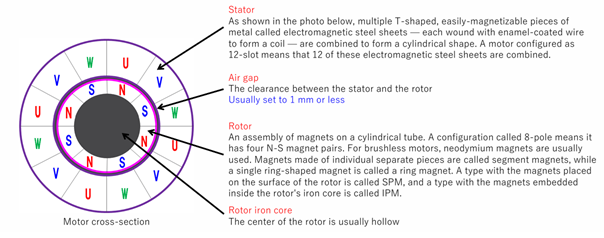
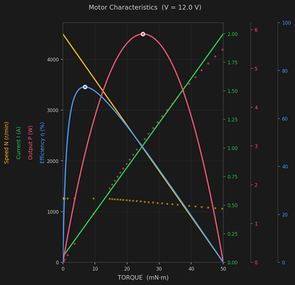

# Motor Model — Electrical and Mechanical Equations

This document describes the plant model of the three-phase brushless DC motor (BLDC / PMSM) used by `bldc-foc-sim`. In the code this corresponds to `motor_model.{hpp,cpp}`.

---

## 1. Target Motor

This series targets a **surface-mounted permanent-magnet three-phase synchronous motor (SPMSM)**. It has a structure in which permanent magnets are bonded to the rotor surface, giving it the property that the d-axis inductance and q-axis inductance are nearly equal ($`L_d \approx L_q = L`$). This assumption simplifies the model and lets us avoid dealing with terms arising from saliency.



*The outer ring is the stator (UVW coil arrangement) and the inner ring is the rotor (N/S arrangement of permanent magnets). This example has 8 poles, i.e. 4 pole pairs (Pn=4).*

| Symbol | Meaning | Unit |
|------|------|------|
| $`R`$ | Winding resistance | Ω |
| $`L`$ | Winding inductance ($`L_d = L_q`$) | H |
| $`K_e`$ | Back-EMF constant | V·s/rad |
| $`K_t`$ | Torque constant | Nm/A |
| $`J`$ | Rotor moment of inertia | kg·m² |
| $`B`$ | Viscous friction coefficient | Nm·s/rad |
| $`P_n`$ | Number of pole pairs | — |

---

## 2. Voltage Equations in the dq Frame

Because three-phase AC quantities are hard to control directly, they are transformed into a **dq rotating reference frame** that rotates in synchronism with the rotor (see [`coordinate-transform.md`](coordinate-transform.md) for the details of the coordinate transform).

The voltage equations in the dq frame are as follows.

$$
v_d = R i_d + L \frac{di_d}{dt} - \omega_e L i_q
$$

$$
v_q = R i_q + L \frac{di_q}{dt} + \omega_e L i_d + K_e \omega_m
$$

- $`v_d,\thinspace  v_q`$ : applied voltages on the d-axis / q-axis
- $`i_d,\thinspace  i_q`$ : currents on the d-axis / q-axis
- $`\omega_e = P_n \cdot \omega_m`$ : electrical angular velocity
- $`\omega_m`$ : mechanical angular velocity
- $`K_e \omega_m`$ : back-EMF term; it appears on the q-axis as the motor rotates

The terms $`-\omega_e L i_q`$ and $`+\omega_e L i_d`$ on the right-hand side are the **cross-coupling terms between the d- and q-axes**. The control that cancels these terms is "decoupling control (non-interference control)," which is covered in detail in [`foc.md`](foc.md).

---

## 3. Equation of Motion of the Mechanical System

The electromagnetic torque is proportional to the q-axis current.

$$
T_e = K_t i_q
$$

The equation of motion about the rotor shaft (the rotational form of Newton's second law) is as follows.

$$
J \frac{d\omega_m}{dt} = T_e - T_{load} - B \omega_m
$$

- $`T_e`$ : electromagnetic torque (the torque produced by the motor)
- $`T_{load}`$ : load torque
- $`B \omega_m`$ : braking torque due to viscous friction

The angle is obtained by integrating the angular velocity.

$$
\theta_m = \int \omega_m \thinspace  dt \quad \text{(mechanical angle)}, \qquad \theta_e = P_n \cdot \theta_m \quad \text{(electrical angle)}
$$

---

## 4. Numerical Integration and Discretization

### 4.1 Electrical System: Forward Euler Method

The dq-axis current equations are discretized using the forward Euler method.

$$
i_{k+1} = \left(1 - \frac{R}{L} dt\right) i_k + \frac{dt}{L} v_k
$$

The stability condition is $`0 \le dt \le \dfrac{2L}{R}`$. In this code, against $`\dfrac{2L}{R} = 2\thinspace \mathrm{ms}`$, we use $`dt = 0.25\thinspace \mathrm{ms}`$ (a margin of 1/8).

### 4.2 Mechanical System: Trapezoidal Integration

Because the mechanical system responds slowly and errors tend to accumulate, we use the more accurate **trapezoidal rule**.

$$
\omega_{k+1} = \omega_k + \frac{dt}{2}\left(\left.\frac{d\omega}{dt}\right|_{k+1} + \left.\frac{d\omega}{dt}\right|_k\right)
$$

### 4.3 Rationale for the Discretization Choices

| System | Integration method | Reason |
|----|----------|------|
| Electrical system | Forward Euler (1st order) | The electrical time constant $`L/R = 1\thinspace \mathrm{ms}`$ leaves ample margin relative to the 250 µs sampling period |
| Mechanical system | Trapezoidal (2nd order) | Slow response makes errors prone to accumulate, so high-accuracy integration is needed |
| PI integral term | Trapezoidal | Realizes an unbiased discrete integration |

---

## 5. Simplifications in This Code

The plant model of `bldc-foc-sim` makes the following simplifications, prioritizing clarity as educational material.

- **SPM assumption ($`L_d = L_q = L`$)** — saliency is ignored
- The dq-axis cross-coupling terms $`\omega_e L i`$ are not solved explicitly inside the plant; instead, the d-axis and q-axis are each integrated as an independent first-order lag system. The effect of the cross-coupling is handled by feedforward on the controller side when decoupling control is enabled
- Iron loss, magnetic saturation, cogging torque, and temperature dependence are out of scope

---

## 6. Correspondence with the Code

The current update in `motor_model.cpp` is the forward-Euler discretization of the dq-axis voltage equations.

```cpp
// Update q-axis current (back_emf = Ke·ω)
q_current_state_ += (q_voltage - back_emf - R * q_current_state_) / L * dt;

// Update d-axis current
d_current_state_ += (d_voltage - R * d_current_state_) / L * dt;
```

The electromagnetic torque is $`T_e = K_t i_q`$, and the mechanical system is updated by trapezoidal integration.

```cpp
electric_torque = torque_constant * q_current;
// Mechanical system (trapezoidal integration)
angular_vel_ += (diff_angular_vel_ + pre_diff_angular_vel_) * resolution_ / 2.0;
```

---

## 7. TIN Characteristics

The TIN characteristics take the **torque (T)** under rated voltage on the horizontal axis and show the characteristics of **rotational speed (N), current (I), output power (P), and efficiency (η)** together on the same graph. It is a standard presentation format found in product datasheets from manufacturers such as Mabuchi Motor.



*Figure: TIN characteristics at V = 12.0 V. Yellow = rotational speed N, green = current I, pink = output power P, blue = efficiency η. The white circles are the maximum point of each curve.*

### 7.1 Rotational Speed N — Inversely Related to Torque

$$
N = N_0 \left(1 - \frac{T}{T_s}\right)
$$

- At **no load (T = 0)**, the rotational speed is at its maximum value $`N_0`$ (the no-load speed)
- As torque increases, the rotational speed **decreases linearly**
- At the **stall torque (T = Ts)**, the rotational speed becomes zero (the stalled condition)

This linear relationship follows from the fact that the back-EMF $`e = K_e \omega`$ is proportional to the rotational speed, and that what remains after subtracting the resistive drop $`RI`$ from the terminal voltage $`V`$ is consumed as back-EMF.

### 7.2 Current I — Proportional to Torque

$$
I = I_0 + (I_s - I_0)\frac{T}{T_s}
$$

- The **no-load current $`I_0`$** is the minimum current needed to cover friction and iron loss, and it does not become zero
- The current also **increases linearly** in proportion to the torque increase
- At stall it reaches its maximum value (the stall current $`I_s`$)
- This directly corresponds to the equation stating that current is proportional to the electromagnetic torque $`T_e = K_t i_q`$

### 7.3 Output Power P — Maximum at Intermediate Torque

$$
P = T \cdot \omega = T \cdot \frac{2\pi N}{60}
$$

- At T = 0 (no load), the motor does no work even though it rotates, so the output power is zero
- At T = Ts (stall), the rotational speed is zero, so the output power is again zero
- At the midpoint between them, **the output power is maximum when $`T = T_s/2`$**
- The maximum output power is $`P_\mathrm{max} = \dfrac{T_s \cdot \omega_0}{4}`$ (where $`\omega_0 = 2\pi N_0/60`$)

### 7.4 Efficiency η — Peaks at a Lower Torque than Maximum Output Power

$$
\eta = \frac{P_\mathrm{out}}{P_\mathrm{in}} = \frac{T \cdot \omega}{V \cdot I}
$$

- The efficiency traces a mountain-shaped curve with respect to torque
- The maximum-efficiency point is located **at a lower torque than the maximum-output point** (toward lighter load)
- Because the output power is zero at both no load and stall, the efficiency is also near zero there
- The practical operating point is generally set near the efficiency peak (the rated point)

### 7.5 Summary of Representative Operating Points

| Operating point | Torque | Speed | Current | Notes |
|--------|--------|--------|------|------|
| No load | $`0`$ | $`N_0`$ | $`I_0`$ | Only the current for friction and iron loss |
| Maximum efficiency | $`T_{\eta\thinspace \mathrm{max}}`$ | — | — | Guideline for practical operation |
| Maximum output | $`T_s / 2`$ | $`N_0 / 2`$ | $`(I_0 + I_s)/2`$ | Output is maximum but efficiency drops |
| Stall | $`T_s`$ | $`0`$ | $`I_s`$ | Danger zone of overcurrent and overheating |

---

## 8. Resolver Sensor

A resolver is an analog sensor that **detects the rotor rotation angle** of the motor. Unlike an encoder, it contains no electronic components, so it is robust in high-temperature, vibration, and noisy environments and is widely used in automotive and industrial applications. Because FOC requires the electrical angle in real time, accurately computing the angle from the resolver output is the key to control performance.

### 8.1 Operating Principle

A resolver consists of an **excitation coil** and **two-phase output coils that have a 90° phase difference from each other**.

1. A sinusoidal voltage (excitation voltage) is applied to the excitation coil
2. The magnetic material attached to the rotor affects the magnetic field of the excitation coil
3. The two-phase output coils induce sinusoids that are 90° out of phase with each other
4. Computing the **arctangent** of these two-phase outputs (the sin component and cos component) detects the angular position of the rotor

### 8.2 Output Waveform Equations

The relationships between the excitation voltage and the two-phase output voltages are shown below.

$$
\text{(excitation voltage)} \quad e_0 = E_0 \sin(\omega t) \qquad (1)
$$

$$
\text{(output voltage, cos phase)} \quad e_\mathrm{cos} = K E_0 \sin(\omega t) \cdot \cos(X\theta) \qquad (2)
$$

$$
\text{(output voltage, sin phase)} \quad e_\mathrm{sin} = K E_0 \sin(\omega t) \cdot \sin(X\theta) \qquad (3)
$$

| Symbol | Meaning | Unit |
|------|------|------|
| $`E_0`$ | Excitation voltage amplitude | V |
| $`K`$ | Transformation ratio | — |
| $`\omega`$ | Excitation angular frequency $`= 2\pi f`$ | rad/s |
| $`f`$ | Excitation frequency | Hz |
| $`\theta`$ | Rotor rotation angle | rad |
| $`X`$ | Axis multiple angle (= 2, 3, 4, etc.) | — |

Because the envelopes of equations (2) and (3) (the components after demodulating $`\sin(\omega t)`$) correspond to $`\cos(X\theta)`$ and $`\sin(X\theta)`$ respectively, the rotor angle $`\theta`$ can be computed from the arctangent of their ratio.

$$
\theta = \frac{1}{X} \arctan\negthinspace \left(\frac{e_\mathrm{sin}}{e_\mathrm{cos}}\right) = \frac{1}{X} \arctan\negthinspace \left(\frac{\sin(X\theta)}{\cos(X\theta)}\right)
$$

### 8.3 Relationship Between Electrical Angle and Mechanical Angle

When applying three-phase sinusoidal voltages to a three-phase brushless motor, the phase of the voltage is determined relative to the angle detected by the resolver. At this point it is important to correctly grasp the relationship between the **electrical angle** and the **mechanical angle**; in motor control it is common to use the electrical angle as the rotor angle.

$$
\theta_e = P_n \cdot \theta_m
$$

- $`\theta_e`$ : electrical angle
- $`\theta_m`$ : mechanical angle (the physical rotation angle of the rotor)
- $`P_n`$ : number of pole pairs

**Example: 8 poles, 12 slots, 4x resolver**

In an 8-pole ($`P_n = 4`$) motor, each time the rotor rotates 90° in mechanical angle, the electrical angle completes one full turn of 360°. A 4x resolver ($`X = 4`$) is a specification matched to this pole-pair count, so the electrical angle makes 4 turns per rotor revolution.

| | 1 electrical cycle | 1 rotor revolution |
|---|---|---|
| Mechanical angle | 90° | 360° |
| Electrical angle | 360° | 1440° (4 turns) |


In FOC, the angle obtained from the resolver output is multiplied by $`P_n`$ to convert it into the electrical angle, which is used as the phase reference for the Park transform and the inverse Park transform.

---

## Related Documents

- [`foc.md`](foc.md) — Principles of Field-Oriented Control (FOC)
- [`coordinate-transform.md`](coordinate-transform.md) — Clarke / Park transforms
- [`pi-tuning.md`](pi-tuning.md) — PI gain design
- [`waveform-analysis.md`](waveform-analysis.md) — Measurement-based waveform difference analysis
