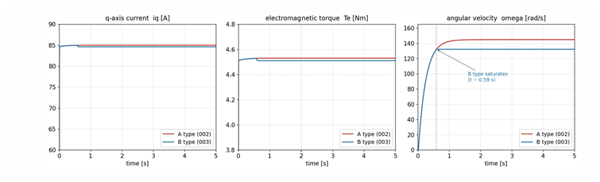

# Waveform-Difference Analysis — Why iq and Torque Behave Differently Across Models

This document analyzes, based on measured simulation values, the **differences in current and torque waveforms** observed in each model of `bldc-foc-sim`. In particular, it focuses on the following two comparisons.

1. **Difference between the ideal voltage source (01) and PWM drive (02)** — the steady-state rotation speed changes
2. **Difference between PWM drive (02) and sensorless (04)** — the torque behavior at startup changes

> **Numerical preconditions**
> The numerical values in this document are measured examples under the default parameters and load conditions ($i_q^* = 85\,\mathrm{A}$, $T_{load} = 4.3\,\mathrm{Nm}$, $V_{dc} = 48\,\mathrm{V}$). Rather than the values themselves, please focus on the causal relationship of "which factor matters."

---

## 1. Ideal Voltage Source Model (01) vs PWM Drive Model (02)

Even when the same FOC and the same physical parameters ($R = 0.1\,\Omega$, $L = 0.1\,\mathrm{mH}$, $K_e = K_t = 0.0533$, $P_n = 4$) are used, the **steady-state rotation speed differs** between the two models. The cause is the voltage saturation specific to the PWM drive model.

### 1.1 Observed Difference

| Quantity | 01 Ideal voltage source (Type A) | 02 PWM drive (Type B) |
|----|---------------------|---------------------|
| Rising waveform | — | Matches 01 |
| $i_q$ steady-state value | 85.00 A (reaches command) | 84.62 A |
| $T_e$ steady-state value | 4.530 Nm | 4.510 Nm |
| $\omega_m$ steady-state value | **144.8 rad/s** | **132.1 rad/s (about 9% lower)** |

The three graphs above show, from left to right, the q-axis current $i_q$, the electromagnetic torque $T_e$, and the angular velocity $\omega_m$. While $i_q$ and $T_e$ nearly coincide, only Type B (PWM drive) reaches voltage saturation at $t \approx 0.59\,\mathrm{s}$ and plateaus for $\omega_m$, settling at a steady-state value about 9% lower than Type A (ideal voltage source).

The key points are the following two.

- The rise (transient) matches between the two models
- The difference appears mainly in $\omega$ (maximum rotation speed)

### 1.2 Why the Rise Matches but the Steady State Differs

During the rising transient, $\omega_m$ is still small, so the back-EMF $K_e \omega_m$ is also small. For this reason, the required q-axis voltage stays below the PWM voltage upper limit, and both models can apply the PI output as is. As a result, the waveforms of $i_q$, $T_e$, and $\omega$ match completely. However, as $\omega_m$ rises, the back-EMF increases, and in the steady-state region only the PWM drive model reaches the voltage upper limit and is clamped. Since the ideal voltage source model has no upper limit, $\omega$ keeps growing, and it is here that the difference first appears.

### 1.3 Cause — Steady-State q-Axis Voltage Balance and Voltage Saturation

The steady-state q-axis voltage balance is given by the following equation.

$$
v_q = R i_q + K_e \omega_m
$$

The back-EMF term $K_e \omega_m$ increases with rotation speed, and in the PWM drive model it reaches the upper limit of the applicable phase-voltage peak. Once the upper limit is reached, the PI output is clamped, no more $i_q$ can be driven, and the rotation speed plateaus. The concrete computation of the voltage upper limit and the verification of the settling point are in [`pwm-inverter.md`](pwm-inverter.md) §5, so they are not repeated here.

> **A common misconception**
> The explanation that "the PWM model rises as a linear ramp" is incorrect. In measurements, the rising waveform matches the ideal voltage source model, and the difference appears in the form of voltage saturation in the high-speed region.

### 1.4 Improvement by Midpoint Modulation

When midpoint modulation (zero-sequence injection / equivalent to SVPWM) is enabled, the phase-voltage peak can be lowered without changing the line-to-line voltage, so the fundamental-wave amplitude can be extended by a factor of up to $2/\sqrt{3} \approx 1.155$ at the same $V_{dc}$. This recovers the rotation speed that had plateaued due to voltage saturation; in measurements, $\omega_m$ returns from 132.1 → 144.8 rad/s to the level of the ideal voltage source model, and $i_q$ also reaches the command value of 85.00 A. For the equations and implementation of midpoint modulation, see [`pwm-inverter.md`](pwm-inverter.md) §4 and §7.

---

## 2. PWM Drive Model (02) vs Sensorless Model (04) — Startup Torque Problem

In the early development of the sensorless model, there was a symptom in which the torque became disturbed at the switch of the startup sequence. There were three causes, and it was solved with three fixes.

### 2.1 Symptom

At the instant of switching from seeded startup (injecting the true rotor angle into the observer) to pure sensorless (upon reaching `kStartupSteps`, default 250 ms), the following disturbances occurred.

- $i_d$ changed abruptly from 0 to about −23 A
- Steps and oscillation in $T_e$
- Growth of the estimated angle error

### 2.2 Cause — 3 Factors

**(a) Mix-up of the speed passed to `force_sync`**: Since the PLL integrates the electrical angle, the electrical angular velocity is required, but the mechanical angular velocity was being passed.

**(b) Hard switching**: The discontinuous switch in a single step caused the dq coordinate frame to jump. The frame jumps by exactly the amount by which the estimated angle is slightly off, producing a step in the torque waveform.

**(c) LPF phase lag**: Without compensation, the angle error $\arctan(\omega_e/\omega_c)$ due to the back-EMF LPF remains. Under the default condition $\omega_e = P_n \omega_m = 4 \times 132 \approx 528\,\mathrm{rad/s}$, $\omega_c = 2000\,\mathrm{rad/s}$, giving $\arctan(528/2000) \approx 14.8°$.

### 2.3 Fixes

| Countermeasure | Content |
|------|------|
| Passing the electrical angular velocity | Pass "mechanical angular velocity × number of pole pairs" to `force_sync` |
| Blended transition | Linearly interpolate from the true value to the estimated value over `kBlendSteps = 200` steps (= 50 ms) |
| LPF phase compensation | Add $+\arctan(\omega_e/\omega_c)$ in `get_angle_deg()` |

### 2.4 Effect of the Fixes

| Metric | Before fix | After fix |
|------|--------|--------|
| Abrupt $i_d$ change at switching | 0 → about −23 A (in one step) | Transitions smoothly |
| $T_e$ step at switching | Clear step and oscillation | Nearly flat |
| Steady-state angle error | About 12.7° (close to the theoretical value of 14.8°) | About −0.5° to −1° |

For the detailed implementation of the startup sequence (seed injection → blended transition → self-sustaining), see [`sensorless.md`](sensorless.md) §6.

---

## 3. Comparison Tools

In the `scripts/` directory of each model, tools are provided to compare waveforms by condition.

| Tool | Purpose |
|--------|------|
| `compare_modulation.py` | Compares midpoint modulation and decoupling control ON/OFF under 4 conditions |
| `compare_decoupling_transient.py` | Compares the transient response of decoupling control ON/OFF |

---

## Related Documents

- [`motor-model.md`](motor-model.md) — Voltage equation including back-EMF
- [`pwm-inverter.md`](pwm-inverter.md) — PWM voltage saturation and midpoint modulation
- [`sensorless.md`](sensorless.md) — Sensorless control and startup sequence
- [`foc.md`](foc.md) — Conditions under which the effect of decoupling control appears
