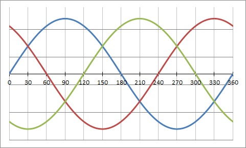
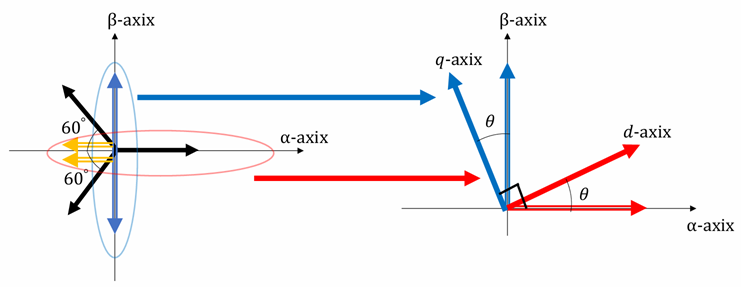

# 座標変換 — Clarke 変換と Park 変換

ベクトル制御で用いる座標変換の数学を説明する。コード上は `motor_vector_conv.{hpp,cpp}` に対応する。  
変換は 2 段階で行われる。

```
三相 UVW ──[Clarke 変換]──▶ 二相 αβ (静止座標) ──[Park 変換]──▶ dq (回転座標)
```

---

## 1. d 軸・q 軸とは

三相ブラシレスモータ制御では、三相交流成分を **d 軸 (Direct Axis)** と **q 軸 (Quadrature Axis)** の 2 軸に分解し、フィードバック制御を適用するのが一般的である。

| 軸 | 名称 | 役割 |
|----|------|------|
| d 軸 | Direct Axis | ロータ磁束と同じ向き。トルクに非寄与。弱め界磁制御で使用 |
| q 軸 | Quadrature Axis | 磁束と直交。**トルクを生む成分** |

三相成分の実効値は q 軸電流と等しいわけではない。d 軸成分が存在する場合（弱め界磁等）、実効値の計算は異なる。



*UVW 三相交流は互いに 120° ずれた正弦波。これを d・q 軸の直流量に変換することで PI 制御が適用できる。*

---

## 2. Clarke 変換 (三相 → 二相 αβ)

三相 UVW 量を、互いに直交する 2 軸 α・β の **静止座標系** に変換する。  
本コードは**電力不変形** ($k = \sqrt{2/3}$) を用いる。

三相各軸を 0°・120°・240° の単位ベクトルへ射影することで αβ 成分を得る（3 センサ版）。

$$
\begin{bmatrix} i_\alpha \cr i_\beta \end{bmatrix}
= \sqrt{\frac{2}{3}}
\begin{bmatrix}
  1 & -\dfrac{1}{2}       & -\dfrac{1}{2}      \cr
  0 & \phantom{-}\dfrac{\sqrt{3}}{2} & -\dfrac{\sqrt{3}}{2}
\end{bmatrix}
\begin{bmatrix} i_U \cr i_V \cr i_W \end{bmatrix}
$$

三相が平衡している ($i_U + i_V + i_W = 0$) 場合、零相成分は 0 となり、上式の 2 行で完全に表現できる。


*(a) 三相 UVW 座標系と αβ 座標系の関係。(b) 三相電流ベクトルを α・β 軸へ射影する様子。*

### 2.1 スケール係数の導出 — 絶対変換条件

以下は射影の基本式であり、これはまだ**相対変換**である。逆変換で元の値に戻るためには**絶対変換**の条件を満たす必要がある。

変換行列をスケール係数 $k$ で定義する。

$$
[C_{abc}]
= k
\begin{bmatrix}
  \cos 0°  & \cos 120°  & \cos 240° \cr
  \sin 0°  & \sin 120°  & \sin 240°
\end{bmatrix},
\qquad
[C_{\alpha\beta}]
= k
\begin{bmatrix}
  \cos 0°  & \cos 120°  & \cos 240° \cr
  \sin 0°  & \sin 120°  & \sin 240°
\end{bmatrix}^{T}
$$

$[C_{abc}]$ に逆変換 $[C_{\alpha\beta}]$ をかけると単位行列になる条件から，

$$
[C_{abc}][C_{\alpha\beta}] = [1]
$$

左辺を展開し，数値を代入して計算すると，

$$
k^2
\begin{bmatrix}
  1 & -\dfrac{1}{2}       & -\dfrac{1}{2}      \cr
  0 & \phantom{-}\dfrac{\sqrt{3}}{2} & -\dfrac{\sqrt{3}}{2}
\end{bmatrix}
\begin{bmatrix}
  1             & 0                   \cr
  -\dfrac{1}{2} & \phantom{-}\dfrac{\sqrt{3}}{2} \cr
  -\dfrac{1}{2} & -\dfrac{\sqrt{3}}{2}
\end{bmatrix}
= k^2
\begin{bmatrix}
  \dfrac{3}{2} & 0            \cr
  0            & \dfrac{3}{2}
\end{bmatrix}
= [1]
$$

よって，

$$
\boxed{k = \sqrt{\frac{2}{3}}}
$$

変換行列は次のように確定する。

$$
[C_{abc}]
= \sqrt{\frac{2}{3}}
\begin{bmatrix}
  1 & -\dfrac{1}{2}       & -\dfrac{1}{2}      \cr
  0 & \phantom{-}\dfrac{\sqrt{3}}{2} & -\dfrac{\sqrt{3}}{2}
\end{bmatrix}
$$

### 2.2 二相センサへの簡略化

$i_U + i_V + i_W = 0$ より $i_V = -(i_U + i_W)$ を代入すると，**U 相・W 相の 2 成分だけ**で αβ 変換が完結する。

**α 成分：**

$$
i_\alpha
= \sqrt{\frac{2}{3}}
\left(
  i_U - \frac{1}{2}\bigl(-(i_U + i_W)\bigr) - \frac{1}{2} i_W
\right)
= \sqrt{\frac{2}{3}} \cdot \frac{3}{2}\thinspace  i_U
$$

**β 成分：**

$$
i_\beta
= \sqrt{\frac{2}{3}}
\left(
  \frac{\sqrt{3}}{2}\bigl(-(i_U + i_W)\bigr)
  - \frac{\sqrt{3}}{2}\thinspace  i_W
\right)
= \sqrt{\frac{2}{3}}
\left(
  -\frac{\sqrt{3}}{2}\thinspace  i_U - \sqrt{3}\thinspace  i_W
\right)
$$

$$
\boxed{
\begin{bmatrix} i_\alpha \cr i_\beta \end{bmatrix}
= \sqrt{\frac{2}{3}}
\begin{bmatrix}
  \dfrac{3}{2}           & 0       \cr
  -\dfrac{\sqrt{3}}{2}   & -\sqrt{3}
\end{bmatrix}
\begin{bmatrix} i_U \cr i_W \end{bmatrix}
}
$$

> ハードウェア上では U・W 相のみセンシングすれば良く，電流センサを 1 個削減できる。

### 2.3 逆 Clarke 変換 (αβ → UVW)

$$
i_U = i_\alpha, \quad
i_V = -\frac{1}{2}i_\alpha + \frac{\sqrt{3}}{2}i_\beta, \quad
i_W = -\frac{1}{2}i_\alpha - \frac{\sqrt{3}}{2}i_\beta
$$

---

## 3. Park 変換 (二相 αβ → 回転 dq)

静止座標 αβ を、電気角 $\theta$ で回転する dq 座標系に変換する。これにより正弦波状の交流量が **直流量** になる。

$$
\begin{bmatrix} i_d \cr i_q \end{bmatrix}
=
\begin{bmatrix} \cos\theta & -\sin\theta \cr \sin\theta & \cos\theta \end{bmatrix}
\begin{bmatrix} i_\alpha \cr i_\beta \end{bmatrix}
$$

ここで $\theta$ は **電気角** であり、機械角 $\theta_m$ に極対数 $P_n$ を掛けたものである ($\theta_e = P_n \cdot \theta_m$)。



*αβ 固定座標から、電気角 θ だけ回転した dq 回転座標へ変換する。ロータと同期して回転するため、正弦波が直流量に見える。*

### 3.1 三相二軸直接変換 — Clarke + Park 統合

2.2 節の αβ 式に Park の回転行列をかけると，

$$
\begin{bmatrix} i_d \cr i_q \end{bmatrix}
= \sqrt{\frac{2}{3}}
\underbrace{
\begin{bmatrix}
  \cos\theta & -\sin\theta \cr
  \sin\theta &  \cos\theta
\end{bmatrix}
}_{\text{回転行列}}
\begin{bmatrix}
  \dfrac{3}{2}           & 0       \cr
  -\dfrac{\sqrt{3}}{2}   & -\sqrt{3}
\end{bmatrix}
\begin{bmatrix} i_U \cr i_W \end{bmatrix}
$$

加法定理により変換行列を整理すると，以下の**三相二軸変換式**が得られる。

$$
\begin{bmatrix} i_d \cr i_q \end{bmatrix}
= \sqrt{2}
\begin{bmatrix}
  \cos\theta & -\sin\theta \cr
  \sin\theta &  \cos\theta
\end{bmatrix}
\begin{bmatrix}
  \dfrac{\sqrt{3}}{2} & 0  \cr
  -\dfrac{1}{2}        & -1
\end{bmatrix}
\begin{bmatrix} i_U \cr i_W \end{bmatrix}
= \sqrt{2}
\begin{bmatrix}
  \sin\negthinspace \left(\theta + \dfrac{2}{3}\pi\right)   & -\sin(\theta)                              \cr
  -\sin\negthinspace \left(\theta + \dfrac{1}{6}\pi\right)  & -\sin\negthinspace \left(\theta + \dfrac{1}{2}\pi\right)
\end{bmatrix}
\begin{bmatrix} i_U \cr i_W \end{bmatrix}
$$

三相交流成分を直流成分に補正するために実効値換算 $\sqrt{\dfrac{1}{3}}$ をかけると（理由は [第 4 節](#4-実効値換算について) 参照），

$$
\boxed{
\begin{bmatrix} i_d \cr i_q \end{bmatrix}
= \sqrt{\frac{2}{3}}
\begin{bmatrix}
  \sin\negthinspace \left(\theta + \dfrac{2}{3}\pi\right)   & -\sin(\theta)                              \cr
  -\sin\negthinspace \left(\theta + \dfrac{1}{6}\pi\right)  & -\sin\negthinspace \left(\theta + \dfrac{1}{2}\pi\right)
\end{bmatrix}
\begin{bmatrix} i_U \cr i_W \end{bmatrix}
}
$$

### 3.2 逆 Park 変換 (dq → αβ)

回転行列の転置 (= 逆行列) で与えられる。

$$
\begin{bmatrix} i_\alpha \cr i_\beta \end{bmatrix}
=
\begin{bmatrix} \cos\theta & \sin\theta \cr -\sin\theta & \cos\theta \end{bmatrix}
\begin{bmatrix} i_d \cr i_q \end{bmatrix}
$$

逆 Park 変換で dq → αβ に戻し、さらに逆 Clarke 変換で αβ → UVW に変換すると、三相 PWM 電圧として出力できる。


*dq 軸の直流指令値を αβ 経由で三相正弦波に変換する。右のグラフは逆変換後の三相電圧波形。*

---

## 4. 実効値換算について

三相二相変換はベクトル空間において以下のように表現できる。

$$
i_{\alpha\beta}
= \sqrt{\frac{2}{3}}
\left(
  i_U + e^{j\frac{2\pi}{3}} i_V + e^{j\frac{4\pi}{3}} i_W
\right)
$$

一相あたりの電流は，実効値を $i$ とすると，

$$
i_U = \sqrt{2}\thinspace  i \cos(\omega t),
\qquad
i_V = \sqrt{2}\thinspace  i \cos\negthinspace \left(\omega t + \frac{2\pi}{3}\right),
\qquad
i_W = \sqrt{2}\thinspace  i \cos\negthinspace \left(\omega t + \frac{4\pi}{3}\right)
$$

オイラーの公式 $\cos(\omega t) = \dfrac{e^{j\omega t} + e^{-j\omega t}}{2}$ で変形し，代入すると，

$$
i_{\alpha\beta}
= \sqrt{\frac{2}{3}} \sqrt{2}\thinspace  i
\left(
  \frac{3}{2}\thinspace  e^{j\omega t}
  + \frac{1}{2}\thinspace  e^{-j\omega t}
  \negthinspace \left(1 + e^{j\frac{4\pi}{3}} + e^{j\frac{8\pi}{3}}\right)
\right)
$$

$1 + e^{j\frac{4\pi}{3}} + e^{j\frac{8\pi}{3}}$ の括弧内は三角関数の対称性から 0 となり，

$$
i_{\alpha\beta} = \sqrt{3}\thinspace  i\thinspace  e^{j\omega t}
$$

> **結論：** 三相二相変換後の電流は実効値の $\sqrt{3}$ 倍となるため，$\sqrt{\dfrac{1}{3}}$ をかける必要がある。

d 軸成分が存在する場合（弱め界磁など）は単純な比例関係にならないことに注意。

---

## 5. 逆変換の導出 — dq → 三相

以下に二軸 (d, q) → 三相 (U, V, W) 変換を説明する。

3.1 節で得た順変換式の逆行列を求める。

$$
\begin{bmatrix} i_d \cr i_q \end{bmatrix}
= \sqrt{\frac{2}{3}}
\begin{bmatrix}
  \sin\negthinspace \left(\theta + \dfrac{2}{3}\pi\right)   & -\sin(\theta)                              \cr
  -\sin\negthinspace \left(\theta + \dfrac{1}{6}\pi\right)  & -\sin\negthinspace \left(\theta + \dfrac{1}{2}\pi\right)
\end{bmatrix}
\begin{bmatrix} i_U \cr i_W \end{bmatrix}
$$

**行列式を計算する。**

$$
\det A
= \sin\negthinspace \left(\theta + \frac{2}{3}\pi\right) \cdot \left(-\sin\negthinspace \left(\theta + \frac{1}{2}\pi\right)\right)
- \left(-\sin(\theta)\right) \cdot \left(-\sin\negthinspace \left(\theta + \frac{1}{6}\pi\right)\right)
$$

加法定理を使って展開すると（$\sin(\theta+\frac{2}{3}\pi)\cos\theta - \sin\theta\sin(\theta+\frac{1}{6}\pi)$ を展開すれば三角関数の直交性により），

$$
\det A = -\frac{\sqrt{3}}{2}
$$

**逆行列を組み立てる。**

$$
\begin{bmatrix} i_U \cr i_W \end{bmatrix}
= \sqrt{\frac{3}{2}} \cdot \frac{1}{-\dfrac{\sqrt{3}}{2}}
\begin{bmatrix}
  -\sin\negthinspace \left(\theta + \dfrac{1}{2}\pi\right) & \phantom{-}\sin(\theta)                   \cr
  \phantom{-}\sin\negthinspace \left(\theta + \dfrac{1}{6}\pi\right)  & \sin\negthinspace \left(\theta + \dfrac{2}{3}\pi\right)
\end{bmatrix}
\begin{bmatrix} i_d \cr i_q \end{bmatrix}
$$

スケール係数を整理する。

$$
\sqrt{\frac{3}{2}} \cdot \left(-\frac{2}{\sqrt{3}}\right)
= -\frac{2}{\sqrt{2}}
= -\sqrt{2}
$$

以上より，

$$
\boxed{
\begin{bmatrix} i_U \cr i_W \end{bmatrix}
= -\sqrt{2}
\begin{bmatrix}
  -\sin\negthinspace \left(\theta + \dfrac{1}{2}\pi\right) & \phantom{-}\sin(\theta)                   \cr
  \phantom{-}\sin\negthinspace \left(\theta + \dfrac{1}{6}\pi\right)  & \sin\negthinspace \left(\theta + \dfrac{2}{3}\pi\right)
\end{bmatrix}
\begin{bmatrix} i_d \cr i_q \end{bmatrix}
}
$$

残る $i_V$ は $i_V = -(i_U + i_W)$ から算出する。

---

## 6. ベクトル変換フロー

目標制御量に追従するよう、dq 軸電流に対してフィードバック制御が適用される。

```
三相電流 UVW
   │
   ▼ [Clarke 変換]
αβ 電流 (静止座標)
   │
   ▼ [Park 変換 (電気角 θ 使用)]
dq 電流 (回転座標) ◀── フィードバック誤差
   │
   ▼ [dq 軸 PI 制御]
dq 電圧指令
   │
   ▼ [逆 Park 変換]
αβ 電圧
   │
   ▼ [逆 Clarke 変換]
三相 PWM 電圧 UVW ──▶ モータ
```

※実際は dq 電流値を PWM 信号の Duty 比に換算し、三相ブリッジ回路を介してモータに印加する。

---

## 7. なぜ 2 段階に分けるのか

Clarke 変換と Park 変換を合成すれば UVW から dq への一度変換行列も書けるが、2 段階に分けることには利点がある。

- **αβ 静止座標は角度に依存しない** — センサーレス制御では、まず αβ で誘起電圧を推定し、その位相から角度を求める。Clarke 変換だけは角度なしで実行できる ([`sensorless.md`](sensorless.md) 参照)
- 各変換の物理的意味が明確になり、デバッグしやすい

本コードでは、`uvw_to_dq()` が内部で 2 段階を合成し、センサーレス用に `uvw_to_alphabeta()` (Clarke 変換のみ) も別途提供している。

---

## 8. コードとの対応

`motor_vector_conv.cpp` に Clarke / Park 変換が静的関数として実装されている。

```cpp
// UVW → dq (Clarke + Park を合成)
Eigen::Vector2d MotorVectorConv::uvw_to_dq(const Eigen::Vector3d& uvw, double deg);

// dq → UVW (逆 Park + 逆 Clarke)
Eigen::Vector3d MotorVectorConv::dq_to_uvw(const Eigen::Vector2d& dq, double deg);

// UVW → αβ (Clarke 変換のみ。センサーレス観測器用)
Eigen::Vector2d MotorVectorConv::uvw_to_alphabeta(const Eigen::Vector3d& uvw);
```

角度引数 `deg` は電気角 [度] である。

---

## まとめ：変換式一覧

| 変換 | 式 |
|------|-----|
| **三相 → αβ（3 センサ）** | $\begin{bmatrix}i_\alpha\cr i_\beta\end{bmatrix}=\sqrt{\frac{2}{3}}\begin{bmatrix}1&-\frac{1}{2}&-\frac{1}{2}\cr0&\frac{\sqrt{3}}{2}&-\frac{\sqrt{3}}{2}\end{bmatrix}\begin{bmatrix}i_U\cr i_V\cr i_W\end{bmatrix}$ |
| **三相 → αβ（2 センサ）** | $\begin{bmatrix}i_\alpha\cr i_\beta\end{bmatrix}=\sqrt{\frac{2}{3}}\begin{bmatrix}\frac{3}{2}&0\cr-\frac{\sqrt{3}}{2}&-\sqrt{3}\end{bmatrix}\begin{bmatrix}i_U\cr i_W\end{bmatrix}$ |
| **三相 → dq（直接）** | $\begin{bmatrix}i_d\cr i_q\end{bmatrix}=\sqrt{\frac{2}{3}}\begin{bmatrix}\sin(\theta+\frac{2}{3}\pi)&-\sin\theta\cr-\sin(\theta+\frac{1}{6}\pi)&-\sin(\theta+\frac{1}{2}\pi)\end{bmatrix}\begin{bmatrix}i_U\cr i_W\end{bmatrix}$ |
| **dq → 三相（逆変換）** | $\begin{bmatrix}i_U\cr i_W\end{bmatrix}=-\sqrt{2}\begin{bmatrix}-\sin(\theta+\frac{1}{2}\pi)&\sin\theta\cr\sin(\theta+\frac{1}{6}\pi)&\sin(\theta+\frac{2}{3}\pi)\end{bmatrix}\begin{bmatrix}i_d\cr i_q\end{bmatrix}$ |

---

## 関連ドキュメント

- [`foc.md`](foc.md) — ベクトル制御 (FOC) の原理
- [`motor-model.md`](motor-model.md) — モータの電気・機械方程式
- [`sensorless.md`](sensorless.md) — センサーレス制御 (αβ で誘起電圧推定)
- [`pwm-inverter.md`](pwm-inverter.md) — PWM インバータと空間ベクトル変調
