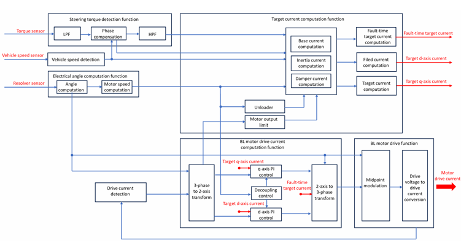
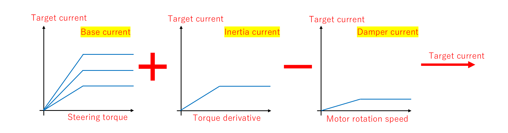

# 電動パワーステアリング (EPS) の力学モデル

`03` / `05` モデルが扱う **電動パワーステアリング (EPS)** の機構と制御を説明する。コード上は `eps_gearbox_model.{hpp,cpp}` および `eps_controller.{hpp,cpp}` に対応する。

---

## 1. EPS とは

電動パワーステアリングは、BLDC モータのトルクでドライバの操舵力を補助するシステムである。油圧式パワーステアリングに比べ、燃費・整備性・制御自由度の点で有利であり、現代の乗用車で広く使われている。

**主な機能:**

- モータトルクでドライバの操舵力を補助し、アシスト力を車両に伝える
- 車速に応じたスムーズな操舵力を実現する

**動作原理:**

1. 操舵入力トルクをトルクセンサ信号へ変換し、入力に応じたモータトルクを発生する
2. 操舵入力トルクをラック＆ピニオンギアから、モータトルクの補助によりラック軸方向の推力に変換する
3. タイヤ回転を支持するタイロッドに推力が伝達され、タイヤの揺動角に変換される

### 1.1 本プロジェクトが想定するモータ

本シミュレーションは、**48 V 系・アシスト電流最大 85 A 級の三相 BLDC モータ**を制御対象とする。これは大きなアシスト力を必要とする**高出力ラックアシスト式 EPS** を想定した諸元である。

| 項目 | 値 | 備考 |
|------|----|----- |
| DC リンク電圧 $V_{dc}$ | 48 V | 出典 [^ato] の定格電圧に整合 |
| 最大アシスト電流 $i_{q,max}$ | 85 A | §5.2 のベース電流上限と一致 |
| トルク定数 / 逆起電力定数 $K_t = K_e$ | 0.0533 | Nm/A, V·s/rad |
| 相抵抗 / インダクタンス $R$ / $L$ | 0.1 Ω / 0.1 mH | — |
| 極対数 $P_n$ | 4 | — |
| 定常動作点 (デフォルト負荷) | $T_e \approx 4.5\thinspace \mathrm{Nm}$, $\omega_m \approx 145\thinspace \mathrm{rad/s}$ | 機械出力 $\approx 650\thinspace \mathrm{W}$ |

**EPS 用途としての位置づけ:**

- EPS のアシストモータは、低コギングトルク・静粛性・高出力密度が要求されるため、現代では**三相ブラシレス DC (BLDC) モータ**が標準的に用いられる[^bldc]。
- モータをラック軸に直結する**ラックアシスト式**は、コラム式に比べて大きなアシスト力を出せるため、車重が重く前軸荷重の大きい車両に採用される[^rack]。この高出力用途では、コラム式で一般的な 12 V 系より高い電圧系（本コードの 48 V など）が有利になる。
- 本コードの各物理パラメータ ($V_{dc} = 48\thinspace \mathrm{V}$, $R$, $L$, $K_t$, $K_e$, $P_n$) は、48 V 系 BLDC モータの製品データシート（ATO 110WDM06020-48V）を根拠に設定している[^ato]。

> **補足 — 「1 kW 級 12 V EPS」との違い**
> 実車のコラム式 EPS は 12 V 系・数十〜80 A 級（$12\thinspace \mathrm{V} \times 85\thinspace \mathrm{A} \approx 1\thinspace \mathrm{kW}$ 相当）が一般的である。本シミュレーションは同じ 85 A 級の電流を扱うが、電圧系は製品データシートに合わせて **48 V** を採用しているため、より高出力なラックアシスト式 EPS に相当する。

[^ato]: ATO 110WDM06020-48V ブラシレス DC モータ データシート（[`../references.md`](../references.md) §2 参照）。
[^bldc]: EPS 用モータには三相ブラシレスモータが用いられる。ABLIC「Automotive Electric Power Steering Motors (EPS Motors)」<https://www.ablic.com/en/semicon/applications/electric-power-steering-motor/>、Bosch「Electric power steering systems」<https://www.bosch-mobility.com/en/solutions/steering/electric-power-steering-systems/>。
[^rack]: ラックアシスト式 EPS は大きなアシスト力を要する（＝重量車・高前軸荷重）用途向け。Nexteer「Rack-Assist Electric Power Steering」<https://www.nexteer.com/electric-power-steering/rack-assist-electric-power-steering/>。

---

## 2. エネルギーフロー

操舵入力からタイヤの揺動までの流れ：

```
ステアリングホイール
   │ ドライバートルク
コラム / インターミディエイトシャフト
   │
トルクセンサ (トーションバーの捻れを検出)
   │ 検出トルク
EPS コントローラ ──▶ BLDC モータ (アシストトルク)
   │
ラック & ピニオンギア (回転 → 直線運動)
   │ ラック推力
タイロッド (左右)
   │
タイヤの揺動
```

---

## 3. EPS 制御ブロック図



上段が **目標電流演算機能**、下段が **BL モータ駆動演算機能** である。

| ブロック | 機能 |
|----------|------|
| 操舵トルク検出 (LPF → 位相補償 → HPF) | トルクセンサ信号のノイズ除去と位相補償 |
| ベース電流演算 | 操舵トルク・車速から基本アシスト電流を算出 (V カーブ) |
| トルク微分補正演算 (イナーシャ電流) | 操舵トルクの変化量に応じて電流の立ち上がりをアシスト |
| ダンパ補正演算 | モータ回転速度から外乱制動電流を算出 |
| 目標電流補正・界磁電流演算 | 最終目標 $i_q^{\ast}$・$i_d^{\ast}$ を生成 |
| 三相二軸変換 (Clarke) | 三相フィードバック電流を dq 軸電流に変換 |
| q 軸 / d 軸 PI 制御 + 非干渉制御 | dq 軸独立 PI + クロスカップリング補償 |
| 二軸三相変換 (逆 Clarke) | dq 電圧指令を三相に変換 |
| 中点変調 | 電圧利用率を $2/\sqrt{3}$ 倍に拡張 |
| 駆動電圧→駆動電流変換 | PWM デューティ比に換算して出力 |

---

## 4. 機構の力学モデル

`eps_gearbox_model.cpp` は **2 質量系** (ステアリングホイール + ローワーコラム/ピニオン) を前進オイラー法で時間積分する。

### 4.1 2 質量系の運動方程式

系は「ステアリングホイール側 ($J_{sw}$)」と「ローワーコラム/ピニオン側 ($J_{col,tot}$)」の 2 つの回転体で構成される。

$$
J_{sw}\frac{d\omega_{sw}}{dt} = T_h - T_{tb}
$$

$$
J_{col,tot}\frac{d\omega_{col}}{dt} = T_{tb} + N_g T_m - T_{spring}
$$

| 記号 | 意味 | 単位 |
|------|------|------|
| $T_h$ | ドライバ操舵トルク (入力) | Nm |
| $T_{tb}$ | トーションバートルク (= トルクセンサ読み値) | Nm |
| $N_g$ | 減速ギア比 | — |
| $T_m$ | モータ軸トルク | Nm |
| $T_{spring}$ | ラックばね・ダンパのピニオン軸等価モーメント | Nm |

### 4.2 換算慣性モーメント

ローワーコラム側の等価慣性 $J_{col,tot}$ は、モータロータ慣性とラック並進慣性をピニオン軸に換算して合算する。

$$
J_{col,tot} = J_{col} + J_{motor} N_g^2 + M_{rack} r_p^2
$$

| 項 | 意味 |
|----|------|
| $J_{col}$ | コラムベース慣性 |
| $J_{motor} N_g^2$ | 減速ギアで換算したモータロータ慣性 |
| $M_{rack} r_p^2$ | ピニオン半径 $r_p$ で換算したラック並進慣性 |

コードでは `EpsGearboxModel::init()` 内の計算に直接対応する。

### 4.3 トーションバー (トルクセンサ)

コラムとピニオンの間にある細い軸。ばね-ダンパ要素としてモデル化し、捻れ角の差からトルクを算出する。

$$
T_{tb} = K_{tb}(\theta_{sw} - \theta_{col}) + C_{tb}(\omega_{sw} - \omega_{col})
$$

- $K_{tb}$ : トーションバー剛性 (≈ 143 Nm/rad ≈ 2.5 Nm/deg)
- $C_{tb}$ : トーションバー減衰 (Nm·s/rad)

この $T_{tb}$ がそのままトルクセンサ出力として EPS コントローラへ渡される。

### 4.4 ラック-ピニオン結合とばね負荷

ピニオンとラックは剛結合であり、ラック変位・速度はピニオン角から一意に決まる。

$$
x_{rack} = r_p \theta_{col}, \qquad v_{rack} = r_p \omega_{col}
$$

ラックに作用するばね・ダンパ力 (路面反力の簡易モデル) は次式で与えられる。

$$
F_{rack} = K_s x_{rack} + C_s v_{rack}
$$

このラック推力をピニオン軸等価モーメントに変換すると、4.1 式の $T_{spring}$ が得られる。

$$
T_{spring} = F_{rack} \cdot r_p = K_s r_p^2 \theta_{col} + C_s r_p^2 \omega_{col}
$$

- $K_s$ : ラックばね定数 [N/m]
- $C_s$ : ラック粘性減衰 [N·s/m]
- $r_p$ : ピニオン半径 [m]

### 4.5 運動学的拘束 (モータ-コラム結合)

減速ギアを介してモータ軸とコラムは剛結合されており、各ステップ先頭でモータの角速度を更新する。

$$
\omega_{motor} = N_g \cdot \omega_{col}
$$

この拘束により、モータの逆起電力が `MotorModel` 内で正しく算出される。コードでは `motor.set_angular_vel(kEpsGearRatio * gearbox_state.omega_col)` に対応する。

### 4.6 前進オイラー積分

各タイムステップ $\Delta t$ ごとに角加速度を算出し、速度・角度を更新する。

$$
\alpha_{sw} = \frac{T_h - T_{tb}}{J_{sw}}, \qquad
\alpha_{col} = \frac{T_{tb} + N_g T_m - T_{spring}}{J_{col,tot}}
$$

$$
\omega_{sw}[k{+}1] = \omega_{sw}[k] + \alpha_{sw}\thinspace \Delta t, \qquad
\theta_{sw}[k{+}1] = \theta_{sw}[k] + \omega_{sw}[k{+}1]\thinspace \Delta t
$$

$$
\omega_{col}[k{+}1] = \omega_{col}[k] + \alpha_{col}\thinspace \Delta t, \qquad
\theta_{col}[k{+}1] = \theta_{col}[k] + \omega_{col}[k{+}1]\thinspace \Delta t
$$

### 4.7 機械共振への注意

トーションバー (ばね) とステアリングホイール・ローワーコラムの慣性が組み合わさると、2 質量系は共振点を持つ。固有角周波数の目安：

$$
\omega_n \approx \sqrt{K_{tb}\left(\frac{1}{J_{sw}} + \frac{1}{J_{col,tot}}\right)} \approx 60\ \text{rad/s} \approx 9.5\ \text{Hz}
$$

トルクセンサ信号をそのままアシスト制御に使うと、この共振を励起してしまう。これを防ぐため、トルクセンサ信号には LPF をかける (次節参照)。

---

## 5. アシスト制御 (アシストマップ)

`eps_controller.cpp` と `eps_main.cpp` が協調して、センサトルクから q 軸電流指令を生成する。

### 5.1 トルクセンサ LPF

トルクセンサ読み値 $T_{tb}$ を 1 次 IIR ローパスフィルタで平滑化する。

$$
\hat{T}_{tb}[k{+}1] = \hat{T}_{tb}[k] + \bigl(T_{tb}[k] - \hat{T}_{tb}[k]\bigr)\cdot \omega_{lpf}\thinspace \Delta t
$$

カットオフ周波数 $\omega_{lpf} \approx 20\ \text{rad/s}\ (\approx 3.2\ \text{Hz})$ は機械共振 (≈ 9.5 Hz) より十分低く設定されている。コードでは `sensor_filt` 変数に対応する。

### 5.2 V カーブ (ベース電流マップ)

フィルタ後トルク $\hat{T}_{tb}$ に対して、デッドゾーン補正付きの比例マップで $i_q^{\ast}$ を算出する。

$$
i_q^{\ast} =
\begin{cases}
\mathrm{clamp}\negthinspace \left(G_{assist}\thinspace \bigl(|\hat{T}_{tb}| - T_{dz}\bigr)\thinspace \mathrm{sgn}(\hat{T}_{tb}),\ \pm i_{q,max}\right)
  & |\hat{T}_{tb}| > T_{dz} \cr
0 & |\hat{T}_{tb}| \le T_{dz}
\end{cases}
$$

| パラメータ | 記号 | デフォルト値 |
|-----------|------|-------------|
| アシストゲイン | $G_{assist}$ | 18.0 A/Nm |
| デッドゾーン幅 | $T_{dz}$ | 0.3 Nm |
| 最大 q 軸電流 | $i_{q,max}$ | 85 A |

デッドゾーンは小さい操舵トルク域での「据わり感 (ハンドルのセンター感覚)」を確保するために設ける。

全体の電流指令は以下の 3 成分の和として定義される（本実装ではベース電流のみ）。

$$
i_q^{\ast} = i_{\text{base}} + i_{\text{inertia}} + i_{\text{damper}}
$$

| 成分 | 決定要素 | 役割 |
|------|----------|------|
| ベース電流 | 操舵トルク・車速 | アシストの基本量を決める (V カーブ) |
| イナーシャ電流 | 操舵トルクの変化量 (微分) | 操舵開始時の電流立ち上げを補助 |
| ダンパ電流 | モータ回転速度 | ステアリングからの外乱を制動 |

> **本コードの実装範囲**  
> `bldc-foc-sim` の `EpsController` は **ベース電流 (V カーブ)** を実装している。イナーシャ電流・ダンパ電流は今後の拡張候補である。

### 5.3 カレントマップ (目標電流の合成)

目標電流は、操舵トルク・車速などの多次元データから引いた個別マップの和差として合成される。各成分は 1 次元マップ（横軸＝決定要素、縦軸＝目標電流）として与えられ、ベース電流とイナーシャ電流を加算し、ダンパ電流を減算する。

#### 絵（カレントマップ）



$$
i_q^{\ast} = i_{\text{base}} + i_{\text{inertia}} - i_{\text{damper}}
$$

> **符号について**  
> 上図はダンパ電流を *制動方向* の量として **減算** する表記である。5.2 節の $i_q^{\ast} = i_{\text{base}} + i_{\text{inertia}} + i_{\text{damper}}$ は $i_{\text{damper}}$ を符号付き（制動時に負）として扱う表記であり、両者は等価である。

#### テキストによる説明

- **目標電流**：モータを制御するための目標電流量は、トルクセンサ・車速などから得た多次元データに基づいて演算される。
- **ベース電流**：操舵トルクと車速から演算され、モータを駆動するための基本電流量を決定する（横軸：操舵トルク、車速をパラメータとした複数曲線）。
- **イナーシャ電流**：操舵トルクの変化量（微分）によって決定され、操舵開始時の電流の立ち上がりをアシストする（横軸：トルク微分）。
- **ダンパ電流**：モータ回転速度によって決定され、ステアリングホイールからの外乱を制動する（横軸：モータ回転速度、減算成分）。

> **本コードの実装範囲 — カレントマップは実装に含めない**
> 本節で説明したカレントマップ（ベース電流・イナーシャ電流・ダンパ電流の各テーブル）は、**あくまで制御アルゴリズムの説明のための概念図であり、`bldc-foc-sim` の実装には含まれていない**。理由は以下のとおりである。
>
> - マップの数値そのものは車両ごとに作り込む**チューニングデータ**であり、操舵トルク・車速などの**車両信号データに依存**する。
> - 実車のマップ値は各社の**秘匿情報（ノウハウ）**にあたるため、本 OSS では具体的なテーブルを収録しない。
>
> このため、現状の `EpsController` は §5.2 の**ベース電流（V カーブ）のみ**を実装している。
>
> **将来対応:** マップ機構を差し替え可能なインタフェースとして切り出し、実データの代わりに**動作確認用の暫定（ダミー）マップ**を投入できる形で追加する準備がある。暫定マップはあくまで挙動確認用であり、実車チューニング値ではない点に留意すること。

---

## 6. 評価シナリオ

`EpsGearboxSim` は、ステアリングラックをばね負荷に接続し、ドライバ操舵トルクをランプ状に与えて、操舵トルクに対するラック推力の特性を評価する。


```sh
./EpsGearboxSim --tmax 6.0 --ramp 0.3 --span 2.0
```

- `--tmax` : ドライバ操舵トルクの最大値 [Nm]
- `--ramp` : 操舵トルクを 0 から最大値まで上げるランプ時間 [s]

出力 `data/eps_output.csv` には、トーションバートルク・アシストトルク・ラック推力・ラック変位などが記録される。

---

## 関連ドキュメント

- [`foc.md`](foc.md) — モータ側のベクトル制御
- [`motor-model.md`](motor-model.md) — モータの電気・機械方程式
- [`sensorless.md`](sensorless.md) — `05` で組み合わされるセンサーレス制御
