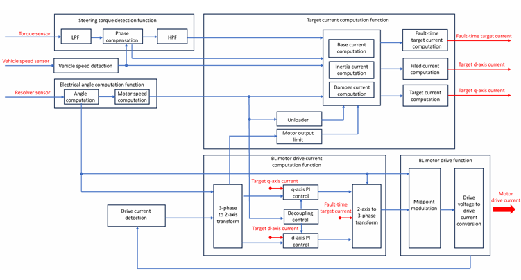

# 機能安全 — 車載システム HARA 分析（ISO 26262 / 主要システム網羅版）

車載システムの **HARA（ハザード分析・リスクアセスメント）** を題材に、ISO 26262 Concept Phase（Part 3〜4）の分析手法と、主要システムを横断した代表ハザードの ASIL 評価を整理する。

ステアリング・ブレーキ・パワートレイン・EV・センサー（カメラ／レーダー）・ADAS・自動運転ほか、車載の主要システムを網羅的に扱う。その中で**ステアリング系（EPS / ステアバイワイヤ）**を筆頭システムとして配置し、本シミュレーションプロジェクト（[`eps.md`](eps.md) / [`foc.md`](foc.md)）との接続点とする。

> **前提値について**  
> 本書の S/E/C・ASIL・FTTI はすべて**教育用の代表・前提値**である。実際の値は Item 定義と妥当性確認により確定する。本書は ISO 26262-10（ガイドライン）的な一般的・代表的例示であり、個別の妥当性確認を要する。

---

## 1. HARA とは何か

**HARA = Hazard Analysis and Risk Assessment（ハザード分析・リスクアセスメント）**

ISO 26262 の Concept Phase（Part 3）で実施される、安全要求を導出するための最も基本的な安全分析プロセス。

### HARA の目的

1. システムが引き起こしうる **ハザード（危険事象）** を網羅的に抽出
2. ハザードが事故に至る **シナリオ**（運転状況との組合せ）を分析
3. シナリオごとに **ASIL（Automotive Safety Integrity Level）** を決定
4. ASIL を満たすための **安全目標（Safety Goal）** を定義

→ 後段の機能安全要求（FSR）・技術安全要求（TSR）のベースとなる。

### なぜ HARA が必要か

- 「故障が発生しても人を傷つけない」設計のため。バグゼロを目指すのではなく、故障が起きた前提で安全側にフェイルする設計を体系化する。
- 上位（製品仕様）から下位（HW/SW 実装）までトレーサビリティを確保する。
- 量産車載 ECU は ISO 26262 認証が事実上必須 → HARA は出発点。

### HARA を行わないとどうなるか

- どの機能を冗長化すべきか判断基準がない
- どの故障モードに対して何 ms 以内に安全状態へ遷移すべきか定まらない
- 部品・コードのレビュー観点が「動くかどうか」だけになり、安全観点が抜ける
- 第三者監査（TÜV, SGS 等）で認証取得不可

---

## 2. HARA の標準フロー

```
Step 1: アイテム定義 ──▶ Step 2: ハザード抽出 ──▶ Step 3: シナリオ分析
                                                          │
                                    Step 5: 安全目標導出 ◀── Step 4: ASIL 決定
                                          │
                                          ▼
                              FSR → TSR → HSR / SSR → 実装・テスト
```

| Step | 内容 |
|------|------|
| **1. アイテム定義** | 分析対象システムの境界・機能・動作モード・運転状況を明確化する。ここが曖昧だと以降の分析がブレる。 |
| **2. ハザード抽出** | アイテムの機能ごとに「故障した場合の危険現象」を列挙する（FMEA・HAZOP・ブレーンストーミング）。 |
| **3. シナリオ分析** | ハザード × 運転状況の組合せから事故に至るシナリオを記述する。単一の故障モードでも状況により重大度が変わる。 |
| **4. ASIL 決定** | シナリオごとに S/E/C を割り当て、ASIL マトリクスで ASIL を決定する。同一故障でも**最も高い ASIL** を採用する。 |
| **5. 安全目標導出** | ハザードの否定形を安全目標として記述し、FTTI（許容遅延）を併記する。 |

→ S/E/C・ASIL の詳細は [第 3 節](#3-分析手法--sec-と-asil-決定)、FTTI は [第 4 節](#4-ftti-の考え方)、安全要求への展開は [第 7 節](#7-安全要求の導出フローステアリングを題材にした一般化例)を参照。

---

## 3. 分析手法 — S/E/C と ASIL 決定

ハザードは「機能」ではなく**運転状況ごと**に評価し、3 指標の組合せで ASIL を決定する。

| パラメータ | 意味 | クラス | 例（最悪側） |
|-----------|------|--------|------|
| **S (Severity)** | 傷害の重大度 | S0〜S3 | S3 = 致命的・生存不確実 |
| **E (Exposure)** | その状況に遭遇する確率（曝露頻度） | E0〜E4 | E4 = 高頻度 |
| **C (Controllability)** | 運転者による回避可能性 | C0〜C3 | C3 = 制御困難 |

**Severity（AIS 尺度参考）**

| クラス | 内容 |
|--------|------|
| S0 | 安全関連でない損害（AIS 0 および AIS 1〜6 の確率が 10% 未満） |
| S1 | 軽度および中程度の障害（AIS 1〜6 の確率が 10% 以上） |
| S2 | 重度および生命を脅かす障害、生存の可能性がある（AIS 3〜6 の確率が 10% 以上） |
| S3 | 生命を脅かす障害・致命的（AIS 5〜6 の確率が 10% 以上） |

*AIS = Abbreviated Injury Scale（略式障害尺度）*

**Exposure（状況の尺度）**

| クラス | 内容 |
|--------|------|
| E1 | 大多数のドライバーにとって年に一回未満しか発生しない状況。 |
| E2 | 平均動作時間の 1% 未満。年に数回しか発生しない状況。 |
| E3 | 平均動作時間の 1〜10%。年に一回以上発生する状況。 |
| E4 | 平均動作時間の 10% 超。ほとんどすべての運転中に発生する状況。 |

**Controllability（コントローラビリティ）**

| クラス | 内容 |
|--------|------|
| C0 | 大抵はコントロール可能。 |
| C1 | 容易にコントロール可能。99% 以上が通常危害を回避できる。 |
| C2 | 通常はコントロール可能。90% 以上が通常危害を回避できる。 |
| C3 | コントロールが困難またはコントロール不能。90% 未満が通常危害を回避できる。 |

### 3.1 ASIL マトリクス

S × E × C の組合せで ASIL を決定する。QM（Quality Management）は通常の品質管理で十分であり安全関連でないことを意味する。S・E・C が高いほど ASIL は上昇し、**S3 + E4 + C3 で最高位の ASIL D** となる。

| S | E | C1 | C2 | C3 |
|---|---|----|----|----|
| S1 | E1 | QM | QM | QM |
| S1 | E2 | QM | QM | QM |
| S1 | E3 | QM | QM | ASIL A |
| S1 | E4 | QM | ASIL A | ASIL B |
| S2 | E1 | QM | QM | QM |
| S2 | E2 | QM | QM | ASIL A |
| S2 | E3 | QM | ASIL A | ASIL B |
| S2 | E4 | ASIL A | ASIL B | ASIL C |
| S3 | E1 | QM | QM | ASIL A |
| S3 | E2 | QM | ASIL A | ASIL B |
| S3 | E3 | ASIL A | ASIL B | ASIL C |
| S3 | E4 | ASIL B | ASIL C | **ASIL D** |

**ASIL レベルの凡例**

| ASIL | 意味 |
|------|------|
| QM | 管理品質 / 安全要求なし |
| A | 最も低い安全要求 |
| B | 中程度 |
| C | 高い |
| D | 最も厳しい安全要求 |

> **決定ロジック：** 同一故障でも状況により S/E/C は変わるため、複数状況のうち**最も高い ASIL を安全目標へ割り当てる**。

### 3.2 ASIL デコンポジション（分解）

ASIL D の単一要素を 2 つの**独立した**要素に分解することで、各々の要求 ASIL を下げる手法。

| 分解パターン | 要素 1 | 要素 2 |
|-------------|--------|--------|
| ASIL D | ASIL B(D) | ASIL B(D) |
| ASIL D | ASIL C(D) | ASIL A(D) |
| ASIL D | ASIL D(D) | ASIL QM(D) |

条件：2 要素が「独立」であること（共通故障原因を持たないこと）。  
例：入力センサ系と監視（Watchdog）系を独立化すれば、各々 B(D) 設計で済む。

### 3.3 FTTI 値の定義前提と根拠

本資料では、各 FTTI を以下の前提条件（運転状況・代表速度・車線幾何・車両ダイナミクスモデル）のもとに定義する。各前提のもとで「その FTTI が物理的に何を守る値か」を、縦・横・イベント固定の各モデルで確保される余裕として示し、値を根拠づける。ここで用いる速度・加速度は illustrative な前提であり、実務では Item 定義・車両ダイナミクス解析による確定を要する。本プロジェクトが対象とするモーター制御の場合、EPS のアシストトルク（§5.1）・インバーターの駆動トルク（§5.4）における「意図しないトルク」は、操舵・駆動を介して直接的な車両運動（横・縦）に直結するため、下の「車両運動律速」に従い FTTI ≈ 100 ms となる。

**定義に用いた前提条件**

代表速度:

| 運転状況 | 速度 |
|---|---|
| 高速 | 100 km/h = 27.8 m/s |
| カーブ | 80 km/h = 22.2 m/s |
| 市街地 | 40 km/h = 11.1 m/s |
| 発進・低速 | 20 km/h = 5.6 m/s |
| 渋滞追従 | 30 km/h = 8.3 m/s |

車線幾何: 車線幅 3.5 m、車幅 1.8 m → 片側の横余裕 ≈ 0.85 m（車線逸脱まで）。

3つの根拠モデル（前提下で確保される余裕）:

- **縦**: $\Delta v = a \cdot FTTI$（介入までに乗る速度変化）。喪失系は $\Delta x = V \cdot FTTI$（バックアップ移行までの無制動距離）
- **横**: $\Delta y = \tfrac{1}{2}\thinspace  a_y \cdot FTTI^2$（介入時点の横偏差）、$v_{lat} = a_y \cdot FTTI$（横速度の立ち上がり）。代表 $a_y = 3\ \mathrm{m/s^2}$（0.3g）、グリップ上限 ≈ 8 m/s²
- **イベント固定**: 火工品の展開窓・熱伝播時間など。車速に依存しない

#### ステアリング系

| 機能 | 想定速度 | モデル | FTTI | 確保する余裕・根拠 | 判定 |
|---|---|---|---|---|---|
| EPS 意図しない操舵トルク | 100 km/h | 横 | 100 ms | Δy ≈ 1.5 cm、v_lat ≈ 0.3 m/s（横余裕 0.85 m の約 2%） | 妥当・保守的。値は横偏差でなくヨーレート制御性で決まる |
| EPS 操舵アシスト喪失 | 40 km/h | 操作力 | 500 ms | 低速旋回では操舵は機械的に継続可、操作力増のみ | 妥当（ASIL A と整合） |
| EPS 操舵ロック／固着 | 100 km/h | 横（需要） | 100 ms | 直進では即ハザード化せず、修正操舵の需要発生時に顕在化 | 要確認。需要トリガ型で 100 ms は厳しめ、シナリオ依存 |
| SBW 指令／転舵不一致 | 80 km/h | 横 | 150 ms | Δy ≈ 3.4 cm、v_lat ≈ 0.45 m/s | 妥当 |

#### ブレーキ系

| 機能 | 想定速度 | モデル | FTTI | 確保する余裕・根拠 | 判定 |
|---|---|---|---|---|---|
| 意図しない急制動 | 100 km/h | 縦（後続） | 150 ms | a = 6 m/s² で Δv ≈ 0.9 m/s（≈ 3 km/h）。ジャーク／後続閉じを抑制 | 妥当 |
| 制動力の喪失 | 100 km/h | 縦（喪失） | 300 ms | 無制動走行 Δx ≈ 8.3 m（総停止距離約 50 m の約 17%）= バックアップ移行窓 | 妥当（誤作動より長い＝正しい非対称） |
| 左右制動力差（片効き） | 100 km/h 湿潤 | 横 | 200 ms | 制動ヨー。低μで実効 a_y 小、200 ms で v_lat 抑制 | 妥当 |
| EPB 不意作動 | 100 km/h | 横／縦 | 150 ms | 後軸ロック → スピンリスク。高速で即危険 → 短 FTTI 適切 | 妥当 |
| ESC 不作動 | 低μ回避 | 横（安定） | 200 ms | 低μでスピン発生は数百 ms、200 ms で介入 | 妥当（B） |

#### パワートレイン／駆動系

| 機能 | 想定速度 | モデル | FTTI | 確保する余裕・根拠 | 判定 |
|---|---|---|---|---|---|
| 意図しない加速（過大トルク） | 20 km/h | 縦 | 150 ms | a = 6 m/s² で Δv ≈ 0.9 m/s、Δx < 10 cm。周辺人／物近接での突進を抑止 | 妥当 |
| 駆動トルクの喪失 | 100 km/h 合流 | 縦（喪失） | 500 ms | 加速不能のみ → ハザード化が遅い | 妥当（B、長め正当） |
| SBW 誤レンジ選択 | 発進 | 縦（方向） | 250 ms | 前後誤り。Δx < 10 cm で誤方向発進を抑止 | 妥当 |
| 回生ブレーキ 意図しない減速 | 100 km/h 後続 | 縦 | 200 ms | 回生上限 ≈ 0.25g、Δv ≈ 0.5 m/s | 妥当（油圧誤制動より穏やか → C） |

#### EV 固有システム

| 機能 | 想定速度 | モデル | FTTI | 確保する余裕・根拠 | 判定 |
|---|---|---|---|---|---|
| BMS 過充電・熱暴走 未検知 | 充電／走行 | 熱イベント | 1 s | 熱伝播は秒オーダー → 検出・遮断に 1 s | 妥当（最長、重大度で D） |
| BMS 走行中の不要遮断 | 100 km/h | 縦（急喪失） | 200 ms | 走行中の突然の駆動喪失 → 200 ms | 妥当 |
| インバーター 意図しないトルク | 走行中 | 縦／横 | 100 ms | 駆動系直結の異常トルク → 操舵並に速い | 妥当（D） |
| 充電 絶縁低下・感電 未検知 | 充電接続 | 電気イベント | 500 ms | 静止・人介在、感電経路成立前に遮断 | 妥当（B） |

#### ADAS

| 機能 | 想定速度 | モデル | FTTI | 確保する余裕・根拠 | 判定 |
|---|---|---|---|---|---|
| AEB 誤作動 | 100 km/h 後続 | 縦（後続） | 150 ms | 誤急制動＝意図しない急制動と同型 | 妥当 |
| AEB 必要時不作動 | 前方静止物 | 縦（不作動） | 300 ms | 制動開始遅延の許容窓。SOTIF 併記 | 妥当（B） |
| ACC 意図しない加速 | 渋滞 30 km/h | 縦（近接） | 200 ms | 車間小、a = 2 m/s² で Δv ≈ 0.4 m/s | 妥当 |
| LKAS 意図しない操舵介入 | 100 km/h | 横（低権限） | 150 ms | トルク制限・ドライバ override 可 → EPS より長めが正当 | 妥当 |
| BSM／RCTA 誤警報・不作動 | 車線変更／後退 | 情報系 | 300 ms | 情報提示の誤り、直接制御でない → 長め | 妥当（B） |

#### 自動運転（AD / L3+）

| 機能 | 想定速度 | モデル | FTTI | 確保する余裕・根拠 | 判定 |
|---|---|---|---|---|---|
| 意図しない加減速・操舵 | 100 km/h | 横／縦 | 100 ms | 直接的な車両運動 → 最短クラス | 妥当（D） |
| MRM 失敗 | 縮退移行時 | 複合 | 200 ms | 縮退動作の実行窓 | 妥当（D） |
| TOR 失敗 | ODD 境界 | 引継ぎ | 1 s | ドライバ復帰余裕を含む → 秒オーダー | 妥当（人間 factor で長い） |

#### カメラ／レーダー（センサー系）

| 機能 | 想定速度 | モデル | FTTI | 確保する余裕・根拠 | 判定 |
|---|---|---|---|---|---|
| 信号断・固着（HW 故障） | 100 km/h | 知覚 coast | 200 ms | 陳腐化データでの走行 Δx ≈ 5.6 m → 誤操作前に縮退 | 妥当（D） |
| カメラ レンズ遮蔽 未検知 | — | 知覚 | 300 ms | 遮蔽検出 → 機能抑制、やや長め | 妥当 |
| レーダー 距離・速度 推定誤差 | ACC 追従 | 知覚 → 縦 | 200 ms | 誤測距 → 誤加減速前に検出 | 妥当 |
| レーダー 軸ずれ 未検知 | 経年・衝撃後 | 緩慢劣化 | 500 ms | 漸進ドリフト → 長い検出窓 | 妥当 |

#### パッシブセーフティ

| 機能 | 想定速度 | モデル | FTTI | 確保する余裕・根拠 | 判定 |
|---|---|---|---|---|---|
| エアバッグ 不要展開 | 通常走行 | 火工品窓 | 10 ms | 発火判定〜起爆の窓内で抑止。車速非依存 | 妥当（最短、定義由来） |
| エアバッグ 衝突時不展開 | 正面衝突 | 火工品窓 | 20 ms | 乗員前方移動（約 30–50 ms）前に展開が必要 | 妥当 |
| プリテンショナー 誤作動 | 通常走行 | 火工品窓 | 20 ms | 同上、火工品の窓に律速 | 妥当 |

#### ボディ／シャシー系

| 機能 | 想定速度 | モデル | FTTI | 確保する余裕・根拠 | 判定 |
|---|---|---|---|---|---|
| 前照灯 走行中消灯 | 夜間 100 km/h | 視認 | 1 s | 視程喪失 → 未視認物との衝突は視程時間軸 → 秒オーダー | 妥当（C、長め） |
| ドアロック 走行中解錠 | 走行中 | 転落 | 500 ms | ドア開＋乗員の傾き成立前に再施錠 | 妥当（B） |
| アクティブサス 異常車高・減衰 | 高速カーブ | 姿勢（緩） | 200 ms | 姿勢／接地荷重変化は直接操舵より遅い → 200 ms | 妥当 |
| トルクベクタリング 誤配分 | 高速カーブ | 横（ヨー） | 150 ms | 過大ヨー → 不安定化前に。カーブで横余裕を既に一部消費 | 妥当 |

#### 総括

FTTI は 3 つの律速に大別できる。

- **車両運動律速**（横・縦、10² ms オーダー）: 操舵・制動・駆動・センサー coast の大半
- **知覚 coast**（約 200–300 ms）: 陳腐化データで走行できる距離で決まる
- **イベント固定**: 火工品（10–20 ms）と熱／電気事象（500 ms–1 s）。車速に依存しない

内部整合の確認点:

- **誤作動 < 不作動 の非対称**が制動・AEB で一貫（150 ms vs 300 ms）。物理的に正しい向き。
- **FTTI と ASIL は独立**。BMS 熱暴走（D・1 s）とインバーター（D・100 ms）が示す通り、重大度が高くても FTTI は事象の速さで決まる。この分離が正しく表れている。
- **横ハザードの FTTI** は「介入時点の横偏差」ではなく「ヨーレート／横速度の立ち上がりを抑える制御性」で決まる。偏差はいずれも車線余裕の数%に収まり、桁として保守的。

唯一の要確認: **EPS 操舵ロック／固着 100 ms**。直進では即ハザード化せず「次に修正操舵が必要になった瞬間」に顕在化する需要トリガ型のため、100 ms は物理より運用前提に依存する。次の操舵需要までの想定時間（例: カーブ／車線維持の修正周期）を固定して根拠づけると、他行と同じ土俵に載る。

> 教育値を根拠のある値へ。各行に「介入までに許容する Δv／Δy／事象進展」を 1 行注記すれば、上の定義根拠が資料内で自己完結し、「前提値」からトレース可能な値に格上げできる。

---

## 4. FTTI の考え方

安全目標には「故障発生からいつまでに安全状態へ遷移すべきか」という時間制約が伴う。これを規定するのが **FTTI** であり、安全機構はこれを分解した時間予算を満たさねばならない。

| 用語 | 意味 |
|------|------|
| **FTTI** (Fault Tolerant Time Interval) | 故障発生からハザード発現までの許容時間 |
| **FDTI** (Fault Detection Time Interval) | 故障を検出するまでの時間 |
| **FRTI** (Fault Reaction Time Interval) | 検出後、安全状態へ移行する時間 |
| **FHTI** (Fault Handling Time Interval) | FDTI + FRTI（検出＋反応の合計） |

**成立条件：**

$$
\text{FHTI} = \text{FDTI} + \text{FRTI} \thickspace \le\thickspace  \text{FTTI}
$$

**仮想例（EV パワートレイン／意図しない駆動トルク・ASIL D）：**

```
故障発生 ─────────────────────────────▶ ハザード発現
        │   FDTI ≤ 40 ms  │  FRTI ≤ 50 ms │  余裕 10 ms │
        │←─── 検出 ───────│←── 反応 ──────│
        │←──── FHTI = FDTI + FRTI = 90 ms ─┤
        │←──────────── FTTI = 100 ms ──────────────────┤
```

結論：FHTI 90 ms ≤ FTTI 100 ms → 安全機構は時間制約を満たす（10 ms の余裕）。  
数値はすべて教育用の仮想・前提値。実際の FTTI は対象機能・車両ダイナミクス・ハザードの種類により決まり、Item 定義と妥当性確認を要する。

---

## 5. システム別 HARA（主要システム網羅）

主要な車載システムについて、代表的な故障モードと運転状況の組合せから S/E/C・ASIL・安全目標を評価する。各表の値は教育用の前提値である。

### 5.1 ステアリング系（EPS / ステアバイワイヤ）

本シミュレーションプロジェクトの対象システム。EPS は操舵トルク検出 → 車速に応じた目標電流演算 → BL モータ駆動によるアシストを担う（[`eps.md`](eps.md) 参照）。**意図しない操舵・操舵系ロックは高速域で S3/E4/C3 が揃い、ASIL D を導く代表ハザード**である。


*EPS（電動パワーステアリング）のシステム構成。車速検出・目標電流演算・BL モータ駆動・各検出機能（操舵トルク／電気角／駆動電流）から成り、各機能がハザード抽出の対象となる。*

| 機能・想定故障モード | 代表的な危険事象 / 運転状況 | S/E/C | ASIL | FTTI（前提値） | 安全目標 (Safety Goal) |
|----------------------|------------------------------|-------|------|----------------|------------------------|
| EPS：意図しない操舵トルク | 高速直進中の急な進路逸脱 | S3/E4/C3 | **D** | ≈ 100 ms | 意図しない操舵介入を防止する |
| EPS：操舵アシスト喪失 | 市街地での低速旋回 | S1/E4/C2 | A | ≈ 500 ms | アシスト喪失時も操舵性を確保する |
| EPS：操舵系ロック／固着 | 高速走行中 | S3/E4/C3 | **D** | ≈ 100 ms | 操舵系のロック・固着を防止する |
| SBW：操舵指令と転舵角の不一致 | カーブ進入時 | S3/E3/C3 | C | ≈ 150 ms | 指令と実転舵角の整合を保証する |

> **状況依存に注意：**「操舵アシスト喪失」は市街地・低速旋回では S1（ASIL A）だが、高速コーナリングでは S が上がり ASIL も上昇しうる。**同一ハザードでも最悪状況の最大 ASIL を採用**する。

### 5.2 ブレーキ系（制動制御 / EPB / ABS・ESC / ブレーキバイワイヤ）

| 機能・想定故障モード | 代表的な危険事象 / 運転状況 | S/E/C | ASIL | FTTI（前提値） | 安全目標 (Safety Goal) |
|----------------------|------------------------------|-------|------|----------------|------------------------|
| 制動：意図しない急制動 | 高速・後続車接近時 | S3/E4/C3 | **D** | ≈ 150 ms | 意図しない自動制動を防止する |
| 制動：制動力の喪失 | 下り坂・要減速時 | S3/E4/C3 | **D** | ≈ 300 ms | 要求された制動力を確保する |
| 制動：左右制動力差（片効き） | 高速・湿潤路 | S3/E3/C3 | C | ≈ 200 ms | 左右の制動力差を許容内に抑える |
| EPB：走行中の不意な作動 | 高速走行中 | S3/E3/C3 | C | ≈ 150 ms | 走行中の意図しない作動を防止する |
| ESC：必要時の不作動 | 低 μ 路での緊急回避 | S3/E2/C3 | B | ≈ 200 ms | 横滑り時の車両安定性を維持する |

### 5.3 パワートレイン／駆動系（エンジン・モーター制御 / シフトバイワイヤ / 回生制御）

| 機能・想定故障モード | 代表的な危険事象 / 運転状況 | S/E/C | ASIL | FTTI（前提値） | 安全目標 (Safety Goal) |
|----------------------|------------------------------|-------|------|----------------|------------------------|
| 駆動：意図しない加速（過大トルク） | 発進・低速走行時 | S3/E4/C3 | **D** | ≈ 150 ms | 意図しない駆動トルク発生を防止する |
| 駆動：駆動トルクの喪失 | 高速道路への合流時 | S2/E3/C2 | B | ≈ 500 ms | 必要トルク確保または安全に縮退する |
| シフトバイワイヤ：誤レンジ選択 | 駐車・発進時（前後誤り） | S3/E3/C2 | C | ≈ 250 ms | 意図と異なるレンジ移行を防止する |
| 回生ブレーキ：意図しない減速 | 高速・後続車接近時 | S2/E4/C3 | C | ≈ 200 ms | 意図しない回生トルクを防止する |

### 5.4 EV 固有システム（BMS / インバーター / 充電システム）

| 機能・想定故障モード | 代表的な危険事象 / 運転状況 | S/E/C | ASIL | FTTI（前提値） | 安全目標 (Safety Goal) |
|----------------------|------------------------------|-------|------|----------------|------------------------|
| BMS：過充電・熱暴走の未検知 | 充電中／走行中 | S3/E3/C3 | **D** | ≈ 1 s | セル異常を検知し速やかに遮断する |
| BMS：走行中の不要なコンタクタ遮断 | 高速走行中 | S3/E3/C3 | C | ≈ 200 ms | 走行中の不意な電源遮断を防止する |
| インバーター：意図しないトルク | 走行中（三相短絡等） | S3/E4/C3 | **D** | ≈ 100 ms | 異常トルク発生を防止する |
| 充電：絶縁低下・感電の未検知 | 充電ケーブル接続時 | S3/E2/C3 | B | ≈ 500 ms | 絶縁低下を検知し充電を停止する |

> インバーターの「意図しないトルク」は、本プロジェクトの FOC／PWM 駆動（[`foc.md`](foc.md) / [`pwm-inverter.md`](pwm-inverter.md)）と同じ電気的故障経路（三相短絡・誤った電圧指令）を共有する点に注意。

### 5.5 ADAS（運転支援：AEB / ACC / LKAS / BSM・RCTA）

| 機能・想定故障モード | 代表的な危険事象 / 運転状況 | S/E/C | ASIL | FTTI（前提値） | 安全目標 (Safety Goal) |
|----------------------|------------------------------|-------|------|----------------|------------------------|
| AEB：誤作動（不要な急制動） | 高速・後続車接近時 | S2/E4/C3 | C | ≈ 150 ms | 不要な自動緊急制動を防止する |
| AEB：必要時の不作動 | 前方静止物への接近 | S3/E2/C2 | B | ≈ 300 ms | 衝突回避・被害軽減を担保（※ SOTIF） |
| ACC：意図しない加速 | 渋滞追従中 | S2/E4/C2 | C | ≈ 200 ms | 意図しない加速を防止する |
| LKAS：意図しない操舵介入 | 高速・隣接車線に他車 | S3/E4/C2 | C | ≈ 150 ms | 意図しない操舵介入を防止する |
| BSM/RCTA：誤警報・不作動 | 車線変更・後退時 | S2/E3/C3 | B | ≈ 300 ms | 周辺物の正確な検知を担保する |

### 5.6 自動運転（AD / L3+：車両運動制御 / MRM / 権限移譲 TOR）

※ SOTIF・サイバーセキュリティを併用する領域。

| 機能・想定故障モード | 代表的な危険事象 / 運転状況 | S/E/C | ASIL | FTTI（前提値） | 安全目標 (Safety Goal) |
|----------------------|------------------------------|-------|------|----------------|------------------------|
| 意図しない加減速・操舵 | 高速自動運転中 | S3/E4/C3 | **D** | ≈ 100 ms | 計画外の車両運動を防止する |
| MRM（最小リスク操作）の失敗 | 故障・縮退移行時 | S3/E3/C3 | **D** | ≈ 200 ms | 安全な最小リスク状態へ移行する |
| TOR（引継ぎ要求）の失敗 | ODD 境界・運転者非介入 | S3/E3/C3 | C | ≈ 1 s | 確実な権限移譲・フォールバックを行う |
| 認識・自己位置推定の誤り | 全自動運転シーン | S3/E4/C3 | SOTIF | — | 知覚性能不足に起因 → ISO 21448 で評価 |

### 5.7 カメラ（センサー系：単眼・ステレオ / 画像認識）

※ 多くは性能限界＝SOTIF 領域。FTTI は HW 故障経路に適用する。

| 機能・想定故障モード | 代表的な危険事象 / 運転状況 | S/E/C | ASIL | FTTI（前提値） | 安全目標 (Safety Goal) |
|----------------------|------------------------------|-------|------|----------------|------------------------|
| 信号断・フリーズ出力（HW 故障） | 高速走行中の前方監視 | S3/E3/C3 | **D** | ≈ 200 ms | 出力の喪失・固着を検知し縮退する |
| 物体・歩行者の誤検知／未検知 | 市街地・歩行者横断 | S3/E3/C3 | SOTIF | — | 知覚性能の不足に起因 → ISO 21448 |
| 逆光・悪天候での性能低下 | 西日・降雨・夜間 | S3/E4/C3 | SOTIF | — | 性能限界を検知し可用性を制限する |
| レンズ遮蔽・汚れの未検知 | 雪・泥の付着時 | S3/E3/C3 | C | ≈ 300 ms | 視野の遮蔽を検知し機能を抑制する |
| 標識・信号の誤認識 | 交差点進入時 | S2/E3/C2 | SOTIF | — | 誤認識を抑制し誤判断を防止する |

### 5.8 レーダー（センサー系：24／77 GHz ミリ波）

※ 虚像・未検知は SOTIF 中心。FTTI は HW 故障経路に適用する。

| 機能・想定故障モード | 代表的な危険事象 / 運転状況 | S/E/C | ASIL | FTTI（前提値） | 安全目標 (Safety Goal) |
|----------------------|------------------------------|-------|------|----------------|------------------------|
| 信号断・出力固着（HW 故障） | 高速走行中 | S3/E3/C3 | **D** | ≈ 200 ms | 出力の喪失・固着を検知し縮退する |
| ゴーストターゲット（虚像誤検知） | 高架下・トンネル・金属構造物 | S2/E3/C3 | SOTIF | — | 虚像を抑制し不要な制動を防止する |
| 静止物の未検知 | 高速・前方停止車両 | S3/E3/C3 | SOTIF | — | 静止物の検知性能を担保 → ISO 21448 |
| 距離・相対速度の推定誤差 | ACC 追従中 | S2/E4/C2 | C | ≈ 200 ms | 測定精度を保証し異常を検知する |
| アライメントずれの未検知 | 経年・衝撃（軽衝突）後 | S3/E3/C3 | C | ≈ 500 ms | 軸ずれを検知し機能を抑制する |

### 5.9 パッシブセーフティ（エアバッグ / SRS / シートベルトプリテンショナー）

| 機能・想定故障モード | 代表的な危険事象 / 運転状況 | S/E/C | ASIL | FTTI（前提値） | 安全目標 (Safety Goal) |
|----------------------|------------------------------|-------|------|----------------|------------------------|
| エアバッグ：不要な展開 | 通常走行中 | S3/E3/C3 | **D** | ≈ 10 ms | 衝突がない状況での展開を防止する |
| エアバッグ：衝突時の不展開 | 正面衝突時 | S3/E2/C3 | C | ≈ 20 ms | 衝突を正しく検知し確実に展開する |
| プリテンショナー：誤作動 | 通常走行中 | S2/E3/C2 | B | ≈ 20 ms | 不要な拘束作動を防止する |

### 5.10 ボディ／シャシー系（灯火 / ドアロック / アクティブサス / トルクベクタリング）

| 機能・想定故障モード | 代表的な危険事象 / 運転状況 | S/E/C | ASIL | FTTI（前提値） | 安全目標 (Safety Goal) |
|----------------------|------------------------------|-------|------|----------------|------------------------|
| 灯火：走行中の前照灯消灯 | 夜間・高速走行 | S3/E3/C2 | C | ≈ 1 s | 夜間走行時の前方照射を維持する |
| ドアロック：走行中の意図しない解錠 | 走行中（乗員転落リスク） | S3/E2/C3 | B | ≈ 500 ms | 走行中の意図しない解錠を防止する |
| アクティブサス：異常な車高・減衰 | 高速カーブ走行中 | S3/E2/C3 | B | ≈ 200 ms | 異常な姿勢変化を防止する |
| トルクベクタリング：誤った配分 | 高速カーブ走行中 | S3/E3/C3 | C | ≈ 150 ms | 過大なヨーモーメント発生を防止する |

---

## 6. システム横断の俯瞰

### 6.1 ASIL D を導きやすい代表ハザード

高い S（致命的）・E（高頻度）・C（回避困難）が揃いやすく、最高位の ASIL D に達しやすい代表ハザード：

- 意図しない操舵（EPS / SBW）
- 意図しない制動・制動力喪失（ブレーキ）
- 意図しない駆動トルク（パワートレイン / インバーター）
- 電池の熱暴走未検知（BMS）
- エアバッグの不要展開（SRS）
- センサー出力の喪失・固着（カメラ／レーダーの HW 故障）
- 計画外の車両運動 / MRM 失敗（自動運転）

### 6.2 横断的な留意点

- **「不作動より誤作動の方が高 ASIL」** になる機能が多い（AEB・LKAS・EPS の意図しない介入など）。ステアリングでも「意図しない操舵（誤作動）= D」に対し「アシスト喪失（不作動）= A〜」と差が出る。
- **故障でない性能限界・誤認識は SOTIF（ISO 21448）**、**攻撃はサイバーセキュリティ（ISO/SAE 21434）** で補完する。カメラ／レーダーの未検知・虚像はその典型で、ASIL ではなく SOTIF で評価する。
- 自動運転では運転者制御を前提にできず、C を高く見積もりがちになる。

---

## 7. 安全要求の導出フロー（ステアリングを題材にした一般化例）

HARA で得た安全目標は、機能安全要求（FSR）→ 技術安全要求（TSR）→ HW/SW 安全要求（HSR/SSR）へ展開される。ここでは [5.1](#51-ステアリング系eps--ステアバイワイヤ) のトップ事象 **「意図しない操舵介入を防止する（ASIL D, FTTI ≈ 100 ms）」** を題材に、導出の流れを一般化して示す。

> **本節の具体値について**  
> 電圧範囲・検出時間・通信手段などの実装値は、Item 定義により確定するパラメータである。本節では具体製品の値ではなく**記号（$V_L$, $V_H$, $T_d$ 等）と代表値**で示す一般化フローとして記述する。

```
安全目標 (SG)：意図しない操舵介入を防止する（ASIL D, FTTI ≈ 100 ms）
   │
   ▼ [ASIL デコンポジション適用]
機能安全要求 (FSR) ← Part 3
   │
   ▼
技術安全要求 (TSR) ← Part 4
   │
   ├──▶ ハードウェア安全要求 (HSR) ← Part 5
   └──▶ ソフトウェア安全要求 (SSR) ← Part 6
              │
              ▼
         実装・テスト・検証
```

### 7.1 機能安全要求 (FSR) の導出

意図しない操舵介入はアシスト経路（トルク検出 → 目標電流演算 → モータ駆動）のいずれの機能不全からも生じうるため、各機能に「検出して安全状態へ導く」要求を割り当てる。ASIL D は独立した 2 系へのデコンポジションにより B(D) へ低減できる。

| 安全目標 | ASIL | FSR ID | ASIL（分解後） | 機能安全要求 |
|---------|------|--------|--------------|------------|
| 意図しない操舵介入を防止する | D | FSR2.1 | B(D) | ドライバートルク入力の検出における機能不全は検出され、安全状態へ導かなければならない |
| 同上 | D | FSR2.2 | B(D) | 目標電流の算出における機能不全は検出され、安全状態へ導かなければならない |
| 同上 | D | FSR2.3 | B(D) | BL モータ駆動における機能不全は検出され、安全状態へ導かなければならない |

### 7.2 技術安全要求 (TSR) の導出

FSR を具体的なシステム技術要求（TSR）へ分解する。

| FSR ID | 機能安全要求 | TSR ID | 技術安全要求 |
|--------|------------|--------|------------|
| FSR2.1 | トルク入力検出の機能不全を検出し安全状態へ導く | TSR2.1.1 | ドライバートルクの入力信号の異常を判定すること |
|  |  | TSR2.1.2 | 異常を検知した場合、モータアシストを停止すること |
|  |  | TSR2.1.3 | 異常を検知した場合、ドライバーに異常を通知すること |
| FSR2.2 | 目標電流算出の機能不全を検出し安全状態へ導く | TSR2.2.1 | ウォッチドッグにより演算機能の実行を監視すること |
|  |  | TSR2.2.2 | ウォッチドッグが異常を検知した場合、モータアシストを停止すること |
| FSR2.3 | BL モータ駆動の機能不全を検出し安全状態へ導く | TSR2.3.1 | 許容値を超えた電流を出力しないこと |
|  |  | TSR2.3.2 | 電流の出力をシャットダウンする機能を有すること |

### 7.3 HW/SW 安全要求 (HSR / SSR) の導出

TSR を HW 要求（HSR）と SW 要求（SSR）に分解し、HSI（Hardware-Software Interface）仕様に落とし込む。下図の各機能ブロックが、HSR/SSR の割付対象となる。



*EPS 制御の機能ブロック。操舵トルク検出・目標電流演算（基本／慣性／ダンパ電流）・電気角演算・BL モータ駆動電流演算（PI 制御・デカップリング）から成り、各ブロックに HW/SW 安全要求が割り付けられる。*

**HSI 仕様の構成例（操舵トルク入力の場合・記号表記）**

- HW：センサ（規定の電圧範囲 $[V_L, V_H]$ で検出する回路）
- SW：操舵トルク検出機能への入力（$V_L$ 未満・$V_H$ 超は異常値として判定）
- I/F：マイコンの ADC（規定ポート経由）

| TSR ID | 技術安全要求 | HSR/SSR ID | HW/SW 要求（一般化） |
|--------|------------|-----------|-----------|
| TSR2.1.1 | 入力信号の異常を判定 | HSR2.1.1.1 | 操舵トルクを規定電圧範囲 $[V_L, V_H]$ で検出する回路を有すること |
|  |  | SSR2.1.1.1 | $V_L$ 未満・$V_H$ 超の電圧を異常入力として判定する機能を有すること |
| TSR2.1.2 | 異常時にアシストを停止 | HSR2.1.2.1 | バッテリーから BL モータ駆動回路への電源供給を遮断する回路（リレー等）を有すること |
|  |  | SSR2.1.2.1 | 異常値を規定時間 $T_d$ 継続検知した場合、電源遮断回路をオフする機能を有すること |
| TSR2.1.3 | 異常をドライバーに通知 | HSR2.1.3.1 | 表示系へ異常を通知するための車載ネットワーク（CAN 等）機能を有すること |
|  |  | SSR2.1.3.1 | 異常値を規定時間 $T_d$ 継続検知した場合、車載ネットワーク経由で通知する機能を有すること |

### 7.4 時間予算の整合確認（FTTI への割り付け）

トップ事象の FTTI ≈ 100 ms に対し、SSR の検出時間・反応時間が時間予算（[第 4 節](#4-ftti-の考え方)）を満たすことを確認する。下記は代表値による検算例。

| 区間 | 内容 | 時間（代表値） |
|------|------|------|
| FDTI（検出） | 入力異常を規定時間 $T_d$ 継続検知 | ≤ 40 ms |
| FRTI（反応） | 電源遮断 → モータアシスト停止 | ≤ 50 ms |
| **FHTI = FDTI + FRTI** | 検出＋反応の合計 | **90 ms** |
| FTTI | 故障発生 → ハザード発現の許容時間 | 100 ms |

→ FHTI 90 ms ≤ FTTI 100 ms。トップ事象の時間制約を満たす（10 ms の余裕）。検出時間 $T_d$ はこの時間予算から逆算して確定する。

---

## 8. Part 5：ハードウェア開発（HW 安全分析 — FMEDA / FTA / アーキテクチャ指標）

第7節で導出した HSR を、ISO 26262-5（ハードウェアレベルの製品開発）の枠組みで検証する。HW 安全分析は **定量評価（FMEDA によるアーキテクチャ指標）** と **定性／演繹評価（FTA）** の両輪で進める。

> **本節の数値について**  
> 故障率 λ（FIT）・診断カバレッジ DC・各指標はすべて**教育用の前提値**である。実際の λ は信頼性ハンドブック（IEC 62380 / SN 29500 等）・部品データ・ミッションプロファイルから、DC は安全機構の有効性評価から確定する。本節は ISO 26262-5 の手法を EPS の信号チェーンに当てはめた**例示**である。

### 8.1 HW アーキテクチャと安全機構の割付

[5.1](#51-ステアリング系eps--ステアバイワイヤ) のシステム構成図（トルク検出 → 目標電流演算 → BL モータ駆動）を HW ブロックに展開し、各ブロックに安全機構（SM）を割り付ける。

```
              ┌───────────── 機能チャネル（アシスト経路）─────────────┐
  操舵トルク   電気角        目標電流          相電流           3相
  センサ ──▶  センサ ──▶   演算(MCU)  ──▶   制御(MCU) ──▶  ゲートドライバ ──▶ BLモータ
   │(R/D)    │(R/D)        │              │              │ +インバータ
   ▼          ▼             ▼              ▼              ▼
 [SM1]      [SM2]         [SM3]          [SM4]          [SM5]
 範囲/レート  sin²+cos²    ロックステップ  相電流和ゼロ   過電流/相短絡
 診断        整合性監視   +ウォッチドッグ  監視          検出
                                                          │
              ┌────── 監視チャネル（独立）────────┐         ▼
              │  外部監視IC(WDT) ─▶ 電源遮断リレー ─────▶ アシスト遮断（安全状態）
              └────────────────────────────────────┘
```

- **機能チャネル**：通常のアシスト演算・駆動を担う。各ブロックに一次診断（SM1〜SM5）を付与。
- **監視チャネル**：機能チャネルから独立した外部監視 IC とハードウェア電源遮断リレー。ASIL デコンポジション（[3.2 節](#32-asil-デコンポジション分解)）の「独立 2 系」を物理的に実現し、単一の共通故障で両系が同時に失われないようにする。
- **安全状態**＝モータ電源を遮断したアシスト停止（マニュアルステアで操舵は維持）。

### 8.2 ハードウェアアーキテクチャ指標と ASIL 別目標

FMEDA の集計から 3 指標を算出し、ASIL D の目標（ISO 26262-5）を満たすことを示す。

| 指標 | 意味 | ASIL B | ASIL C | ASIL D |
|------|------|--------|--------|--------|
| **SPFM** (Single-Point Fault Metric) | 単一点／残存故障に対するロバスト性 | ≥ 90 % | ≥ 97 % | **≥ 99 %** |
| **LFM** (Latent Fault Metric) | 潜在（多点）故障に対するロバスト性 | ≥ 60 % | ≥ 80 % | **≥ 90 %** |
| **PMHF** (Probabilistic Metric for random HW Failures) | 安全目標違反の時間あたり確率 | < 100 FIT | < 100 FIT | **< 10 FIT** |

$$
\text{SPFM} = 1 - \frac{\sum (\lambda_{\text{SPF}} + \lambda_{\text{RF}})}{\sum \lambda_{\text{SR}}}, \qquad
\text{LFM} = 1 - \frac{\sum \lambda_{\text{MPF,latent}}}{\sum (\lambda_{\text{SR}} - \lambda_{\text{SPF}} - \lambda_{\text{RF}})}
$$

ここで $\lambda_{\text{SR}}$＝安全関連故障率、$\lambda_{\text{SPF}}$＝単一点故障（安全機構なし）、$\lambda_{\text{RF}}$＝残存故障（DC < 100 % の取りこぼし）、$\lambda_{\text{MPF,latent}}$＝検出されない潜在故障。`1 FIT = 1×10⁻⁹ /h`。

### 8.3 FMEDA（故障モード影響・診断解析）

安全目標 **「意図しない操舵介入を防止する（ASIL D）」** に対する EPS HW の FMEDA 抜粋。各ブロックの危険側故障 $\lambda_D$ に安全機構（DC）を適用し、残存故障 $\lambda_{\text{RF}} = \lambda_D \times (1 - \text{DC})$ を求める。

| HW ブロック | $\lambda$ (FIT) | 安全側 $\lambda_S$ | 危険側 $\lambda_D$ | 安全機構 (SM) | DC | 残存 $\lambda_{\text{RF}}$ |
|------------|-----------------|-------------------|-------------------|--------------|------|---------------------------|
| 操舵トルクセンサ + I/F | 100 | 30 | 70 | SM1 範囲/レート診断（冗長検出） | 99 % | 0.70 |
| 電気角センサ（レゾルバ）+ R/D | 80 | 32 | 48 | SM2 sin²+cos² 整合性監視 | 99 % | 0.48 |
| 電流センサ + アンプ | 50 | 15 | 35 | SM4 相電流和ゼロ監視 | 99 % | 0.35 |
| MCU 制御演算コア | 150 | 60 | 90 | SM3 ロックステップ + WDT | 99.5 % | 0.45 |
| ゲートドライバ + 3相インバータ | 220 | 110 | 110 | SM5 過電流/相短絡検出 → 遮断 | 98 % | 2.20 |
| **合計（機能チャネル）** | **600** | **247** | **353** | — | — | **4.18** |

この表は **単一点故障・残存故障**（SPFM / PMHF の分子）を評価する。残存故障の合計 $\sum\lambda_{\text{RF}} = 4.18$ FIT が SPFM と PMHF を支配する。

**潜在故障 FMEDA（監視チャネル＝安全機構 HW・LFM 用）**

LFM は「**安全機構そのものが壊れたまま気づかれず潜在化する**」リスクを評価する。機能チャネルの危険故障（[上表](#83-fmeda故障モード影響診断解析)で検出済みとした 348.82 FIT＝$\lambda_D - \lambda_{\text{RF}}$）は、対応する安全機構が**潜在故障している間に**一次故障が重なると安全目標違反に至る。そこで安全機構 HW の危険側故障 $\lambda_{D,\text{SM}}$ に、潜在故障を暴く検査（始動時セルフテスト／定期テスト）の被覆率 DC$_\text{latent}$ を適用し、潜在残存 $\lambda_{\text{MPF,latent}} = \lambda_{D,\text{SM}} \times (1 - \text{DC}_\text{latent})$ を求める。

| 安全機構 HW | $\lambda$ (FIT) | 危険側 $\lambda_{D,\text{SM}}$ | 潜在故障検査 | DC$_\text{latent}$ | 潜在残存 $\lambda_{\text{MPF,latent}}$ |
|------------|-----------------|-------------------------------|--------------|--------------------|----------------------------------------|
| 外部監視 IC（WDT） | 40 | 24 | 始動時 Q&A テスト＋時間窓監視 | 90 % | 2.40 |
| 電源遮断リレー | 60 | 36 | 始動時 導通／遮断セルフテスト | 90 % | 3.60 |
| 機能チャネル内診断回路（基準電圧・比較器・ADC 自己診断） | 50 | 30 | 始動時 BIST | 85 % | 4.50 |
| **合計（監視チャネル）** | **150** | **90** | — | — | **10.50** |

> DC$_\text{latent}$ が無い（セルフテスト無し）と $\lambda_{\text{MPF,latent}} = \lambda_{D,\text{SM}} = 90$ FIT となり LFM は約 85 % まで落ち ASIL D を割り込む。**始動時／定期セルフテストが LFM を成立させる鍵**である。

**指標の算出（前提値）**

| 指標 | 計算 | 結果 | ASIL D 目標 | 判定 |
|------|------|------|------------|------|
| SPFM | $1 - \dfrac{\sum(\lambda_{\text{SPF}}+\lambda_{\text{RF}})}{\sum\lambda_{\text{SR}}} = 1 - \dfrac{4.18}{600}$ | **99.30 %** | ≥ 99 % | ✅ |
| LFM | $1 - \dfrac{\sum\lambda_{\text{MPF,latent}}}{\sum\lambda_{\text{SR}}-\sum\lambda_{\text{SPF}}-\sum\lambda_{\text{RF}}} = 1 - \dfrac{10.50}{600 - 0 - 4.18}$ | **98.24 %** | ≥ 90 % | ✅ |
| PMHF | $\sum\lambda_{\text{RF}} + \lambda_\text{dual-point} \approx 4.18 + 0.2$ | **≈ 4.4×10⁻⁹ /h** | < 10 FIT | ✅ |

- $\lambda_{\text{SPF}} = 0$（全危険故障に安全機構を割付済み）と仮定。安全機構を持たないブロックがあれば $\lambda_{\text{SPF}}$ として加算され SPFM は低下する。
- **LFM の分母** $\sum\lambda_{\text{SR}}-\sum\lambda_{\text{SPF}}-\sum\lambda_{\text{RF}} = 595.82$ FIT は「安全機構で検出済み＝潜在化しうる」故障の母数、**分子** $\sum\lambda_{\text{MPF,latent}} = 10.50$ FIT は安全機構の潜在残存。簡略化のため監視チャネル HW（150 FIT）自体は SPFM の分母に算入していない（安全機構単独の故障は一次故障と重ならない限り SG 違反に至らないため）。
- **PMHF** は残存故障 4.18 FIT に、潜在故障 × 一次故障の二重点寄与（テスト間隔依存・本例では ≈0.2 FIT と概算）を加える。いずれも 10 FIT 予算に対し十分小さい。
- DC・DC$_\text{latent}$ を上げる主手段が SM の追加・冗長化・セルフテスト整備であり、**FMEDA が HSR（[7.3 節](#73-hwsw-安全要求-hsr--ssr-の導出)）の十分性を定量的に裏づける**。

### 8.4 FTA（フォールトツリー解析）

トップ事象 **「意図しない操舵トルク出力（誤アシスト）」** から演繹的に基本事象へ展開する。FMEDA がボトムアップ（部品 → 影響）なのに対し、FTA はトップダウン（ハザード → 原因）で、**両者の整合（同じ故障経路を双方が捉えているか）を確認する**のが狙い。

```
                    ┌──────────────────────────────────┐
                    │ TOP: 意図しない操舵トルク出力（誤アシスト）│  ASIL D
                    └───────────────┬──────────────────┘
                                   │ OR
        ┌───────────────┬──────────┴───────┬─────────────────┐
        ▼               ▼                  ▼                 ▼
 ┌────────────┐  ┌────────────┐    ┌────────────┐    ┌──────────────┐
 │ G1 トルク指令 │  │ G2 電流ベクトル│    │ G3 演算結果の │    │ G4 インバータ  │
 │   誤生成     │  │   誤生成      │    │   誤り       │    │   誤通電      │
 └─────┬──────┘  └─────┬──────┘    └─────┬──────┘    └──────┬───────┘
       │ AND           │ AND             │ AND              │ AND
   ┌───┴───┐       ┌───┴───┐         ┌───┴───┐          ┌───┴────┐
   ▼       ▼       ▼       ▼         ▼       ▼          ▼        ▼
 ┌─────┐ ┌────┐ ┌─────┐ ┌────┐   ┌─────┐ ┌────┐    ┌──────┐ ┌──────┐
 │トルク │ │SM1 │ │電気角 │ │SM2 │   │MCU  │ │SM3 │    │MOSFET│ │SM5   │
 │センサ │ │診断 │ │/電流 │ │整合性│  │演算 │ │WDT │    │誤オン │ │過電流 │
 │危険 │ │失敗 │ │センサ │ │監視 │   │危険 │ │失敗 │    │      │ │遮断  │
 │故障 │ │    │ │危険  │ │失敗 │   │故障 │ │    │    │      │ │失敗  │
 └─────┘ └────┘ └─────┘ └────┘   └─────┘ └────┘    └──────┘ └──────┘
   基本    基本   基本   基本     基本    基本      基本      基本
```

**最小カットセット（いずれも次数 2 以上＝単一点故障なし）**

| # | カットセット | 解釈 |
|---|-------------|------|
| MCS1 | {トルクセンサ危険故障, SM1 範囲/レート診断 失敗} | 過大トルク誤検出が監視をすり抜ける |
| MCS2 | {電気角/電流センサ危険故障, SM2/SM4 整合性監視 失敗} | 誤った電流ベクトルが監視をすり抜ける |
| MCS3 | {MCU 演算危険故障, SM3 ロックステップ/WDT 失敗} | 演算誤りが監視をすり抜ける |
| MCS4 | {MOSFET 誤オン, SM5 過電流/相短絡遮断 失敗} | 誤通電が遮断をすり抜ける |

- すべてのカットセットが **次数 ≥ 2**＝「基本故障 ＋ それを担当する安全機構の失敗」の同時発生を要する。**単一点故障（次数 1）が無い**ことは、ASIL D（SPFM ≥ 99 %）の必須条件を演繹的に裏づける。
- 各 MCS の発生確率は FMEDA の残存故障率 $\lambda_{\text{RF}}$ に対応し、トップ事象確率 ≈ $\sum$（カットセット確率）≈ PMHF。**FTA と FMEDA の数値が一致**することで分析の妥当性が高まる。
- 監視チャネル（外部監視 IC ＋ 電源遮断リレー）を機能チャネルから独立させているため、共通原因故障（CCF）がカットセットの次数を 1 に縮退させない。CCF（共通電源・共通クロック・共通グランド）の排除は β ファクタ解析で別途確認する。

---

## 9. Part 6：ソフトウェア開発（SW 安全要求・アーキテクチャ・検証）

第7節で導出した SSR を、ISO 26262-6（ソフトウェアレベルの製品開発）の枠組みで実装・検証する。HW と異なり SW は定量的故障率を持たない（**系統的故障**のみ）ため、**アーキテクチャ設計・コーディング・検証の手法を ASIL に応じて選択する**ことで信頼性を担保する。

### 9.1 SW アーキテクチャと安全機構

[8.1 節](#81-hw-アーキテクチャと安全機構の割付)の HW 安全機構（SM1〜SM5）に対応する SW 側の実装。本シミュレーションプロジェクトの制御ループ（[`foc.md`](foc.md) / [`eps.md`](eps.md)）と同じ演算経路上に診断を挿入する。

| SW 安全機構 | 対応 SM | 実装概要 | 割付 ASIL |
|------------|---------|----------|-----------|
| 入力信号診断 | SM1 | 操舵トルク／車速の範囲・レート・整合性（範囲外・急変・冗長不一致）判定 | D |
| センサ整合性監視 | SM2/SM4 | レゾルバ $\sin^2\theta+\cos^2\theta \approx 1$ チェック、相電流和 $i_u+i_v+i_w \approx 0$ チェック | D |
| プログラムフロー監視 | SM3 | ウォッチドッグ（時間窓＋実行順序のクエスチョン＆アンサ方式） | D |
| 出力電流リミッタ | SM5 | $d/q$ 電流指令・デューティの上下限クランプ、過大指令の遮断要求 | D |
| 安全状態遷移 | 共通 | 異常を $T_d$ 継続検知でアシスト停止＋電源遮断リレー駆動＋ CAN 通知 | D |
| 通信保護 | 7.3 | CAN メッセージの E2E 保護（CRC ＋ ローリングカウンタ ＋ タイムアウト） | D |

### 9.2 SSR と SW ユニットの割付

[7.3 節](#73-hwsw-安全要求-hsr--ssr-の導出)の SSR を SW ユニット（関数）へ落とし込む例。

| SSR ID | ソフトウェア安全要求 | SW ユニット（関数）例 | 単体検証観点 |
|--------|---------------------|----------------------|------------|
| SSR2.1.1.1 | $V_L$ 未満・$V_H$ 超を異常入力と判定 | `torque_input_diagnose()` | 境界値（$V_L,V_H$ 直近）・範囲外・NaN |
| SSR2.1.2.1 | 異常を $T_d$ 継続検知で電源遮断をオフ | `safe_state_manager()` | デバウンス時間 $T_d$・チャタリング耐性 |
| SSR2.1.3.1 | $T_d$ 継続検知で CAN 経由通知 | `fault_notify_can()` | E2E カウンタ連番・CRC・タイムアウト |

### 9.3 Freedom From Interference（干渉からの独立）

ASIL D ソフトウェア（安全機構）と QM／低 ASIL ソフトウェア（アシストマップ等の機能系）を同一マイコンに混載する場合、**低 ASIL 側の暴走が高 ASIL 側を侵害しないこと（FFI）**を保証する必要がある（ISO 26262-6 Annex D）。

| 干渉の種類 | 対策 |
|-----------|------|
| **メモリ** | MPU によるパーティション分離（ASIL D 領域への書込み禁止） |
| **時間／実行** | 周期タスクの実行時間監視・デッドライン監視（タイムパーティショニング） |
| **交換（通信）** | タスク間メッセージへの整合性チェック（カウンタ／チェックサム） |

→ FFI が成立して初めて、[3.2 節](#32-asil-デコンポジション分解)の ASIL デコンポジションを「同一マイコン上の 2 ソフトウェア要素」で主張できる。成立しなければ物理的に別マイコン（[8.1 節](#81-hw-アーキテクチャと安全機構の割付)の監視チャネル）へ分離する。

### 9.4 SW 検証手法（ASIL 別）

ISO 26262-6 は ASIL に応じた手法の推奨度（`++` 強く推奨 / `+` 推奨）を定める。ASIL D では網羅性の高い手法が求められる。

| フェーズ | 手法 | ASIL A | ASIL B | ASIL C | ASIL D |
|---------|------|--------|--------|--------|--------|
| コーディング | コーディング規約（MISRA C 等）の遵守 | ++ | ++ | ++ | ++ |
| 単体テスト | 要求ベース／インタフェーステスト | ++ | ++ | ++ | ++ |
| 単体テスト | 境界値・等価クラス・エラー推測 | + | ++ | ++ | ++ |
| 構造カバレッジ | ステートメントカバレッジ | ++ | ++ | ++ | ++ |
| 構造カバレッジ | ブランチカバレッジ | + | ++ | ++ | ++ |
| 構造カバレッジ | **MC/DC（条件分岐網羅）** | + | + | + | **++** |
| 統合テスト | 故障注入テスト（フォールトインジェクション） | + | + | ++ | ++ |

- ASIL D では **MC/DC** が強く推奨され、上記 SW 安全機構（`torque_input_diagnose()` 等）の分岐をすべて網羅する単体テストが必要となる。
- 故障注入（センサ値の範囲外・固着・通信欠落の注入）で SM1〜SM5 と安全状態遷移が **FTTI 内**（[7.4 節](#74-時間予算の整合確認ftti-への割り付け)の FDTI ≤ 40 ms）に働くことを確認する。本シミュレーション環境（OSS 005／006 のセンサーレス・EPS 統合）は、こうした異常注入の格好の検証基盤となりうる。

---

## まとめ：HARA〜安全要求導出フローの概観

| フェーズ | 成果物 | ISO 26262 Part |
|---------|--------|---------------|
| アイテム定義 | アイテム定義書 | Part 3 |
| ハザード抽出 | ハザードリスト | Part 3 |
| シナリオ分析 | シナリオ表 | Part 3 |
| ASIL 決定 | ASIL 評価表（システム別 HARA 表） | Part 3 |
| 安全目標導出 | 安全目標リスト（FTTI 付き） | Part 3 |
| 機能安全要求導出 | FSR 仕様書 | Part 3 |
| 技術安全要求導出 | TSR 仕様書 | Part 4 |
| HW/SW 安全要求導出 | HSR / SSR / HSI 仕様書 | Part 5 / Part 6 |
| HW 安全分析・検証 | FMEDA（SPFM/LFM/PMHF）・FTA | Part 5 |
| SW 設計・検証 | SW アーキテクチャ・FFI・単体／構造カバレッジ | Part 6 |

**実務上の留意点**

- S/E/C・ASIL・FTTI はすべて前提値（教育用の概算）。実際は Item 定義と妥当性確認で確定する。
- 同一故障モードでも運転状況ごとに S/E/C が変わる。状況を網羅し最大 ASIL を採用する。
- FTTI は対象機能・車両ダイナミクス・ハザード種別で決まる（FHTI = FDTI + FRTI ≤ FTTI）。
- 「不作動より誤作動の方が高 ASIL」になる機能が多い（EPS の意図しない操舵・AEB・LKAS 等）。
- 故障でない性能限界・誤認識は SOTIF（ISO 21448）、攻撃は ISO/SAE 21434 で補完する。
- S/E/C 分類・ASIL 決定マトリクスは ISO 26262-3、FTTI は ISO 26262-1 の定義に準拠。本書は一般的な例示であり個別の妥当性確認を要する。
- HW は FMEDA で SPFM/LFM/PMHF を定量評価し、FTA（演繹）と FMEDA（帰納）の数値整合で妥当性を確認する（ISO 26262-5）。λ・DC はすべて前提値。
- SW は系統的故障のみのため定量指標を持たず、ASIL に応じた設計・検証手法（MISRA・MC/DC・故障注入・FFI）の選択で担保する（ISO 26262-6）。

---

## 関連ドキュメント

- [`eps.md`](eps.md) — EPS 機構・アシストマップ・制御ブロック図
- [`foc.md`](foc.md) — ベクトル制御 (FOC) の原理
- [`pwm-inverter.md`](pwm-inverter.md) — PWM インバーター・三相ブリッジ
- [`motor-model.md`](motor-model.md) — モータの電気・機械方程式
