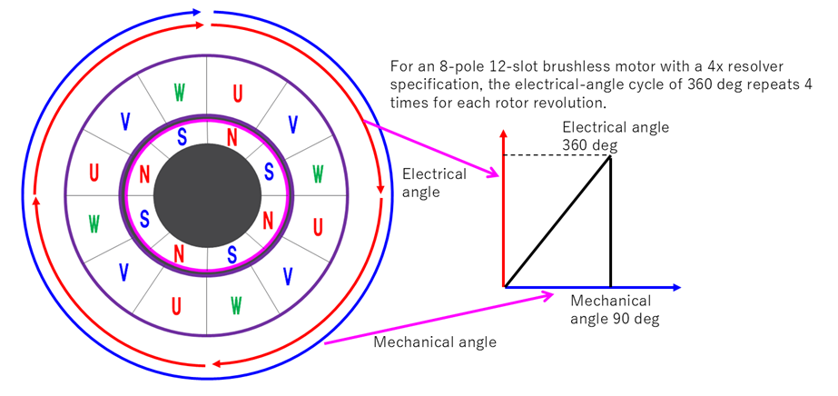

# モータモデル — 電気・機械方程式

`bldc-foc-sim` が用いる三相ブラシレス DC モータ (BLDC / PMSM) のプラントモデルを説明する。コード上は `motor_model.{hpp,cpp}` に対応する。

---

## 1. 対象とするモータ

本シリーズが対象とするのは **表面磁石型 三相同期モータ (SPMSM)** である。ロータ表面に永久磁石を貼り付けた構造で、d 軸インダクタンスと q 軸インダクタンスがほぼ等しい ($L_d \approx L_q = L$) という性質を持つ。この仮定によりモデルが単純化され、突極性に由来する項を扱わずに済む。


*外周がステーター (UVW コイル配置)、内周がロータ (永久磁石 N/S 配置)。この例は 8 極 4 極対数 (Pn=4)。*

| 記号 | 意味 | 単位 |
|------|------|------|
| $R$ | 巻線抵抗 | Ω |
| $L$ | 巻線インダクタンス ($L_d = L_q$) | H |
| $K_e$ | 逆起電力定数 | V·s/rad |
| $K_t$ | トルク定数 | Nm/A |
| $J$ | ロータ慣性モーメント | kg·m² |
| $B$ | 粘性摩擦係数 | Nm·s/rad |
| $P_n$ | 極対数 (pole pairs) | — |

---

## 2. dq 軸での電圧方程式

三相交流量はそのままでは制御しにくいため、ロータと同期して回転する **dq 回転座標系** に変換して扱う (座標変換の詳細は [`coordinate-transform.md`](coordinate-transform.md) 参照)。

dq 座標系での電圧方程式は次のとおりである。

$$
v_d = R i_d + L \frac{di_d}{dt} - \omega_e L i_q
$$

$$
v_q = R i_q + L \frac{di_q}{dt} + \omega_e L i_d + K_e \omega_m
$$

- $v_d,\thinspace  v_q$ : d 軸 / q 軸の印加電圧
- $i_d,\thinspace  i_q$ : d 軸 / q 軸の電流
- $\omega_e = P_n \cdot \omega_m$ : 電気角速度
- $\omega_m$ : 機械角速度
- $K_e \omega_m$ : 逆起電力 (Back-EMF) 項。回転に伴い q 軸に現れる

右辺の $-\omega_e L i_q$ および $+\omega_e L i_d$ の項は **dq 軸間の相互結合項 (cross-coupling term)** である。この項を打ち消す制御が「非干渉制御 (デカップリング)」であり、詳細は [`foc.md`](foc.md) で扱う。

---

## 3. 機械系の運動方程式

電磁トルクは q 軸電流に比例する。

$$
T_e = K_t i_q
$$

ロータ軸まわりの運動方程式 (ニュートンの第二法則の回転版) は次のとおり。

$$
J \frac{d\omega_m}{dt} = T_e - T_{load} - B \omega_m
$$

- $T_e$ : 電磁トルク (モータが発生するトルク)
- $T_{load}$ : 負荷トルク
- $B \omega_m$ : 粘性摩擦による制動トルク

角度は角速度の積分で得られる。

$$
\theta_m = \int \omega_m \thinspace  dt \quad \text{(機械角)}, \qquad \theta_e = P_n \cdot \theta_m \quad \text{(電気角)}
$$

---

## 4. 数値積分と離散化

### 4.1 電気系：前進オイラー法

dq 軸の電流方程式を前進オイラー法で離散化する。

$$
i_{k+1} = \left(1 - \frac{R}{L} dt\right) i_k + \frac{dt}{L} v_k
$$

安定条件は $0 \le dt \le \dfrac{2L}{R}$ である。本コードでは $\dfrac{2L}{R} = 2\thinspace \mathrm{ms}$ に対し $dt = 0.25\thinspace \mathrm{ms}$ (余裕 1/8) を使用する。

### 4.2 機械系：台形積分法

機械系は応答が遅く誤差が累積しやすいため、より精度の高い **台形積分 (Trapezoidal Rule)** を使用する。

$$
\omega_{k+1} = \omega_k + \frac{dt}{2}\left(\left.\frac{d\omega}{dt}\right|_{k+1} + \left.\frac{d\omega}{dt}\right|_k\right)
$$

### 4.3 離散化の選択理由

| 系 | 積分手法 | 理由 |
|----|----------|------|
| 電気系 | 前進オイラー (1次) | サンプリング周期 250 µs に対し電気時定数 $L/R = 1\thinspace \mathrm{ms}$ と十分余裕 |
| 機械系 | 台形積分 (2次) | 応答が遅く誤差累積しやすいため高精度積分が必要 |
| PI 積分項 | 台形積分 | バイアスのない離散積分を実現 |

---

## 5. 本コードでの簡略化

`bldc-foc-sim` のプラントモデルは、教材としての見通しを優先して以下の簡略化を行っている。

- **SPM 仮定 ($L_d = L_q = L$)** — 突極性を無視する
- dq 軸の相互結合項 $\omega_e L i$ をプラント内部では明示的に解かず、d 軸と q 軸をそれぞれ独立な 1 次遅れ系として積分する。相互結合の影響は、非干渉制御を有効にした場合にコントローラ側のフィードフォワードで扱う
- 鉄損・磁気飽和・コギングトルク・温度依存性は対象外

---

## 6. コードとの対応

`motor_model.cpp` の電流更新は、dq 軸電圧方程式を前進オイラー法で離散化したものである。

```cpp
// q 軸電流の更新 (back_emf = Ke·ω)
q_current_state_ += (q_voltage - back_emf - R * q_current_state_) / L * dt;

// d 軸電流の更新
d_current_state_ += (d_voltage - R * d_current_state_) / L * dt;
```

電磁トルクは $T_e = K_t i_q$、機械系は台形積分で更新される。

```cpp
electric_torque = torque_constant * q_current;
// 機械系 (台形積分)
angular_vel_ += (diff_angular_vel_ + pre_diff_angular_vel_) * resolution_ / 2.0;
```

---

## 7. TIN 特性

TIN 特性とは、定格電圧下における **トルク (T)** を横軸にとり、**回転数 (N)・電流 (I)・出力 (P)・効率 (η)** の各特性を同一グラフ上に示したものである。マブチモータ等の製品データシートに掲載される標準的な表記形式である。


*図: V = 12.0 V における TIN 特性。黄=回転数 N、緑=電流 I、ピンク=出力 P、青=効率 η。白丸はそれぞれの最大点。*

### 7.1 回転数 N — トルクと反比例の関係

$$
N = N_0 \left(1 - \frac{T}{T_s}\right)
$$

- **無負荷 (T = 0)** では回転数が最大値 $N_0$（無負荷回転数）となる
- トルクが増加するにつれて回転数は**直線的に低下**する
- **拘束トルク (T = Ts)** で回転数がゼロとなる（拘束状態）

この直線関係は、逆起電力 $e = K_e \omega$ が回転数に比例し、端子電圧 $V$ から抵抗降下 $RI$ を引いた残りが逆起電力として消費されることから導かれる。

### 7.2 電流 I — トルクと比例の関係

$$
I = I_0 + (I_s - I_0)\frac{T}{T_s}
$$

- **無負荷電流 $I_0$** は摩擦・鉄損を賄うための最小電流であり、ゼロにはならない
- トルクの増加に比例して電流も**直線的に増加**する
- 拘束時に最大値（拘束電流 $I_s$）に達する
- 電磁トルク $T_e = K_t i_q$ に比例するという式と直接対応する

### 7.3 出力 P — 中間トルクで最大

$$
P = T \cdot \omega = T \cdot \frac{2\pi N}{60}
$$

- T = 0（無負荷）では回転していても仕事をしておらず、出力はゼロ
- T = Ts（拘束）では回転数がゼロのため、やはり出力はゼロ
- その中間である **$T = T_s/2$ のとき出力が最大**となる
- 最大出力は $P_\mathrm{max} = \dfrac{T_s \cdot \omega_0}{4}$（$\omega_0 = 2\pi N_0/60$）

### 7.4 効率 η — 最大出力より低トルク側でピーク

$$
\eta = \frac{P_\mathrm{out}}{P_\mathrm{in}} = \frac{T \cdot \omega}{V \cdot I}
$$

- 効率はトルクに対して山形の曲線を描く
- 最大効率点は**最大出力点より低トルク側**（軽負荷寄り）に位置する
- 無負荷・拘束のいずれでも出力がゼロのため、効率もゼロに近い
- 実用動作点は効率ピーク付近（定格点）に設定するのが一般的である

### 7.5 代表的な動作点のまとめ

| 動作点 | トルク | 回転数 | 電流 | 備考 |
|--------|--------|--------|------|------|
| 無負荷 | $0$ | $N_0$ | $I_0$ | 摩擦・鉄損分の電流のみ |
| 最大効率 | $T_{\eta\thinspace \mathrm{max}}$ | — | — | 実用動作の目安 |
| 最大出力 | $T_s / 2$ | $N_0 / 2$ | $(I_0 + I_s)/2$ | 出力最大だが効率は低下 |
| 拘束 | $T_s$ | $0$ | $I_s$ | 過電流・過熱の危険域 |

---

## 8. レゾルバセンサ

レゾルバはモータの**ロータ回転角度を検出する**アナログ式センサである。エンコーダと異なり電子部品を含まないため、高温・振動・ノイズ環境に強く、車載・産業用途で広く用いられる。FOC では電気角をリアルタイムで必要とするため、レゾルバの出力から正確に角度を算出することが制御性能の鍵となる。

### 8.1 動作原理

レゾルバは**励磁コイル**と、互いに **90° 位相差を持つ 2 相の出力コイル**から構成される。

1. 励磁コイルに正弦波電圧（励磁電圧）を印加する
2. ロータに取り付けられた磁性体が励磁コイルの磁界に影響を与える
3. 2 相の出力コイルには、互いに 90° 位相がずれた正弦波が誘起される
4. この 2 相出力（sin 成分・cos 成分）の**アークタンジェント**を計算することでロータの角度位置を検出する

### 8.2 出力波形の式

励磁電圧および 2 相出力電圧の関係式を以下に示す。

$$
\text{（励磁電圧）} \quad e_0 = E_0 \sin(\omega t) \tag{1}
$$

$$
\text{（出力電圧 cos 相）} \quad e_\mathrm{cos} = K E_0 \sin(\omega t) \cdot \cos(X\theta) \tag{2}
$$

$$
\text{（出力電圧 sin 相）} \quad e_\mathrm{sin} = K E_0 \sin(\omega t) \cdot \sin(X\theta) \tag{3}
$$

| 記号 | 意味 | 単位 |
|------|------|------|
| $E_0$ | 励磁電圧振幅 | V |
| $K$ | 変圧比 | — |
| $\omega$ | 励磁角周波数 $= 2\pi f$ | rad/s |
| $f$ | 励磁周波数 | Hz |
| $\theta$ | ロータ回転角度 | rad |
| $X$ | 軸倍角（= 2, 3, 4 など） | — |

式 (2)(3) の包絡線（$\sin(\omega t)$ を復調した成分）がそれぞれ $\cos(X\theta)$、$\sin(X\theta)$ に対応するため、その比のアークタンジェントからロータ角 $\theta$ を算出できる。

$$
\theta = \frac{1}{X} \arctan\negthinspace \left(\frac{e_\mathrm{sin}}{e_\mathrm{cos}}\right) = \frac{1}{X} \arctan\negthinspace \left(\frac{\sin(X\theta)}{\cos(X\theta)}\right)
$$

### 8.3 電気角と機械角の関係

三相ブラシレスモータに三相正弦波電圧を印加する際、電圧の位相はレゾルバで検出した角度を基準として決まる。このとき**電気角**と**機械角**の関係を正しく把握することが重要であり、モータ制御ではロータ角として電気角を使用するのが一般的である。

$$
\theta_e = P_n \cdot \theta_m
$$

- $\theta_e$ : 電気角
- $\theta_m$ : 機械角（ロータの物理的回転角）
- $P_n$ : 極対数（pole pairs）

**例：8 極 12 スロット・4x レゾルバ**

8 極（$P_n = 4$）のモータでは、ロータが機械角 90° 回転するたびに電気角が 360° 一周する。4x レゾルバ（$X = 4$）はこの極対数と一致させた仕様であり、ロータ 1 回転あたり電気角が 4 周する。

| | 1 電気角サイクル | ロータ 1 回転 |
|---|---|---|
| 機械角 | 90° | 360° |
| 電気角 | 360° | 1440°（4 周） |



FOC ではレゾルバ出力から求めた角度に $P_n$ を乗じて電気角に換算し、Park 変換・逆 Park 変換の位相基準として用いる。

---

## 関連ドキュメント

- [`foc.md`](foc.md) — ベクトル制御 (FOC) の原理
- [`coordinate-transform.md`](coordinate-transform.md) — Clarke / Park 変換
- [`pi-tuning.md`](pi-tuning.md) — PI ゲインの設計
- [`waveform-analysis.md`](waveform-analysis.md) — 実測ベースの波形差解析
